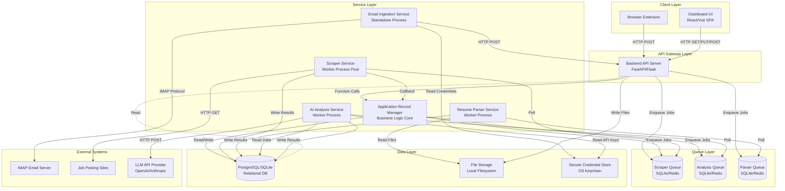

# Job Application Tracker - Architecture Design Document

**Document Version:** 1.0  
**Last Updated:** December 10, 2025  
**System Type:** Single-User Desktop Application  
**Deployment Model:** Local-Only, On-Premises

---

## PART 1: Logical Architecture Diagram & Description

### 1.1 Logical Architecture Overview Diagram



---

### 1.2 Component Detailed Descriptions

#### Component 1: Browser Extension

**Purpose:**  
Captures job application submissions from monitored job boards in real-time, extracts metadata from the page DOM, and transmits captured data to the Backend API for persistence.

**Inputs:**
- Browser form submission events (DOM events)
- Current page HTML/DOM structure
- User confirmation/edits from modal UI

**Outputs:**
- HTTP POST requests to Backend API with structured application data
- Visual feedback to user (modal, toasts, status indicators)
- Local storage entries (for offline capture when backend unavailable)

**Internal Responsibilities:**
- Detect form submissions on monitored job board domains using event listeners and mutation observers
- Extract metadata using CSS selectors and XPath queries:
  - Job title from page headings (h1, h2 elements)
  - Company name from page metadata, logo alt text, or structured data
  - Job posting URL from browser address bar (cleaned of tracking parameters)
  - Application timestamp (browser local time)
  - Job board source (domain name)
- Display confirmation modal with extracted data for user review and editing
- Handle user actions (Confirm, Cancel, Edit fields)
- Implement retry logic for failed backend communication (1 retry with 5-second delay)
- Queue failed submissions to browser localStorage when backend unavailable
- Background sync process to push queued submissions when backend becomes available
- Maintain extension state (enabled/disabled per domain)

**Boundaries (What it does NOT do):**
- Does NOT persist application data permanently (only temporary queue in localStorage)
- Does NOT perform duplicate detection (delegated to ARM)
- Does NOT scrape job postings (only captures current page URL)
- Does NOT perform validation beyond required field checks
- Does NOT interact with database directly
- Does NOT handle email ingestion
- Does NOT execute AI analysis

**Error Domain:**
- Extraction failures (missing job title, company name)
- Backend connection failures (timeout, connection refused)
- Network errors during POST requests
- User cancellation (not an error, but alternate path)
- Page navigation before confirmation (silent failure, data discarded)

**Sync vs Async Behavior:**
- **Synchronous:** DOM extraction, modal display, user interaction handling
- **Asynchronous:** HTTP POST requests to backend, background sync of queued submissions
- **Event-Driven:** Form submission detection via browser events

---

#### Component 2: Email Ingestion Service

**Purpose:**  
Monitors configured email accounts for application confirmation emails, parses email content to extract application metadata, and submits parsed data to Backend API for application record creation.

**Inputs:**
- IMAP server connection credentials (from SecureStorage)
- Email polling interval configuration (default: 5 minutes)
- Email confirmation detection patterns (regex, keywords)
- Email parsing rules (company/job extraction patterns)

**Outputs:**
- HTTP POST requests to Backend API with parsed application data
- IMAP commands to mark emails as read
- Log entries for processing status
- Error notifications to dashboard (for auth failures)

**Internal Responsibilities:**
- Establish and maintain IMAP connection using stored credentials
- Poll target email folder at configured intervals (default: 300 seconds)
- Retrieve unread emails using IMAP SEARCH UNSEEN command
- For each email:
  - Perform confirmation detection using pattern matching on subject and body
  - If confirmed, parse email to extract:
    - Company name (from sender domain, email signature, or body text)
    - Job title (from subject line patterns or body text)
    - Application timestamp (email received time as proxy)
    - Job posting URL (extract links from email body matching job board patterns)
    - Email metadata (subject, sender for reference)
  - Handle HTML-only emails (strip tags, extract text)
  - Handle multi-job confirmation emails (create multiple application records)
- Mark successfully processed emails as read (\Seen flag)
- Track processed email UIDs locally to prevent duplicate processing on IMAP failure
- Handle authentication errors by pausing polling and notifying user
- Queue parsed data locally when backend unavailable, retry on reconnection

**Boundaries (What it does NOT do):**
- Does NOT store full email content (only extracts metadata)
- Does NOT process non-confirmation emails (leaves unread)
- Does NOT perform duplicate detection (delegated to ARM)
- Does NOT scrape job postings from URLs (queues scraping jobs)
- Does NOT manage email account setup UI (handled by Dashboard)
- Does NOT support non-IMAP protocols (POP3, Exchange API excluded from MVP)

**Error Domain:**
- IMAP connection failures (network timeout, DNS failure)
- Authentication failures (invalid credentials, expired OAuth token)
- Email parsing failures (unstructured format, missing fields)
- HTML parsing errors (malformed email body)
- Backend unavailability (queued data with retry)

**Sync vs Async Behavior:**
- **Asynchronous:** All operations are async (polling, IMAP I/O, HTTP POST)
- **Scheduled:** Polling triggered by timer every 5 minutes
- **Independent Process:** Runs as standalone daemon, does not block other services

---

#### Component 3: Backend API Server

**Purpose:**  
Serves as the central API gateway, handling all HTTP requests from clients (Browser Extension, Dashboard UI), routing requests to appropriate business logic components, and managing synchronous request-response cycles.

**Inputs:**
- HTTP requests from Browser Extension (POST /api/applications/capture)
- HTTP requests from Email Ingestion Service (POST /api/applications/ingest)
- HTTP requests from Dashboard UI (GET/POST/PUT/DELETE on various resources)
- Configuration files (port, database connection, queue settings)

**Outputs:**
- HTTP responses with JSON payloads (application data, lists, status codes)
- Job enqueue operations to background queues (scraping, parsing, analysis)
- Log entries (request logs, error logs)
- Database reads (via ARM for query operations)

**Internal Responsibilities:**
- HTTP request routing to appropriate handlers (using FastAPI/Flask routing)
- Request validation (schema validation, required fields, data types)
- Authentication/authorization (if implemented; single-user MVP may skip this)
- Coordinate calls to Application Record Manager (ARM) for business logic
- Enqueue background jobs to appropriate queues (scraper, parser, analysis)
- Handle file uploads (multipart form data for resume uploads)
- Serve static files (Dashboard UI assets if bundled)
- Implement CORS headers for browser extension cross-origin requests (if needed)
- Rate limiting (per NFR: prevent excessive scraping requests)
- Error handling and HTTP status code mapping (400, 404, 409, 500, 503)
- Health check endpoint (/health) for service monitoring

**Boundaries (What it does NOT do):**
- Does NOT contain business logic (delegated to ARM)
- Does NOT perform web scraping (delegates to Scraper Service)
- Does NOT parse resumes (delegates to Parser Service)
- Does NOT call LLM APIs (delegates to Analysis Service)
- Does NOT poll email (Email Service is independent)
- Does NOT execute long-running operations synchronously (queues background jobs)
- Does NOT maintain websocket connections (uses HTTP polling or SSE for real-time updates)

**Error Domain:**
- Request validation errors (400 Bad Request)
- Resource not found errors (404 Not Found)
- Duplicate resource conflicts (409 Conflict)
- Database connection errors (503 Service Unavailable)
- Internal server errors (500 Internal Server Error)
- Queue unavailability (503 or graceful degradation)

**Sync vs Async Behavior:**
- **Synchronous:** All HTTP request handling (blocking I/O)
- **Asynchronous:** Uses async/await for database queries and ARM calls if using async framework (FastAPI with async def)
- **Non-Blocking Job Submission:** Enqueues jobs and returns immediately without waiting for completion

---

#### Component 4: Application Record Manager (ARM)

**Purpose:**  
Core business logic component responsible for all application lifecycle management, including creation, updates, deletion, status changes, duplicate detection, and coordination of dependent services (scraping, analysis).

**Inputs:**
- Application data from Backend API (capture, ingest, manual entry)
- Status update requests
- Job posting linkage notifications from Scraper Service
- Analysis completion notifications from Analysis Service
- Configuration for auto-analyze settings

**Outputs:**
- Application records written to Database
- Timeline events written to Database
- Job enqueue operations to Scraper Queue and Analysis Queue
- Success/failure responses to Backend API
- Notifications for duplicate detection

**Internal Responsibilities:**
- **Application CRUD Operations:**
  - Create application records with validation (required fields: company_name, job_title, application_date)
  - Update application records (status, notes, job posting linkage, analysis linkage)
  - Soft-delete or hard-delete applications
  - Query applications with filters, sorting, pagination
- **Duplicate Detection:**
  - Check for duplicates using: (company_name + job_title + date range) OR job_posting_url
  - Return duplicate information to caller with options (view existing, create anyway)
- **Job Posting Linkage:**
  - Accept posting_id from Scraper Service
  - Update application record with posting_id and timestamp
  - Trigger AI analysis if auto-analyze enabled
- **Analysis Linkage:**
  - Accept analysis_id from Analysis Service
  - Update application record with analysis_id and completion flag
- **Status Management:**
  - Validate status transitions against allowed values
  - Create timeline events for all status changes
  - Implement optimistic locking for concurrent updates (updated_at timestamp check)
- **Timeline Event Management:**
  - Create timeline events for: application submission, status changes, scraping completion, analysis completion, notes updates
  - Support manual timeline event creation by user
- **Job Queuing Coordination:**
  - Enqueue scraping jobs when application created with job_posting_url
  - Enqueue analysis jobs when posting linked and auto-analyze enabled
  - Re-queue jobs on manual retry requests

**Boundaries (What it does NOT do):**
- Does NOT handle HTTP requests directly (Backend API layer responsibility)
- Does NOT perform web scraping (Scraper Service responsibility)
- Does NOT parse emails (Email Service responsibility)
- Does NOT call LLM APIs (Analysis Service responsibility)
- Does NOT parse resumes (Parser Service responsibility)
- Does NOT manage queues directly (uses queue abstraction layer)
- Does NOT perform authentication/authorization

**Error Domain:**
- Validation errors (missing required fields, invalid status values)
- Database constraint violations (foreign key, unique constraints)
- Optimistic lock conflicts (concurrent updates)
- Duplicate detection conflicts (with user resolution options)
- Queue enqueue failures (retry or graceful degradation)

**Sync vs Async Behavior:**
- **Synchronous:** All operations blocking (within Backend API request cycle)
- **Transactional:** Database operations use transactions for consistency
- **Immediate Return:** Job enqueuing returns immediately; does not wait for job completion

---

#### Component 5: Scraper Service

**Purpose:**  
Background worker service that polls the scraper queue, fetches job posting HTML from URLs, extracts structured content, stores results in database, and notifies ARM of completion.

**Inputs:**
- Scraper queue entries (job_id, url, application_id, priority, source)
- Rate limit state (per-domain request tracking)
- Configuration for request timeouts, retry policies, user-agent strings

**Outputs:**
- HTTP GET requests to job posting sites
- Scraped HTML stored in Database (scraped_postings table)
- Extracted structured data stored in Database (job_postings table)
- Callback notifications to ARM with posting_id
- Updated queue entries (status: complete, failed, or retry scheduled)
- Log entries for success, failures, rate limits

**Internal Responsibilities:**
- **Queue Management:**
  - Poll scraper queue every 10 seconds
  - Dequeue jobs in priority order (manual > browser > email)
  - Update job status (pending → processing → complete/failed)
- **URL Validation:**
  - Validate URL format (HTTP/HTTPS)
  - Normalize URL (remove tracking parameters, lowercase domain)
  - Perform DNS lookup to ensure resolvability
- **Duplicate Detection:**
  - Query database for existing scraped_postings with same normalized URL
  - If found and age < 7 days, reuse existing data
  - If age >= 7 days, re-scrape for updated content
- **Rate Limiting:**
  - Track requests per domain in last 60 seconds
  - Enforce limit: max 10 requests per minute per domain
  - If limit exceeded, delay job by 6 seconds and re-queue
- **HTTP Fetching:**
  - Perform GET request with:
    - User-Agent header mimicking standard browser
    - Timeout: 30 seconds
    - Follow redirects: max 5
  - Store response: status code, final URL (post-redirect), headers, HTML content
- **Content Extraction:**
  - Parse HTML using BeautifulSoup or similar
  - Extract structured fields:
    - job_title (h1, meta og:title, CSS class patterns)
    - company_name (meta tags, CSS class patterns, domain inference)
    - description (largest text block in main content area)
    - requirements (sections with headers: "Requirements", "Qualifications")
    - nice_to_have (sections with headers: "Nice to Have", "Bonus")
    - salary_range (regex patterns: $XX,XXX - $XX,XXX)
    - location (meta tags, CSS class patterns)
    - employment_type (patterns: Full-time, Part-time, Contract)
  - Mark extraction as complete or incomplete based on critical fields (job_title, description)
- **Retry Logic:**
  - For transient errors (timeout, 5xx, connection error):
    - Retry up to 3 times with exponential backoff (1 min, 5 min, 15 min)
  - For permanent errors (404, 403):
    - Mark as permanently failed, do not retry
- **ARM Notification:**
  - Call ARM.linkJobPosting(application_id, posting_id) on success
  - Call ARM.notifyScrapeFailed(application_id, reason) on permanent failure

**Boundaries (What it does NOT do):**
- Does NOT handle JavaScript-rendered pages (no headless browser in MVP)
- Does NOT bypass authentication walls (login-required pages fail)
- Does NOT handle CAPTCHAs (fails gracefully)
- Does NOT violate robots.txt (checks disallow rules before scraping)
- Does NOT scrape sites outside job board whitelist (future enhancement)
- Does NOT perform AI analysis (delegates to Analysis Service)
- Does NOT create application records (ARM responsibility)

**Error Domain:**
- HTTP errors (404, 403, 500, timeout)
- Network errors (DNS failure, connection refused)
- Parsing errors (malformed HTML, missing expected elements)
- Rate limit violations (from target site or self-imposed)
- Storage errors (database write failure)

**Sync vs Async Behavior:**
- **Asynchronous:** All operations non-blocking (polling, HTTP I/O, database I/O)
- **Worker Pool:** Multiple worker processes/threads for parallel scraping (configurable: 5-10 workers)
- **Isolated Process:** Failures do not crash Backend API

---

#### Component 6: Resume Parser Service

**Purpose:**  
Background worker service that polls the parser queue, extracts text from uploaded resume files (PDF, DOCX, TXT), identifies resume sections, extracts structured data, and stores parsed results in database.

**Inputs:**
- Parser queue entries (job_id, resume_id, file_path, format)
- Resume files from File Storage
- Parsing configuration (section header keywords, extraction patterns)

**Outputs:**
- Extracted plain text (intermediate)
- Structured resume data written to Database (resume_data table)
- Updated resume records (status: completed or failed)
- Updated parser queue entries (status: complete, failed)
- Log entries for parsing success/failure

**Internal Responsibilities:**
- **Queue Management:**
  - Poll parser queue every 5 seconds
  - Dequeue jobs in FIFO order
  - Update job status (pending → processing → complete/failed)
- **Text Extraction:**
  - For PDF: Use pdfplumber or PyPDF2 to extract text page by page
    - Detect image-based PDFs (no text layer) and fail with clear error
  - For DOCX: Use python-docx to extract paragraphs and table content
    - Handle password-protected files (fail with clear error)
  - For TXT: Read file with UTF-8 encoding
  - Normalize extracted text (remove excess whitespace, consistent newlines)
- **Section Identification:**
  - Use keyword matching (case-insensitive) to identify sections:
    - Contact Info: "Contact", "Email", "Phone"
    - Summary: "Summary", "Objective", "Profile", "About"
    - Experience: "Experience", "Work History", "Employment", "Professional Experience"
    - Education: "Education", "Academic Background", "Degrees"
    - Skills: "Skills", "Technical Skills", "Competencies", "Technologies"
    - Certifications: "Certifications", "Licenses", "Credentials"
  - If no sections identifiable (unstructured resume), place entire content in "other" section
- **Structured Data Extraction:**
  - Contact Info: Regex extraction for email, phone, location patterns
  - Skills: Extract comma-separated or bullet-pointed lists → Store as array
  - Experience: Extract job entries with company, title, date range, responsibilities → Store as array of objects
  - Education: Extract institution, degree, major, graduation year → Store as array of objects
  - Certifications: Extract certification names → Store as array
  - If extraction fails for any section, store raw text as fallback
- **Resume Versioning:**
  - Query for existing active resume (is_active=true)
  - If found, mark as archived (is_active=false, archived_at=timestamp)
  - Mark new resume as active (is_active=true)
- **Error Handling:**
  - Mark resume as failed for: scanned PDFs, password-protected files, corrupted files, empty files
  - Provide clear error messages for user remediation

**Boundaries (What it does NOT do):**
- Does NOT perform OCR on scanned PDFs (out of scope for MVP)
- Does NOT handle formats beyond PDF, DOCX, TXT (no ODT, RTF in MVP)
- Does NOT validate resume content quality
- Does NOT perform AI-based section classification (uses keyword matching only)
- Does NOT trigger analysis automatically (ARM responsibility)
- Does NOT manage file uploads (Backend API responsibility)

**Error Domain:**
- File access errors (file not found, permission denied)
- Parsing library errors (corrupted files, unsupported formats)
- Empty or minimal text extraction (scanned PDFs)
- Password-protected files
- Database write failures

**Sync vs Async Behavior:**
- **Asynchronous:** All operations non-blocking (file I/O, database I/O)
- **Single Worker or Pool:** Can be single process or small pool (2-3 workers) given low volume
- **Isolated Process:** Failures do not crash Backend API

---

#### Component 7: AI Analysis Service

**Purpose:**  
Background worker service that polls the analysis queue, constructs prompts from resume and job posting data, calls LLM API for analysis, parses responses, stores results in database, and notifies ARM of completion.

**Inputs:**
- Analysis queue entries (job_id, application_id, posting_id, resume_id)
- Resume structured data from Database
- Job posting structured data from Database
- LLM API credentials from SecureStorage
- Configuration for LLM provider, model, temperature, max_tokens

**Outputs:**
- HTTP POST requests to LLM API Provider
- Analysis results written to Database (analysis_results table)
- Updated application records (analysis_completed flag, analysis_id)
- Timeline events for analysis completion
- Updated analysis queue entries (status: complete, failed)
- Log entries for API calls, successes, failures, token usage

**Internal Responsibilities:**
- **Queue Management:**
  - Poll analysis queue every 10 seconds
  - Dequeue jobs in FIFO order (or priority order for manual retries)
  - Update job status (pending → processing → complete/failed)
- **Prerequisite Validation:**
  - Verify active resume exists
  - Verify job posting has description data
  - Verify LLM API key configured
  - Fail immediately if prerequisites not met
- **Prompt Construction:**
  - Build structured prompt with sections:
    - System context: "You are a job application analyzer helping a job seeker..."
    - Resume input: summary, skills array, experience entries, education, certifications
    - Job posting input: job_title, company, description, requirements, nice_to_have
    - Task instructions: "Analyze match between resume and job. Provide: (1) match score 0-100, (2) matched qualifications, (3) missing qualifications, (4) skill suggestions"
    - Output format: "Return response as valid JSON: {match_score, matched_qualifications, missing_qualifications, skill_suggestions}"
  - Check token count; if combined resume + job posting > 12,000 tokens, truncate job description while preserving requirements section
  - Handle missing resume sections by noting unavailability in prompt
- **LLM API Call:**
  - POST request to configured provider (OpenAI, Anthropic, etc.)
  - Parameters: temperature=0.3 (deterministic), max_tokens=2000, response_format=json
  - Timeout: 60 seconds
  - Handle API-specific error codes (rate limits, auth errors, server errors)
- **Response Parsing:**
  - Extract JSON from response (may be wrapped in markdown code blocks)
  - Validate structure: match_score (numeric), matched_qualifications (array), missing_qualifications (array), skill_suggestions (array)
  - Clamp match_score to 0-100 range if outside bounds
  - Filter empty strings from arrays
  - If parsing fails, mark as invalid response and retry
- **Retry Logic:**
  - For rate limits (429): Exponential backoff 1 min, 5 min, 15 min (respect Retry-After header)
  - For timeouts: Retry once after 10 seconds, then exponential backoff
  - For server errors (5xx): Exponential backoff 1 min, 5 min, 15 min
  - For invalid responses: Exponential backoff (may be prompt issue)
  - Maximum 3 retry attempts before permanent failure
  - For auth errors (401, 403): Fail immediately, notify user to configure API key
- **Result Storage:**
  - Insert analysis_results record with: application_id, match_score, matched_qualifications (JSON), missing_qualifications (JSON), skill_suggestions (JSON), analyzed_at, model_used
  - Update application record: analysis_completed=true, analysis_id
  - Create timeline event: type='analysis_completed', data={analysis_id, match_score}
- **Cost Tracking:**
  - Log token usage per analysis (if provided by API)
  - Maintain cumulative token count for user cost awareness

**Boundaries (What it does NOT do):**
- Does NOT create application records (ARM responsibility)
- Does NOT scrape job postings (Scraper Service responsibility)
- Does NOT parse resumes (Parser Service responsibility)
- Does NOT store resume or job posting data (reads from Database only)
- Does NOT implement custom ML models (uses third-party LLM APIs only)
- Does NOT handle payment/billing for LLM usage (user provides own API key)

**Error Domain:**
- LLM API errors (rate limits, timeouts, auth failures, server errors)
- Response parsing errors (invalid JSON, missing fields)
- Prerequisite validation errors (no resume, no job description, no API key)
- Database write failures

**Sync vs Async Behavior:**
- **Asynchronous:** All operations non-blocking (database I/O, HTTP I/O to LLM API)
- **Worker Pool:** Multiple workers possible (3-5) to handle concurrent analyses within rate limits
- **Isolated Process:** Failures do not crash Backend API
- **Rate-Limited:** Self-imposed concurrency limits to respect LLM provider rate limits

---

#### Component 8: Database Layer

**Purpose:**  
Persistent data storage for all application records, job postings, resumes, analysis results, timeline events, queue entries, and metadata. Provides ACID transactional guarantees.

**Inputs:**
- SQL queries from Backend API, ARM, Scraper Service, Parser Service, Analysis Service
- Schema migrations on application startup or upgrade

**Outputs:**
- Query results (rows, aggregates, counts)
- Transaction commit/rollback acknowledgments
- Constraint violation errors

**Internal Responsibilities:**
- Store all structured data in relational tables:
  - applications (id, company_name, job_title, application_date, status, posting_id, analysis_id, notes, source, is_deleted, created_at, updated_at)
  - job_postings (id, posting_id, job_title, company_name, description, requirements, nice_to_have, salary_range, location, employment_type)
  - scraped_postings (id, url, normalized_url, html_content, fetch_timestamp, http_status, final_url, content_hash)
  - resumes (id, filename, file_path, upload_timestamp, status, is_active, archived_at)
  - resume_data (id, resume_id, email, phone, location, skills (JSON), experience (JSON), education (JSON), certifications (JSON))
  - analysis_results (id, application_id, match_score, matched_qualifications (JSON), missing_qualifications (JSON), skill_suggestions (JSON), analyzed_at, model_used)
  - timeline_events (id, application_id, event_type, event_data (JSON), occurred_at)
  - scraper_queue, parser_queue, analysis_queue (job management tables)
  - processed_email_uids (uid, processed_at) for email deduplication
- Enforce foreign key constraints, unique constraints, not-null constraints
- Provide indexes for common queries (application_date, status, company_name, normalized_url)
- Support full-text search on job descriptions and notes (if using PostgreSQL with pg_trgm or FTS)
- Handle concurrent access with row-level locking and optimistic locking
- Execute schema migrations automatically on version upgrades
- Backup and restore capabilities (user-initiated via CLI or UI)

**Boundaries (What it does NOT do):**
- Does NOT contain business logic (all logic in ARM and services)
- Does NOT perform web scraping or API calls
- Does NOT handle HTTP requests
- Does NOT manage file storage (filesystem responsibility)
- Does NOT enforce application-level authorization (single-user system)

**Error Domain:**
- Connection errors (server not running, network issues)
- Constraint violations (foreign key, unique, not-null)
- Query syntax errors (should not occur in production)
- Transaction deadlocks (rare in single-user system)
- Disk space exhaustion

**Sync vs Async Behavior:**
- **Synchronous:** All query operations blocking
- **Transactional:** Supports BEGIN/COMMIT/ROLLBACK for consistency
- **Connection Pooling:** Maintains pool of connections for concurrent access

---

#### Component 9: File Storage Layer

**Purpose:**  
Local filesystem storage for binary files: uploaded resume files, scraped HTML snapshots (optional), export files, and log files.

**Inputs:**
- File write requests from Backend API (resume uploads)
- File write requests from Scraper Service (HTML snapshots)
- File write requests from Export Service (CSV, JSON exports)
- File write requests from Logging subsystem

**Outputs:**
- File read streams for resume parsing
- File paths for database references
- Disk space usage metrics

**Internal Responsibilities:**
- Store resume files in designated directory: `/home/claude/uploads/resumes/`
  - Use UUID-based filenames to avoid conflicts
  - Maintain original extension for format detection
  - Set file permissions to owner-only (chmod 600)
- Store scraped HTML in designated directory: `/home/claude/uploads/scraped_html/`
  - Optional based on configuration (can be disabled to save space)
  - Use content hash for deduplication
- Store export files in temporary directory: `/home/claude/exports/`
  - Auto-delete after 24 hours
- Store log files in designated directory: `/home/claude/logs/`
  - Rotate at 100MB size limit, retain 10 files
- Enforce disk space checks before large writes (exports, HTML snapshots)
- Provide cleanup utilities for old files (user-triggered or scheduled)

**Boundaries (What it does NOT do):**
- Does NOT implement database functionality (use Database Layer for structured data)
- Does NOT perform file parsing (resume parsing is Parser Service responsibility)
- Does NOT handle cloud storage (local-only per requirements)
- Does NOT encrypt files at rest (relies on OS-level filesystem encryption if needed)

**Error Domain:**
- Disk space exhaustion
- Permission errors (cannot write to directory)
- File not found errors (file deleted or moved)
- Corrupted files (detected during read)

**Sync vs Async Behavior:**
- **Synchronous:** File I/O operations blocking
- **Async-Compatible:** Can be used in async contexts with async file I/O libraries

---

#### Component 10: Background Job Queues

**Purpose:**  
Persistent, fault-tolerant job queues for managing asynchronous tasks (scraping, parsing, analysis). Enables retry logic, prioritization, and decoupling of job submission from execution.

**Inputs:**
- Job enqueue requests from Backend API and ARM (new jobs)
- Job status updates from worker services (processing, complete, failed)
- Job dequeue requests from worker services (polling)

**Outputs:**
- Job entries returned to worker services (job_id, payload, priority)
- Job status query results
- Queue depth metrics

**Internal Responsibilities:**
- **Queue Implementation:**
  - SQLite-backed queues (lightweight, file-based, ACID guarantees) OR
  - Redis-backed queues (higher performance, in-memory) OR
  - PostgreSQL-backed queues (shared with main DB, transactional)
- **Queue Tables/Structures:**
  - scraper_queue: job_id, url, application_id, priority, status (pending, processing, complete, failed), attempts, retry_after, created_at
  - parser_queue: job_id, resume_id, file_path, format, status, attempts, created_at
  - analysis_queue: job_id, application_id, posting_id, resume_id, status, attempts, retry_after, created_at
- **Priority Management:**
  - Support priority levels: high (manual), medium (browser), low (email)
  - Dequeue in priority order, then FIFO within priority
- **Retry Management:**
  - Track attempt count per job
  - Store retry_after timestamp for exponential backoff
  - Mark jobs as permanently failed after max attempts (3)
- **Status Tracking:**
  - Status transitions: pending → processing → complete/failed
  - Prevent duplicate processing (lock jobs during processing)
- **Queue Health:**
  - Expose metrics: queue depth, processing rate, failure rate
  - Alert when queues exceed thresholds (>100 pending jobs)
- **Cleanup:**
  - Purge completed jobs after retention period (30 days)
  - Purge permanently failed jobs after retention period (90 days for audit)

**Boundaries (What it does NOT do):**
- Does NOT execute jobs (worker services responsibility)
- Does NOT contain job logic (services define job behavior)
- Does NOT guarantee job execution order beyond priority (workers may process concurrently)
- Does NOT implement distributed queuing (single-machine system)

**Error Domain:**
- Queue storage errors (disk space, database connection)
- Lock contention (multiple workers trying to dequeue same job)
- Stale job detection (jobs stuck in processing state due to worker crash)

**Sync vs Async Behavior:**
- **Synchronous:** Enqueue and dequeue operations blocking
- **Polled by Workers:** Workers poll periodically (every 5-10 seconds)
- **Persistent:** Survives application restarts

---

#### Component 11: Dashboard UI

**Purpose:**  
Single-page web application providing user interface for viewing applications, managing status, uploading resumes, configuring settings, and triggering actions (scraping retries, analysis reruns, exports).

**Inputs:**
- User interactions (clicks, form submissions, file uploads)
- HTTP responses from Backend API (application data, lists, status updates)
- Configuration settings from local storage or API

**Outputs:**
- HTTP requests to Backend API (GET, POST, PUT, DELETE)
- Rendered HTML/CSS/JS in browser
- User feedback (toasts, modals, progress indicators)

**Internal Responsibilities:**
- **Views/Pages:**
  - Application List View: Paginated table with filters, sorting, search
  - Application Detail View: Complete application info, job posting, analysis, timeline
  - Resume Management: Upload, view parsed resume, manage versions
  - Settings: Email configuration, API key management, preferences
  - Export: Configure and download exports
- **Interactions:**
  - Create manual application entries
  - Update application status and notes
  - Trigger scraping retries
  - Trigger analysis reruns
  - Upload resume files
  - Configure email accounts
  - View and edit user preferences
- **Real-Time Updates:**
  - Poll Backend API for job status updates (scraping, analysis)
  - Display progress indicators for long-running operations
  - Update UI when background jobs complete
- **Client-Side Validation:**
  - Validate form inputs before submission (required fields, length limits, date formats)
  - Provide immediate feedback for validation errors
- **State Management:**
  - Maintain UI state (current view, filters, selected application)
  - Cache application data to reduce API calls
  - Handle browser back/forward navigation
- **Error Handling:**
  - Display user-friendly error messages for API failures
  - Provide retry options for failed requests
  - Handle network offline scenarios gracefully

**Boundaries (What it does NOT do):**
- Does NOT contain business logic (all logic in Backend API and ARM)
- Does NOT access Database directly (all data via Backend API)
- Does NOT perform web scraping or email ingestion
- Does NOT call LLM APIs directly (delegated to Analysis Service)
- Does NOT store sensitive credentials (uses Backend API for secure storage)

**Error Domain:**
- Network errors (API unavailable, timeout)
- API errors (400, 404, 500 responses)
- Client-side validation errors
- Browser compatibility issues

**Sync vs Async Behavior:**
- **Asynchronous:** All API calls non-blocking (async/await or promises)
- **Event-Driven:** Responds to user interactions and API responses
- **Polling:** Polls Backend API for status updates (every 5-10 seconds when jobs active)

---

## PART 2: Physical Architecture Diagram & Deployment Topology

### 2.1 Physical Deployment Architecture

```mermaid
graph TB
    subgraph "User's Local Machine"
        subgraph "Browser Process"
            BrowserExtension[Browser Extension<br/>Chrome/Edge Extension<br/>Port: N/A]
            DashboardTab[Dashboard UI<br/>Browser Tab<br/>http://localhost:8000]
        end
        
        subgraph "Backend Services (Python)"
            BackendAPI[Backend API Server<br/>FastAPI/Flask<br/>Port: 8000<br/>Process: backend_api.py]
            EmailService[Email Ingestion Service<br/>Standalone Daemon<br/>Process: email_service.py]
        end
        
        subgraph "Worker Processes (Python)"
            ScraperWorkers[Scraper Workers<br/>Pool of 5 processes<br/>Process: scraper_worker.py]
            ParserWorker[Parser Worker<br/>Single process<br/>Process: parser_worker.py]
            AnalysisWorkers[Analysis Workers<br/>Pool of 3 processes<br/>Process: analysis_worker.py]
        end
        
        subgraph "Data Storage"
            Database[(PostgreSQL/SQLite<br/>Port: 5432 (PG) or file (SQLite)<br/>Data: /home/claude/data/)]
            FileSystem[File Storage<br/>/home/claude/uploads/<br/>/home/claude/logs/]
            Keychain[OS Keychain<br/>macOS Keychain<br/>Windows Credential Manager<br/>Linux Secret Service]
        end
        
        subgraph "Queue Layer"
            QueueDB[(Queue Storage<br/>SQLite file or Redis<br/>Port: 6379 (Redis) or file]
        end
    end
    
    subgraph "External Network"
        IMAPServer[Email Server<br/>IMAP SSL/TLS<br/>Port: 993]
        JobSites[Job Posting Sites<br/>HTTPS<br/>Port: 443]
        LLMAPI[LLM API<br/>HTTPS<br/>Port: 443]
    end
    
    BrowserExtension -->|HTTP POST<br/>localhost:8000| BackendAPI
    DashboardTab -->|HTTP GET/POST/PUT<br/>localhost:8000| BackendAPI
    
    BackendAPI -->|TCP Socket<br/>localhost:5432| Database
    BackendAPI -->|File I/O| FileSystem
    BackendAPI -->|Queue Operations| QueueDB
    
    EmailService -->|IMAP SSL<br/>port 993| IMAPServer
    EmailService -->|Read Credentials| Keychain
    EmailService -->|HTTP POST<br/>localhost:8000| BackendAPI
    
    ScraperWorkers -->|Poll Queue| QueueDB
    ScraperWorkers -->|Read/Write| Database
    ScraperWorkers -->|HTTPS GET<br/>port 443| JobSites
    
    ParserWorker -->|Poll Queue| QueueDB
    ParserWorker -->|Read/Write| Database
    ParserWorker -->|File Read| FileSystem
    
    AnalysisWorkers -->|Poll Queue| QueueDB
    AnalysisWorkers -->|Read/Write| Database
    AnalysisWorkers -->|Read API Key| Keychain
    AnalysisWorkers -->|HTTPS POST<br/>port 443| LLMAPI
```

---

### 2.2 Process Startup and Lifecycle

**Startup Order:**
1. **Database Server** (PostgreSQL or SQLite auto-created)
   - PostgreSQL: Must be started first if using PostgreSQL
   - SQLite: No separate process needed (file-based)
   - Verify connectivity before proceeding

2. **Backend API Server** (backend_api.py)
   - Reads configuration (database connection, port, queue settings)
   - Initializes database connection pool
   - Runs schema migrations if needed
   - Binds to localhost:8000
   - Exposes /health endpoint for monitoring
   - Logs startup success

3. **Worker Processes** (can start concurrently after Backend API)
   - **Scraper Workers** (5 processes): scraper_worker.py --workers 5
   - **Parser Worker** (1 process): parser_worker.py
   - **Analysis Workers** (3 processes): analysis_worker.py --workers 3
   - Each worker:
     - Connects to queue storage
     - Connects to database
     - Begins polling respective queue
     - Logs startup success

4. **Email Ingestion Service** (email_service.py)
   - Reads email configuration from database or config file
   - Retrieves IMAP credentials from OS keychain
   - Validates IMAP connection (optional: can start with disabled state)
   - Begins polling cycle (every 5 minutes)
   - Logs startup success

5. **Dashboard UI** (accessed via browser)
   - User navigates to http://localhost:8000
   - Backend API serves static HTML/CSS/JS files (or separate frontend server)
   - Dashboard loads and makes initial API calls to Backend

**Shutdown Order:**
1. Dashboard UI (user closes browser tab)
2. Email Ingestion Service (graceful stop: finish current poll cycle, close IMAP connection)
3. Worker Processes (graceful stop: finish current jobs, mark as processing → pending for retry)
4. Backend API Server (graceful stop: finish active requests, close DB connections)
5. Database Server (if PostgreSQL, user stops service)

**Process Management:**
- **Linux/macOS:** systemd unit files or launchd plists for auto-start
- **Windows:** Task Scheduler for auto-start or Windows Service wrappers
- **Manual Management:** Shell scripts (start_all.sh, stop_all.sh) for development

---

### 2.3 Inter-Process Communication (IPC)

**Communication Patterns:**

1. **Browser Extension ↔ Backend API:**
   - **Protocol:** HTTP REST over TCP
   - **Endpoint:** http://localhost:8000/api/*
   - **Authentication:** None (single-user, localhost-only) OR token-based (stored in extension local storage)
   - **Security:** Backend binds only to localhost (127.0.0.1), not accessible from network

2. **Dashboard UI ↔ Backend API:**
   - **Protocol:** HTTP REST over TCP
   - **Endpoint:** http://localhost:8000/api/*
   - **Authentication:** None (single-user) OR session-based
   - **Security:** Same-origin policy enforced; localhost-only binding

3. **Email Service → Backend API:**
   - **Protocol:** HTTP REST over TCP (same as browser/dashboard)
   - **Endpoint:** http://localhost:8000/api/applications/ingest
   - **Authentication:** Internal service token (shared secret in config)

4. **Backend API ↔ Database:**
   - **Protocol:** PostgreSQL wire protocol (TCP) or SQLite file I/O
   - **Connection:** localhost:5432 (PostgreSQL) or file path (SQLite)
   - **Connection Pooling:** SQLAlchemy or Psycopg2 with pool size 10-20

5. **Backend API ↔ Queue Storage:**
   - **Protocol:** Direct library calls (SQLite) or Redis protocol (TCP)
   - **Connection:** File-based (SQLite) or localhost:6379 (Redis)

6. **Worker Processes ↔ Queue Storage:**
   - **Protocol:** Same as Backend API
   - **Polling:** Workers poll every 5-10 seconds using SELECT queries (SQLite) or BLPOP/RPOPLPUSH (Redis)

7. **Worker Processes ↔ Database:**
   - **Protocol:** Same as Backend API
   - **Connection:** Separate connection pool per worker process

8. **Worker Processes ↔ External APIs:**
   - **Scraper → Job Sites:** HTTPS GET requests
   - **Analysis → LLM API:** HTTPS POST requests
   - **Email Service → IMAP Server:** IMAPS (IMAP over SSL/TLS, port 993)

---

### 2.4 Failure Isolation

**Isolation Boundaries:**

1. **Browser Extension Isolation:**
   - Runs in separate browser process
   - Extension crash does not affect Backend API or workers
   - Backend unavailability does not crash extension (queues data locally)

2. **Email Service Isolation:**
   - Runs as separate daemon process
   - Email service crash does not affect Backend API or workers
   - IMAP connection failures do not crash service (retries on next poll)
   - Backend unavailability does not crash service (queues data locally)

3. **Worker Process Isolation:**
   - Each worker runs in separate OS process
   - Scraper crash does not affect Parser or Analysis workers
   - Worker crash does not affect Backend API (jobs remain in queue for retry)
   - Resource exhaustion in one worker does not affect others

4. **Backend API Isolation:**
   - Backend API crash does not affect worker processes (continue processing jobs)
   - Database unavailability causes Backend API to return 503 but does not crash (connection retry logic)
   - Queue unavailability degrades functionality but does not crash Backend API

5. **Database Isolation:**
   - Database crash/restart does not crash other processes (connection pools handle reconnection)
   - Connection exhaustion does not crash processes (connection pooling with max limits)

**Circuit Breaker Patterns:**
- Scraper: Rate limit violations trigger cooldown period (re-queue job with delay)
- Analysis: LLM API rate limits trigger exponential backoff (not circuit breaker per se, but similar)
- Email: Repeated authentication failures pause polling (manual intervention required)

---

### 2.5 Security Boundaries

**Credential Protection:**
- **Email IMAP Credentials:**
  - Stored in OS keychain (macOS Keychain, Windows Credential Manager, Linux Secret Service)
  - Accessed by Email Service via system API calls
  - Never logged or transmitted except to IMAP server over SSL/TLS
  - Encrypted at rest by OS keychain (AES-256 or OS default)

- **LLM API Keys:**
  - Stored in OS keychain (same as email credentials)
  - Accessed by Analysis Service via system API calls
  - Never logged or displayed in UI (masked as "•••••••key")
  - Transmitted only to LLM API over HTTPS

- **Database Credentials:**
  - PostgreSQL: Stored in configuration file with restricted permissions (chmod 600)
  - SQLite: No credentials needed (file-based with file permissions)

**File System Security:**
- Resume files: Owner-only permissions (chmod 600)
- Database files: Owner-only permissions (chmod 600)
- Configuration files: Owner-only permissions (chmod 600)
- Log files: Owner-only permissions (chmod 600)
- Upload directories: Owner-only access (chmod 700)

**Network Security:**
- Backend API binds only to 127.0.0.1 (localhost), not 0.0.0.0
- No external network access except:
  - Email Service → IMAP Server (SSL/TLS required)
  - Scraper → Job Sites (HTTPS only)
  - Analysis → LLM API (HTTPS only)
- All external connections validate SSL/TLS certificates (no bypass option)

---

### 2.6 Queue Implementation Details

**Option 1: SQLite-Backed Queues (Recommended for MVP)**
- **Advantages:**
  - Zero-configuration (no separate queue server)
  - ACID guarantees (transactional)
  - Persistent across restarts
  - Simple to deploy (single file)
- **Disadvantages:**
  - Lower throughput than Redis (but sufficient for single-user workload)
  - Write contention with many workers (mitigated by short transactions)
- **Implementation:**
  - Three separate SQLite files: scraper_queue.db, parser_queue.db, analysis_queue.db
  - Table schema: job_id, payload (JSON), priority, status, attempts, retry_after, created_at
  - Enqueue: INSERT INTO queue
  - Dequeue: BEGIN TRANSACTION; SELECT + UPDATE status='processing'; COMMIT;
  - Poll interval: 10 seconds

**Option 2: Redis-Backed Queues (Alternative for Higher Performance)**
- **Advantages:**
  - Higher throughput (in-memory)
  - Built-in pub/sub for real-time job notifications
  - Atomic operations (RPOPLPUSH for reliable dequeue)
- **Disadvantages:**
  - Requires separate Redis server installation
  - Additional configuration and startup dependency
  - In-memory only (requires persistence configuration for durability)
- **Implementation:**
  - Three Redis lists: scraper_queue, parser_queue, analysis_queue
  - Priority queues: Use sorted sets with score=priority
  - Enqueue: RPUSH or ZADD
  - Dequeue: BLPOP (blocking pop, no polling needed)

**Chosen Implementation for MVP: SQLite-Backed Queues**
- Justification: Simplicity, zero-configuration, sufficient performance for single-user workload (per PERF-005: 50 URLs/hour = <1/minute throughput requirement)

---

## PART 3: Data Flow Architecture

### 3.1 Data Flow: Browser Submission → Dashboard

```mermaid
flowchart TD
    Start([User Submits Application<br/>in Browser]) --> Extract[Browser Extension<br/>Extracts Metadata]
    Extract --> ExtractData{Extraction<br/>Successful?}
    
    ExtractData -->|Partial/Failed| SetDefaults[Set Default Values<br/>company='Unknown Company'<br/>title='Unknown Position']
    ExtractData -->|Success| ShowModal[Display Confirmation Modal<br/>with Extracted Data]
    SetDefaults --> ShowModal
    
    ShowModal --> UserReview{User<br/>Action?}
    UserReview -->|Cancel| End1([End - No Record Created])
    UserReview -->|Confirm/Edit| ValidateClient[Client-Side Validation<br/>Required Fields Present]
    
    ValidateClient --> PostAPI[HTTP POST to Backend API<br/>/api/applications/capture<br/>Data: company, title, url, date, source]
    
    PostAPI --> BackendValidate{Backend<br/>Validation?}
    BackendValidate -->|Invalid| Return400[Return 400 Bad Request<br/>Display Error in Modal]
    Return400 --> UserReview
    
    BackendValidate -->|Valid| ARMCreate[ARM: createApplication<br/>Data Transform:<br/>- Add application_id UUID<br/>- Add timestamps<br/>- Set status='applied']
    
    ARMCreate --> DupCheck{Duplicate<br/>Detection?}
    DupCheck -->|Duplicate Found| Return409[Return 409 Conflict<br/>Show Duplicate Warning]
    Return409 --> UserChoice{User<br/>Choice?}
    UserChoice -->|View Existing| End2([End - Navigate to Existing App])
    UserChoice -->|Create Anyway| InsertDB[INSERT application record<br/>State Persisted:<br/>- All application fields<br/>- source='browser']
    
    DupCheck -->|No Duplicate| InsertDB
    
    InsertDB --> InsertTimeline[INSERT timeline_event<br/>type='application_submitted'<br/>State Persisted:<br/>- event_id, timestamp]
    
    InsertTimeline --> CheckURL{job_posting_url<br/>Present?}
    CheckURL -->|No| Return201[Return 201 Created<br/>to Extension]
    CheckURL -->|Yes| EnqueueScrape[Enqueue Scraper Job<br/>Data Transform:<br/>- Create job_id<br/>- Set priority='medium'<br/>- Set status='pending']
    
    EnqueueScrape --> Return201
    Return201 --> ShowSuccess[Extension Shows<br/>Success Toast]
    ShowSuccess --> End3([End - Browser Flow Complete])
    
    %% Async Scraping Flow
    EnqueueScrape -.->|Async| ScraperPoll[Scraper Worker Polls Queue]
    ScraperPoll --> DequeueJob[Dequeue Job<br/>Data: url, application_id]
    DequeueJob --> ValidateURL{URL Valid?}
    ValidateURL -->|Invalid| MarkFailed1[Mark Job Failed<br/>reason='INVALID_URL']
    ValidateURL -->|Valid| RateLimit{Rate Limit<br/>OK?}
    
    RateLimit -->|Exceeded| Requeue[Re-queue with Delay<br/>retry_after=now+6s]
    RateLimit -->|OK| HTTPGet[HTTP GET Request<br/>timeout=30s]
    
    HTTPGet --> HTTPResult{Response?}
    HTTPResult -->|Timeout/Error| RetryLogic[Retry Logic<br/>attempts < 3?]
    RetryLogic -->|Yes| Requeue2[Re-queue with Backoff<br/>1min, 5min, 15min]
    RetryLogic -->|No| MarkFailed2[Mark Permanently Failed]
    
    HTTPResult -->|404/403| MarkFailed3[Mark Permanently Failed<br/>reason='HTTP_404/403']
    
    HTTPResult -->|200 OK| StoreHTML[INSERT scraped_postings<br/>State Persisted:<br/>- url, html, timestamp, status<br/>Data Transform: content_hash]
    
    StoreHTML --> ExtractContent[Extract Structured Content<br/>Data Transform:<br/>HTML → title, company,<br/>description, requirements]
    
    ExtractContent --> ExtractResult{Critical Fields<br/>Extracted?}
    ExtractResult -->|No| StorePartial[INSERT job_postings<br/>with partial data<br/>incomplete_flag=true]
    ExtractResult -->|Yes| StoreComplete[INSERT job_postings<br/>with complete data]
    
    StorePartial --> LinkPosting
    StoreComplete --> LinkPosting[ARM: linkJobPosting<br/>UPDATE applications<br/>SET posting_id, posting_linked_at]
    
    LinkPosting --> AutoAnalyze{Auto-Analyze<br/>Enabled?}
    AutoAnalyze -->|No| End4([End - Scraping Complete])
    AutoAnalyze -->|Yes| EnqueueAnalysis[Enqueue Analysis Job<br/>Data: application_id, posting_id, resume_id]
    
    EnqueueAnalysis -.->|Async| AnalysisPoll[Analysis Worker Polls Queue]
    AnalysisPoll --> PrereqCheck{Prerequisites<br/>Met?}
    PrereqCheck -->|No Resume| MarkFailedAnalysis1[Mark Failed<br/>reason='NO_ACTIVE_RESUME']
    PrereqCheck -->|No Job Data| MarkFailedAnalysis2[Mark Failed<br/>reason='MISSING_JOB_DATA']
    
    PrereqCheck -->|Yes| FetchData[Fetch resume_data and job_postings<br/>Data: skills[], experience[], description]
    FetchData --> BuildPrompt[Construct LLM Prompt<br/>Data Transform:<br/>resume+job → structured prompt]
    
    BuildPrompt --> TokenCheck{Prompt Size<br/>> 12k tokens?}
    TokenCheck -->|Yes| Truncate[Truncate Job Description<br/>Preserve Requirements]
    TokenCheck -->|No| CallLLM
    Truncate --> CallLLM[HTTP POST to LLM API<br/>Data: prompt, temp=0.3, max_tokens=2000<br/>Validation: timeout=60s]
    
    CallLLM --> LLMResult{API<br/>Response?}
    LLMResult -->|Rate Limit 429| RetryAnalysis[Retry with Backoff<br/>1min, 5min, 15min]
    LLMResult -->|Timeout/5xx| RetryAnalysis
    LLMResult -->|Auth Error 401| MarkFailedAnalysis3[Mark Failed<br/>reason='API_KEY_INVALID'<br/>No Retry]
    
    LLMResult -->|200 OK| ParseResponse[Parse JSON Response<br/>Data Transform:<br/>JSON → validated structure<br/>Validation:<br/>- match_score 0-100<br/>- arrays present]
    
    ParseResponse --> ParseResult{Parse<br/>Successful?}
    ParseResult -->|Invalid| RetryAnalysis
    ParseResult -->|Valid| StoreAnalysis[INSERT analysis_results<br/>State Persisted:<br/>- match_score<br/>- matched_qualifications[]<br/>- missing_qualifications[]<br/>- skill_suggestions[]]
    
    StoreAnalysis --> UpdateApp[UPDATE applications<br/>SET analysis_completed=true, analysis_id]
    UpdateApp --> InsertTimelineAnalysis[INSERT timeline_event<br/>type='analysis_completed']
    InsertTimelineAnalysis --> End5([End - Analysis Complete])
    
    %% Dashboard View
    End5 -.->|User Opens Dashboard| DashboardLoad[Dashboard Loads]
    DashboardLoad --> APIList[HTTP GET /api/applications<br/>Query: page, filters, sort]
    APIList --> QueryDB[Database SELECT with Filters<br/>JOIN analysis_results for match_score]
    QueryDB --> ReturnList[Return Application List<br/>Data: [{id, company, title, date,<br/>status, match_score}, ...]<br/>+ pagination metadata]
    ReturnList --> RenderList[Render Application List<br/>Display match_score badge]
    
    RenderList --> UserClick{User Clicks<br/>Application?}
    UserClick -->|Yes| APIDetail[HTTP GET /api/applications/:id/detail]
    APIDetail --> QueryDetail[Database SELECT<br/>application + job_postings<br/>+ analysis_results + timeline_events]
    QueryDetail --> ReturnDetail[Return Complete Data<br/>Data: application, job_posting,<br/>analysis, timeline[]]
    ReturnDetail --> RenderDetail[Render Detail View<br/>Show: job description,<br/>match score, qualifications,<br/>timeline events]
    RenderDetail --> End6([End - User Views Complete Data])
```

**Key Data Transformations:**
1. **Browser → Backend:** Raw DOM data → Structured application object with UUID, timestamps
2. **Backend → Database:** Application object → Database row with constraints enforced
3. **Scraper → Database:** Raw HTML → Extracted structured job posting fields
4. **Database → LLM:** Resume + Job posting → Structured prompt string
5. **LLM → Database:** JSON response → Validated analysis_results row
6. **Database → Dashboard:** Database rows → JSON API response → Rendered UI

**Required Fields at Each Stage:**
- Browser capture: company_name (can be "Unknown"), job_title (can be "Unknown")
- Backend validation: company_name, job_title, application_date, source
- Scraper extraction: job_title (critical), description (critical), other fields optional
- Analysis prerequisites: resume_data (active), job_postings.description

**Validation Points:**
1. Client-side (extension): Required fields present, URL format
2. Backend API: Required fields, data types, length limits
3. ARM: Duplicate detection, status value validation
4. Scraper: URL validation, rate limit checks
5. Analysis: Prerequisites (resume, job data, API key), response parsing validation

**Retry Points:**
- Backend POST (extension): 1 retry after 5s, then localStorage queue
- Scraper HTTP GET: 3 retries with exponential backoff (1m, 5m, 15m)
- Analysis LLM API: 3 retries with exponential backoff (varies by error type)

**Failure Isolation Points:**
- Extension failure: Data queued in localStorage, no backend impact
- Scraper failure: Job marked failed, application record remains, user can retry manually
- Analysis failure: Analysis marked failed, application record remains, user can retry manually
- Backend failure: Extension queues data, workers continue processing existing jobs

---

### 3.2 Data Flow: Email → Backend → Scraper

```mermaid
flowchart TD
    Start([Email Polling Interval<br/>Triggered Every 5 Min]) --> ConnectIMAP[Email Service Connects to IMAP<br/>Data: credentials from OS keychain]
    
    ConnectIMAP --> ConnectionResult{Connection<br/>Successful?}
    ConnectionResult -->|Auth Failure| PausePolling[Pause Polling<br/>Notify User: Re-authenticate]
    ConnectionResult -->|Network Failure| LogError[Log Error<br/>Retry on Next Interval]
    
    ConnectionResult -->|Success| SearchUnread[IMAP: SEARCH UNSEEN<br/>Query: Unread emails in target folder]
    
    SearchUnread --> EmailsFound{Emails<br/>Found?}
    EmailsFound -->|No| End1([End - No New Emails])
    
    EmailsFound -->|Yes| FetchEmail[IMAP: FETCH Email<br/>Data: headers + body for each UID]
    
    FetchEmail --> DetectConfirmation[Pattern Matching for Confirmation<br/>Validation:<br/>- Subject: 'application received'<br/>- Sender: job board domain<br/>- Body: 'your application']
    
    DetectConfirmation --> IsConfirmation{Is Confirmation<br/>Email?}
    IsConfirmation -->|No| SkipEmail[Skip Email<br/>Leave Unread<br/>Continue to Next]
    
    IsConfirmation -->|Yes| ParseEmail[Parse Email Content<br/>Data Transform:<br/>- Subject → job_title<br/>- Sender → company_name<br/>- Body links → job_posting_url<br/>- Received time → application_timestamp]
    
    ParseEmail --> ParseResult{Required Fields<br/>Extracted?}
    ParseResult -->|No| SetNeedsReview[Flag as needs_review<br/>Set defaults for missing fields<br/>company='Domain from sender'<br/>title='Position from sender']
    
    ParseResult -->|Yes| PostBackend
    SetNeedsReview --> PostBackend[HTTP POST to Backend API<br/>/api/applications/ingest<br/>Data: company, title, url, date, source='email']
    
    PostBackend --> BackendAvailable{Backend<br/>Available?}
    BackendAvailable -->|No| QueueLocal[Queue Parsed Data Locally<br/>State Persisted: filesystem JSON<br/>Background Retry Every 60s]
    
    BackendAvailable -->|Yes| ARMCreate[ARM: createApplication<br/>Data Transform: Add application_id, timestamps]
    
    ARMCreate --> DupCheck{Duplicate<br/>Detection?}
    DupCheck -->|Duplicate from Email| SkipDup[Skip Creation<br/>Already Processed<br/>Do NOT Mark Email as Read]
    DupCheck -->|Duplicate from Browser| CreateWithNote[Create Application<br/>Add note: 'Confirmed via email']
    DupCheck -->|No Duplicate| CreateNew[Create Application Record<br/>State Persisted:<br/>- All fields<br/>- source='email'<br/>- needs_review flag if incomplete]
    
    CreateWithNote --> InsertTimeline
    CreateNew --> InsertTimeline[INSERT timeline_event<br/>type='email_received'<br/>Data: email_subject, email_sender]
    
    InsertTimeline --> CheckURL{job_posting_url<br/>Extracted?}
    CheckURL -->|No| MarkRead
    CheckURL -->|Yes| EnqueueScrape[Enqueue Scraper Job<br/>Data: url, application_id<br/>Priority='low' (email source)]
    
    EnqueueScrape --> MarkRead[IMAP: STORE +FLAGS \Seen<br/>Mark Email as Read<br/>INSERT processed_email_uid<br/>State Persisted: UID, timestamp]
    
    MarkRead --> LogSuccess[Log Success<br/>'Email processed: [subject]']
    LogSuccess --> MoreEmails{More Unread<br/>Emails?}
    
    MoreEmails -->|Yes| FetchEmail
    MoreEmails -->|No| End2([End - Polling Cycle Complete])
    
    %% Scraping flow (same as browser flow)
    EnqueueScrape -.->|Async| ScraperPoll[Scraper Worker Polls Queue<br/>See 'Browser Submission' Flow for Details]
    ScraperPoll -.-> ScraperEnd([Scraping Completes as in Flow 3.1])
```

**Key Data Transformations:**
1. **IMAP → Email Service:** Raw email (RFC822) → Parsed headers and body text
2. **Email Service → Backend:** Email content → Structured application object (company, title, url, date)
3. **Backend → Database:** Application object → Database row with source='email'

**Required Fields:**
- Email parsing: email_subject, email_sender (always present)
- Extracted for application: company_name (default from sender domain), job_title (extracted or default)
- Optional: job_posting_url (if present in email body)

**Validation Points:**
1. IMAP connection: Credential validation
2. Confirmation detection: Pattern matching thresholds
3. Email parsing: Extraction success for company and title
4. Backend API: Same validation as browser capture

**Retry Points:**
- IMAP connection: Retry on next polling interval (5 minutes)
- Backend POST: Queue locally, retry every 60 seconds
- Email left unread if processing fails (will retry on next poll)

**Failure Isolation:**
- IMAP connection failure: Service logs error, retries on next interval, does not crash
- Email parsing failure: Skip email, leave unread, continue to next email
- Backend unavailability: Queue parsed data locally, continue processing other emails

---

### 3.3 Data Flow: Resume Upload → Parser → Database

```mermaid
flowchart TD
    Start([User Clicks Upload Resume<br/>in Dashboard]) --> SelectFile[User Selects File<br/>from Filesystem<br/>Allowed: PDF, DOCX, TXT]
    
    SelectFile --> ClientValidate[Client-Side Validation<br/>Validation:<br/>- Size < 10MB<br/>- Extension matches]
    
    ClientValidate --> ValidationResult{Validation<br/>Passed?}
    ValidationResult -->|No| ShowError1[Display Error<br/>'Invalid file. Use PDF/DOCX/TXT < 10MB']
    ShowError1 --> End1([End - User Retries])
    
    ValidationResult -->|Yes| UploadFile[HTTP POST /api/resumes/upload<br/>Multipart Form Data<br/>Data: file binary]
    
    UploadFile --> ServerValidate[Backend: Server-Side Validation<br/>Validation:<br/>- Size < 10MB<br/>- MIME type matches extension]
    
    ServerValidate --> ServerResult{Validation<br/>Passed?}
    ServerResult -->|No| Return400[Return 400 Bad Request<br/>Error: details]
    Return400 --> ShowError2[Display Error in UI]
    ShowError2 --> End1
    
    ServerResult -->|Yes| WriteFile[Write File to Storage<br/>Location: /home/claude/uploads/resumes/<br/>Filename: UUID.extension<br/>Permissions: chmod 600<br/>Data Transform: user_filename → UUID_filename]
    
    WriteFile --> InsertDB[INSERT resumes Record<br/>State Persisted:<br/>- resume_id<br/>- filename (original)<br/>- file_path<br/>- upload_timestamp<br/>- status='pending'<br/>- is_active=false (initially)]
    
    InsertDB --> EnqueueParser[Enqueue Parser Job<br/>Data: resume_id, file_path, format<br/>State Persisted: parser_queue]
    
    EnqueueParser --> Return201[Return 201 Created<br/>Response: resume_id]
    Return201 --> ShowProgress[Display 'Parsing in Progress'<br/>Show Spinner UI]
    
    ShowProgress -.->|Async| ParserPoll[Parser Worker Polls Queue<br/>Every 5 Seconds]
    
    ParserPoll --> DequeueJob[Dequeue Parser Job<br/>Data: resume_id, file_path, format]
    
    DequeueJob --> DetermineFormat{File<br/>Format?}
    
    DetermineFormat -->|PDF| ExtractPDF[pdfplumber / PyPDF2<br/>Extract Text Page by Page<br/>Data Transform: Binary PDF → Plain Text]
    DetermineFormat -->|DOCX| ExtractDOCX[python-docx<br/>Extract Paragraphs + Tables<br/>Data Transform: Binary DOCX → Plain Text]
    DetermineFormat -->|TXT| ExtractTXT[Read File UTF-8<br/>Data Transform: Text File → String]
    
    ExtractPDF --> ExtractionResult{Text<br/>Extraction<br/>Successful?}
    ExtractDOCX --> ExtractionResult
    ExtractTXT --> ExtractionResult
    
    ExtractionResult -->|Empty/Error| MarkFailed[UPDATE resumes<br/>SET status='failed'<br/>error='PDF scanned / corrupted / password-protected'<br/>Notify User with Error Details]
    MarkFailed --> End2([End - User Must Re-Upload])
    
    ExtractionResult -->|Success| NormalizeText[Normalize Text<br/>Data Transform:<br/>- Remove excess whitespace<br/>- Consistent newlines]
    
    NormalizeText --> IdentifySections[Identify Resume Sections<br/>Pattern Matching:<br/>- Contact: 'Email', 'Phone'<br/>- Experience: 'Experience', 'Work History'<br/>- Education: 'Education'<br/>- Skills: 'Skills', 'Technical Skills'<br/>Data Transform:<br/>Plain Text → Segmented Sections Map]
    
    IdentifySections --> SectionsFound{Sections<br/>Identified?}
    SectionsFound -->|No| SetOther[Place All Content in 'other'<br/>Log Warning: 'Unstructured resume']
    SectionsFound -->|Yes| ExtractStructured
    
    SetOther --> ExtractStructured[Extract Structured Data<br/>Data Transform:<br/>Contact → email (regex), phone (regex)<br/>Skills → array (split by comma/newline)<br/>Experience → array of objects:<br/>  {company, title, dates, responsibilities}<br/>Education → array of objects:<br/>  {institution, degree, major, year}<br/>Certifications → array]
    
    ExtractStructured --> ExtractionComplete{Extraction<br/>Complete?}
    ExtractionComplete -->|Partial| StorePartial[INSERT resume_data<br/>State Persisted:<br/>- Successfully extracted fields<br/>- Raw text for failed sections<br/>incomplete_flag=true]
    ExtractionComplete -->|Full| StoreFull[INSERT resume_data<br/>State Persisted:<br/>- email, phone, location<br/>- skills[]<br/>- experience[]<br/>- education[]<br/>- certifications[]]
    
    StorePartial --> CheckActive
    StoreFull --> CheckActive[Query Existing Active Resume<br/>Data: SELECT WHERE is_active=true]
    
    CheckActive --> ActiveExists{Active Resume<br/>Exists?}
    ActiveExists -->|Yes| ArchiveOld[UPDATE resumes (old)<br/>SET is_active=false, archived_at=now<br/>State Transform: Active → Archived]
    ActiveExists -->|No| ActivateNew
    
    ArchiveOld --> ActivateNew[UPDATE resumes (new)<br/>SET is_active=true, status='completed'<br/>State Transform: Pending → Active]
    
    ActivateNew --> NotifyUI[Notify Dashboard<br/>via Polling or WebSocket<br/>Data: resume_id, status='completed']
    
    NotifyUI --> ShowSuccess[Display Success<br/>'Resume uploaded and parsed'<br/>Show Resume Preview with Sections]
    
    ShowSuccess --> End3([End - Resume Ready for Analysis])
```

**Key Data Transformations:**
1. **File Upload → Storage:** Binary file → UUID-based filename on filesystem
2. **PDF/DOCX → Parser:** Binary → Plain text (via extraction library)
3. **Plain Text → Sections:** Unstructured text → Segmented sections map
4. **Sections → Structured Data:** Text sections → Structured database objects (arrays, nested objects)
5. **Resume Versioning:** Old active resume → Archived, New resume → Active

**Required Fields:**
- File upload: file (binary), filename
- Database record: resume_id, file_path, upload_timestamp, status
- Parsed data: At minimum, text content (may have empty structured fields)

**Validation Points:**
1. Client-side: File size, extension
2. Server-side: File size, MIME type, write permissions
3. Parser: Text extraction success, sections identifiable
4. Structured extraction: Field format validation (email regex, date parsing)

**Retry Points:**
- File upload: Client retry on network failure
- Parser: No automatic retry; user must re-upload if parsing fails permanently

**Failure Isolation:**
- File upload failure: User notified, no database record created
- Parser failure: Resume marked as failed in database, user can re-upload
- Database write failure: Parser logs error, can retry job

---

### 3.4 Data Flow: Dashboard Queries → Backend → Database

```mermaid
flowchart TD
    Start([User Opens Dashboard<br/>or Navigates to List View]) --> BuildQuery[Dashboard Builds Query Parameters<br/>Data:<br/>- page=1, page_size=25<br/>- sort=application_date, order=desc<br/>- filters: status[], date_range<br/>- search: query string]
    
    BuildQuery --> APIRequest[HTTP GET /api/applications<br/>Query String: ?page=1&page_size=25&sort=application_date&order=desc&status=applied]
    
    APIRequest --> ParseParams[Backend: Parse & Validate Query Params<br/>Validation:<br/>- page >= 1<br/>- page_size <= 100<br/>- sort field in allowed list<br/>- order in ['asc', 'desc']]
    
    ParseParams --> ValidationResult{Validation<br/>Passed?}
    ValidationResult -->|No| Return400[Return 400 Bad Request<br/>Error: 'Invalid query parameter']
    
    ValidationResult -->|Yes| BuildSQL[Build SQL Query<br/>Data Transform:<br/>Query params → SQL WHERE + ORDER BY<br/>SELECT applications.*,<br/>  analysis_results.match_score<br/>FROM applications<br/>LEFT JOIN analysis_results<br/>WHERE is_deleted=false<br/>  AND status IN (?)<br/>  AND application_date >= ?<br/>ORDER BY ? ?<br/>LIMIT ? OFFSET ?]
    
    BuildSQL --> ExecuteQuery[Database: Execute Query<br/>Data: Retrieve application rows]
    
    ExecuteQuery --> QueryResult{Query<br/>Successful?}
    QueryResult -->|DB Error| Return503[Return 503 Service Unavailable<br/>Error: 'Database temporarily unavailable']
    
    QueryResult -->|Success| FetchCount[Database: Execute Count Query<br/>SELECT COUNT(*)<br/>FROM applications<br/>WHERE [same filters]<br/>Data: total_count]
    
    FetchCount --> CalcPagination[Calculate Pagination Metadata<br/>Data Transform:<br/>total_count, page_size → total_pages<br/>total_pages = ceil(total_count / page_size)]
    
    CalcPagination --> BuildResponse[Build JSON Response<br/>Data:<br/>{<br/>  applications: [<br/>    {id, company, title, date, status, match_score},<br/>    ...25 items<br/>  ],<br/>  pagination: {<br/>    total_count, page, page_size, total_pages<br/>  }<br/>}]
    
    BuildResponse --> Return200[Return 200 OK<br/>Content-Type: application/json]
    
    Return200 --> RenderList[Dashboard: Render Application List<br/>Data Transform:<br/>JSON array → HTML table rows<br/>- Date formatting<br/>- Status badge styling<br/>- Match score percentage<br/>- Clickable rows]
    
    RenderList --> UserAction{User<br/>Action?}
    
    UserAction -->|Click Row| DetailRequest[HTTP GET /api/applications/:id/detail<br/>Data: application_id]
    UserAction -->|Change Filter| BuildQuery
    UserAction -->|Change Page| BuildQuery
    
    DetailRequest --> FetchApp[Database: SELECT * FROM applications<br/>WHERE id = ?<br/>Data: Single application record]
    
    FetchApp --> AppExists{Application<br/>Found?}
    AppExists -->|No| Return404[Return 404 Not Found]
    
    AppExists -->|Yes| FetchPosting[Database: SELECT * FROM job_postings<br/>WHERE id = application.posting_id<br/>Data: Job posting record (if linked)]
    
    FetchPosting --> FetchAnalysis[Database: SELECT * FROM analysis_results<br/>WHERE id = application.analysis_id<br/>Data: Analysis record (if exists)]
    
    FetchAnalysis --> FetchTimeline[Database: SELECT * FROM timeline_events<br/>WHERE application_id = ?<br/>ORDER BY occurred_at DESC<br/>Data: Array of timeline events]
    
    FetchTimeline --> BuildDetailResponse[Build Detailed JSON Response<br/>Data:<br/>{<br/>  application: {...full fields},<br/>  job_posting: {...} or null,<br/>  analysis_results: {<br/>    match_score, matched_qualifications[],<br/>    missing_qualifications[], skill_suggestions[]<br/>  } or null,<br/>  timeline: [{type, data, timestamp}, ...]<br/>}]
    
    BuildDetailResponse --> Return200Detail[Return 200 OK]
    
    Return200Detail --> RenderDetail[Dashboard: Render Detail View<br/>Data Transform:<br/>- Display all application fields<br/>- Render job description (markdown)<br/>- Display match score with progress bar<br/>- List matched/missing qualifications<br/>- Show timeline as vertical timeline UI]
    
    RenderDetail --> End1([End - User Views Complete Application])
```

**Key Data Transformations:**
1. **Dashboard → API:** UI state → HTTP query parameters (page, filters, sort)
2. **API → SQL:** Query parameters → SQL WHERE clause and ORDER BY
3. **Database → API:** Database rows → JSON objects
4. **API → Dashboard:** JSON → Rendered HTML/CSS UI components

**Required Fields:**
- List query: No required fields (all optional with defaults)
- Detail query: application_id (in URL path)

**Validation Points:**
1. API: Query parameter validation (types, ranges, allowed values)
2. Database: Application existence check (404 if not found)

**No Retries:**
- Query operations are idempotent; client can retry on network failure
- No automatic retry logic in backend

**Failure Isolation:**
- Database unavailability: Backend returns 503, Dashboard displays error, retries automatically every 10 seconds
- Network failure: Dashboard displays connection error, user can manually refresh

---

## PART 4: Service Boundaries & Interactions

### 4.1 Module Separation: Processes vs Libraries

**Separate Processes (Must Be Isolated):**

1. **Backend API Server** (backend_api.py)
   - **Reason:** Entry point for all HTTP traffic; must remain responsive; isolation from worker failures
   - **Process:** Single Python process (or multi-process via Gunicorn/Uvicorn)

2. **Email Ingestion Service** (email_service.py)
   - **Reason:** Independent polling schedule; IMAP I/O can block; isolation from Backend API
   - **Process:** Single daemon process

3. **Scraper Workers** (scraper_worker.py)
   - **Reason:** HTTP I/O to external sites can hang; resource-intensive HTML parsing; must isolate failures
   - **Process:** Pool of 5 worker processes (configurable)

4. **Parser Worker** (parser_worker.py)
   - **Reason:** File I/O and parsing can be slow; PDF/DOCX parsing can crash on corrupted files
   - **Process:** Single worker process (or small pool of 2-3)

5. **Analysis Workers** (analysis_worker.py)
   - **Reason:** LLM API calls can timeout; unpredictable latency; API failures must not crash Backend API
   - **Process:** Pool of 3 worker processes (configurable)

**Libraries Within Backend API Process:**

1. **Application Record Manager (ARM)**
   - **Reason:** Core business logic; tightly coupled with Backend API request handling; no I/O beyond database
   - **Implementation:** Python module imported by Backend API

2. **Database Abstraction Layer**
   - **Reason:** Provides ORM or query builder; used by Backend API and ARM
   - **Implementation:** SQLAlchemy or similar ORM library

3. **Queue Abstraction Layer**
   - **Reason:** Provides enqueue/dequeue interface; used by Backend API and workers
   - **Implementation:** Python module with SQLite or Redis backend

4. **Logging Subsystem**
   - **Reason:** Used by all components; no need for separate process
   - **Implementation:** Python logging library with structured JSON formatter

**Rationale for Separation:**
- **Fault Isolation:** Worker crashes do not affect Backend API; Backend API crashes do not affect workers
- **Resource Management:** Workers can use CPU/memory intensively without starving Backend API
- **Scalability:** Workers can be scaled independently (e.g., more scraper workers during high load)
- **Blocking I/O:** Long-running I/O operations (IMAP, HTTP, LLM API) isolated from HTTP request handling

---

### 4.2 API Contracts Between Services

#### Contract 1: Browser Extension / Dashboard → Backend API

**POST /api/applications/capture**
- **Request:**
  - Method: POST
  - Headers: Content-Type: application/json
  - Body: `{company_name: string, job_title: string, application_date: ISO8601, job_posting_url?: string, source: 'browser', notes?: string}`
- **Response:**
  - Success: 201 Created, Body: `{application_id: UUID, message: string}`
  - Duplicate: 409 Conflict, Body: `{error: string, existing_application_id: UUID}`
  - Validation Error: 400 Bad Request, Body: `{error: string, field_errors: {field: error_message}}`
  - Backend Unavailable: Connection Refused (handled by client)

**GET /api/applications**
- **Request:**
  - Method: GET
  - Query Params: `?page=1&page_size=25&sort=application_date&order=desc&status[]=applied&date_range=last_30_days&search=company+name`
- **Response:**
  - Success: 200 OK, Body: `{applications: [{id, company_name, job_title, application_date, status, match_score?}, ...], pagination: {total_count, page, page_size, total_pages}}`
  - Validation Error: 400 Bad Request

**GET /api/applications/:id/detail**
- **Request:**
  - Method: GET
  - Path Param: application_id (UUID)
- **Response:**
  - Success: 200 OK, Body: `{application: {...}, job_posting?: {...}, analysis_results?: {...}, timeline: [...]}`
  - Not Found: 404 Not Found

**PUT /api/applications/:id/status**
- **Request:**
  - Method: PUT
  - Body: `{status: string}`
- **Response:**
  - Success: 200 OK, Body: `{updated_application: {...}}`
  - Validation Error: 400 Bad Request
  - Conflict: 409 Conflict (optimistic lock failure)

**POST /api/resumes/upload**
- **Request:**
  - Method: POST
  - Content-Type: multipart/form-data
  - Body: file (binary)
- **Response:**
  - Success: 201 Created, Body: `{resume_id: UUID}`
  - Validation Error: 400 Bad Request

**POST /api/applications/export**
- **Request:**
  - Method: POST
  - Body: `{format: 'csv' | 'json', date_range?: {start, end}, status_filter?: string[], include_analysis: boolean}`
- **Response:**
  - Success: 200 OK, Body: `{file_id: UUID, filename: string, record_count: number, download_url: string}`

---

#### Contract 2: Email Service → Backend API

**POST /api/applications/ingest**
- **Request:**
  - Method: POST
  - Headers: Content-Type: application/json, Authorization: Bearer <internal_token>
  - Body: `{company_name: string, job_title: string, application_date: ISO8601, job_posting_url?: string, source: 'email', email_subject: string, email_sender: string, needs_review?: boolean}`
- **Response:**
  - Success: 201 Created, Body: `{application_id: UUID}`
  - Duplicate (email source): 200 OK (skip), Body: `{message: 'Already processed'}`
  - Duplicate (other source): 201 Created (create with note)

---

#### Contract 3: Workers → Queue Layer

**Enqueue Job (Backend API → Queue)**
- **Operation:** INSERT INTO {queue_name}_queue (url, application_id, priority, status, created_at)
- **Data:** Queue-specific payload (e.g., scraper: url, application_id; parser: resume_id, file_path)
- **Result:** job_id (auto-increment or UUID)

**Dequeue Job (Worker → Queue)**
- **Operation:** 
  1. BEGIN TRANSACTION
  2. SELECT * FROM {queue_name}_queue WHERE status='pending' ORDER BY priority DESC, created_at ASC LIMIT 1 FOR UPDATE
  3. UPDATE {queue_name}_queue SET status='processing' WHERE job_id=?
  4. COMMIT
- **Data:** Job payload
- **Result:** Job record or null (no pending jobs)

**Update Job Status (Worker → Queue)**
- **Operation:** UPDATE {queue_name}_queue SET status='complete'/'failed', completed_at=now, attempts=?, error_message=? WHERE job_id=?

**Re-queue Job (Worker → Queue)**
- **Operation:** UPDATE {queue_name}_queue SET status='pending', retry_after=now+delay, attempts=attempts+1 WHERE job_id=?

---

#### Contract 4: Workers → Database

**Scraper → Database**
- **Write:** INSERT scraped_postings, INSERT job_postings
- **Callback:** Call ARM.linkJobPosting(application_id, posting_id)

**Parser → Database**
- **Write:** INSERT resume_data, UPDATE resumes (status, is_active)
- **Read:** SELECT resumes WHERE is_active=true (for versioning)

**Analysis → Database**
- **Read:** SELECT resume_data, SELECT job_postings
- **Write:** INSERT analysis_results, UPDATE applications (analysis_id, analysis_completed)
- **Write:** INSERT timeline_events

---

#### Contract 5: Workers → ARM (Callbacks)

**ARM.linkJobPosting(application_id, posting_id)**
- **Trigger:** Scraper completes successfully
- **Action:** UPDATE applications SET posting_id, posting_linked_at; if auto_analyze, enqueue analysis job

**ARM.notifyScrapeFailed(application_id, reason)**
- **Trigger:** Scraper fails permanently
- **Action:** Log error, update application metadata (scraping_failed flag), notify dashboard

---

### 4.3 Event Triggers and Queue Semantics

**Event Triggers:**

1. **Application Created → Scraper Queue**
   - **Trigger:** ARM.createApplication() called with job_posting_url
   - **Action:** Enqueue scraping job with priority based on source (manual=high, browser=medium, email=low)
   - **Semantics:** Fire-and-forget; application record created regardless of scraping success

2. **Job Posting Linked → Analysis Queue**
   - **Trigger:** ARM.linkJobPosting() called AND auto_analyze setting enabled
   - **Action:** Enqueue analysis job with application_id, posting_id, resume_id (active)
   - **Semantics:** Conditional trigger; only if prerequisites met (active resume exists)

3. **Resume Uploaded → Parser Queue**
   - **Trigger:** Resume file saved to filesystem
   - **Action:** Enqueue parsing job with resume_id, file_path, format
   - **Semantics:** Fire-and-forget; parsing can be retried manually if fails

4. **Status Update → Timeline Event**
   - **Trigger:** ARM.updateStatus() called
   - **Action:** INSERT timeline_events with old_status, new_status
   - **Semantics:** Synchronous within ARM transaction; atomic with status update

**Queue Semantics:**

- **Ordering:** Priority-based, then FIFO within priority
- **Delivery:** At-least-once (jobs can be retried on worker crash)
- **Concurrency:** Multiple workers can dequeue jobs concurrently (controlled by database locking)
- **Visibility Timeout:** Jobs marked "processing" remain invisible to other workers
- **Dead Letter Queue:** After max retries (3), jobs marked "permanently_failed" and moved to failed jobs table for audit
- **Idempotency:** Workers should handle duplicate job processing gracefully (e.g., scraper checks for existing scraped_posting before fetching)

---

### 4.4 Isolation Requirements

**Scraper & LLM Analysis Isolation:**

1. **Process Isolation:**
   - Scrapers run in separate processes from Backend API
   - Analysis workers run in separate processes from Backend API
   - Worker crashes do not affect Backend API availability

2. **Resource Isolation:**
   - Workers have separate memory space (OS process isolation)
   - CPU-intensive operations (HTML parsing, LLM prompt construction) do not starve Backend API
   - Database connection pools separate per process (workers do not exhaust Backend API's pool)

3. **Failure Isolation:**
   - Scraper HTTP timeouts do not block Backend API requests
   - LLM API failures do not crash Backend API
   - Worker infinite loops or hangs do not affect other workers (process watchdog can restart stuck workers)

4. **Queue-Based Decoupling:**
   - Backend API enqueues jobs and returns immediately (non-blocking)
   - Workers poll queue asynchronously
   - Job failures do not propagate to Backend API (reported via database status updates)

**Benefits:**
- Backend API remains responsive even during heavy scraping or analysis load
- Workers can be restarted independently without affecting user-facing services
- Failures contained to individual workers; other workers continue processing
- Scales to handle bursts of scraping/analysis requests without blocking HTTP responses

---

## PART 5: Technology Choices Justification

### 5.1 Backend Framework: FastAPI

**Choice:** FastAPI (Python async web framework)

**Justification:**
- **NFR PERF-002:** Dashboard response time <2000ms for lists, <1500ms for details
  - FastAPI's async/await support enables non-blocking database queries, reducing latency
  - Automatic request validation with Pydantic reduces overhead
- **NFR MAINT-009:** Structured logging and observability
  - FastAPI integrates easily with Python logging; supports JSON logging formatters
  - Built-in request logging and metrics endpoints
- **NFR USE-001:** Clear error messages
  - FastAPI's automatic validation provides detailed error messages for 400 Bad Request
  - Exception handlers can be customized for user-friendly errors
- **NFR ENV-007:** Dependency management
  - Pure Python; works with standard pip and virtual environments
  - No complex runtime dependencies beyond Python 3.10+
- **Alternative Considered:** Flask
  - Flask is synchronous by default (blocking I/O)
  - FastAPI provides better performance for I/O-bound operations (database queries)
  - FastAPI has built-in OpenAPI schema generation (useful for documentation)

---

### 5.2 Queue System: SQLite-Backed Queues

**Choice:** SQLite database files for job queues

**Justification:**
- **NFR ENV-001:** Zero-configuration deployment
  - SQLite requires no separate server installation (file-based)
  - Single file per queue; no ports, no configuration
- **NFR REL-010:** Data durability (ACID guarantees)
  - SQLite provides full ACID transactions; jobs persist across crashes
  - Write-ahead logging (WAL) ensures durability
- **NFR PERF-005:** Scraping throughput 50 URLs/hour (< 1/minute)
  - SQLite write performance sufficient for low-moderate throughput (single-user workload)
  - No need for high-performance in-memory queue (Redis)
- **NFR SCALE-003:** Queue depth limit 500 URLs
  - SQLite handles this scale easily (thousands of rows no problem)
- **Alternative Considered:** Redis
  - Requires separate server installation and configuration (violates ENV-001)
  - Overkill for single-user, moderate throughput workload
  - Would provide better performance for high-concurrency, but not needed for MVP
- **Alternative Considered:** In-Memory Queues (Python Queue)
  - Not persistent; jobs lost on process restart (violates REL-010)

---

### 5.3 Database: PostgreSQL with SQLite Fallback

**Choice:** PostgreSQL as primary, SQLite as zero-config alternative

**Justification for PostgreSQL:**
- **NFR PERF-009:** Database concurrency (10 concurrent reads, 5 concurrent writes)
  - PostgreSQL handles high concurrency with MVCC (Multi-Version Concurrency Control)
  - Superior to SQLite for concurrent writes
- **NFR SCALE-001:** Support 5,000 applications with full-text search
  - PostgreSQL's `pg_trgm` and full-text search (FTS) optimized for large datasets
  - Better indexing strategies for complex queries
- **NFR MAINT-015:** Dependency management and production readiness
  - PostgreSQL is industry-standard for production applications
  - Better tooling for backups, replication, monitoring

**Justification for SQLite Fallback:**
- **NFR ENV-001:** Zero-configuration for users who don't want to install PostgreSQL
  - SQLite requires no installation (bundled with Python)
  - Suitable for users with < 1,000 applications (lighter workload)
- **NFR ENV-010:** Installation simplicity
  - SQLite mode: one-click install, no prerequisites
  - PostgreSQL mode: requires user to install and configure PostgreSQL

**Implementation Strategy:**
- Database abstraction layer (SQLAlchemy) supports both PostgreSQL and SQLite
- Configuration file specifies database type and connection string
- Installation wizard offers choice: "Simple (SQLite)" or "Advanced (PostgreSQL)"

---

### 5.4 Scraper Implementation: Requests + BeautifulSoup

**Choice:** Python `requests` library for HTTP, `BeautifulSoup` for HTML parsing

**Justification:**
- **NFR PERF-005:** HTTP timeout 30 seconds, rate limiting 10 req/min per domain
  - `requests` provides simple timeout and connection pooling
  - Easy to implement rate limiting with manual tracking
- **NFR COMP-003:** Robots.txt compliance
  - `requests` can easily fetch and parse robots.txt before scraping
- **NFR ENV-007:** Lightweight dependencies
  - `requests` and `BeautifulSoup` are pure Python, no native dependencies
- **FR JS-005:** Content extraction from HTML
  - `BeautifulSoup` provides flexible CSS selector and tag-based extraction
  - Handles malformed HTML gracefully
- **Alternative Considered:** Scrapy framework
  - Overkill for simple
  single-page scraping (designed for crawling entire sites)
  - More complex to configure and deploy
- **Alternative Considered:** Selenium / Playwright (headless browser)
  - Handles JavaScript-rendered pages (not required for MVP per FR exclusions)
  - Significantly slower (2-5x) and more resource-intensive
  - Complexity and resource usage not justified for MVP

---

### 5.5 Parser Libraries: PyPDF2, python-docx

**Choice:** `PyPDF2` or `pdfplumber` for PDF, `python-docx` for DOCX, built-in file I/O for TXT

**Justification:**
- **NFR ENV-007:** Pure Python dependencies (no native libraries)
  - `PyPDF2`, `pdfplumber`, `python-docx` are pure Python or have minimal C dependencies (bundled)
  - No requirement for external tools like `pdftotext`, `libreoffice`
- **FR RP-002:** Text extraction from PDF, DOCX, TXT
  - `PyPDF2` / `pdfplumber`: Extract text from text-based PDFs
  - `python-docx`: Extract paragraphs and tables from DOCX files
  - Both handle most common resume formats
- **FR RP-002 Failure Handling:** Scanned PDF detection
  - Libraries return empty string for scanned PDFs (no text layer)
  - Clear error message to user: "PDF contains no extractable text. Use text-based PDF."
- **Alternative Considered:** Apache Tika (Java-based)
  - Requires Java runtime (violates ENV-007 simplicity)
  - More powerful but unnecessary for MVP scope
- **Alternative Considered:** OCR (Tesseract)
  - Not required for MVP (scanned PDFs explicitly excluded per FR RP-002)
  - Adds significant complexity and dependencies

---

### 5.6 Browser Extension Architecture: Content Script + Background Service Worker

**Choice:** Chrome Extension Manifest V3 with content scripts and background service worker

**Justification:**
- **FR BR-002:** Job board detection and form submission interception
  - Content scripts run in page context, can access DOM and intercept events
  - Manifest V3 required for Chrome Web Store (Manifest V2 deprecated)
- **FR BR-006:** Backend communication
  - Background service worker can make HTTP requests to localhost Backend API
  - Service worker persists across page navigations (maintains state)
- **NFR SEC-003:** Minimal permissions
  - `activeTab`: Access to currently active tab only (no browsing history)
  - Host permissions for specific job board domains (not <all_urls>)
  - `storage`: Local storage for offline queue
- **NFR REL-004:** Offline queue and background sync
  - Service worker can register background sync events (or use alarms API)
  - Local storage persists data when backend unavailable
- **Alternative Considered:** Firefox Extension (WebExtensions)
  - Out of scope for MVP (Chromium browsers only per requirements)
  - Would require minimal changes (WebExtensions API compatible)

---

### 5.7 Async Processing Justification

**Why Async Processing is Mandatory:**

1. **FR JS-003:** Scraping timeout 30 seconds
   - **Problem:** Synchronous HTTP request would block Backend API thread for 30s
   - **Solution:** Async worker processes decouple scraping from HTTP request handling
   - **NFR PERF-002:** Backend API must respond within 500ms; cannot wait for scraping

2. **FR AI-003:** LLM API call timeout 60 seconds
   - **Problem:** LLM API calls unpredictable (0.5s - 60s latency)
   - **Solution:** Analysis workers process jobs asynchronously
   - **NFR REL-007:** API failures must not crash Backend API; isolation requires separate process

3. **FR EI-002:** Email polling every 5 minutes
   - **Problem:** IMAP connections can hang or timeout
   - **Solution:** Independent Email Service daemon process
   - **NFR REL-003:** Email failures must not affect Backend API availability

4. **NFR PERF-006:** Support 10 concurrent scraping tasks
   - **Problem:** Synchronous scraping limits throughput to 1 scrape per 30s = 120/hour max
   - **Solution:** Worker pool of 5 processes enables 5 concurrent scrapes = 600/hour potential throughput

5. **NFR REL-007:** Component failure isolation
   - **Problem:** Worker infinite loop or crash would crash Backend API if same process
   - **Solution:** Separate processes isolate failures; workers can restart independently

**Architecture Pattern:**
- **Job Queue Pattern:** Backend API enqueues jobs, workers poll and execute asynchronously
- **Process Isolation:** Each async component runs in separate OS process
- **Non-Blocking API:** Backend API returns immediately after enqueuing job; client polls for completion status

---

### 5.8 Structured Logging Justification

**Why Structured Logging is Required:**

1. **NFR MAINT-009:** Structured logging (JSON format)
   - **Requirement:** Logs must be machine-parseable for analysis, debugging, and monitoring
   - **Solution:** Python `logging` library with `JSON formatter` outputs logs as JSON objects
   - **Benefit:** Easy to parse with log aggregation tools (e.g., grep, jq, ELK stack)

2. **NFR OBS-003:** Sensitive data exclusion from logs
   - **Problem:** Logs might accidentally include passwords, API keys, resume content
   - **Solution:** Structured logging with explicit field inclusion (not string formatting)
   - **Example:**
     ```python
     logger.info("Scrape completed", extra={
         "url": scrubbed_url,  # URL with query params removed
         "duration_ms": duration,
         "status_code": status_code
         # NO raw HTML, NO full URL with tracking params
     })
     ```

3. **NFR OBS-009:** Error aggregation
   - **Requirement:** Aggregate similar errors to prevent log spam
   - **Solution:** Structured logs enable counting errors by `error_type` and `message` fields
   - **Benefit:** Dashboard can display "Error X occurred 15 times" instead of 15 log entries

4. **NFR MAINT-012:** Operational metrics from logs
   - **Requirement:** Extract metrics (scraping success rate, analysis latency) from logs
   - **Solution:** Structured logs with consistent field names enable log-based metrics
   - **Example:** Extract `duration_ms` field to calculate p50, p95, p99 latencies

5. **NFR OBS-011:** Audit logging
   - **Requirement:** Track user actions (application creation, status changes) with structured data
   - **Solution:** Audit logs as JSON with fields: `timestamp`, `action`, `user`, `resource_id`, `old_value`, `new_value`

**Implementation:**
- Use `python-json-logger` or custom JSON formatter
- Log to both console (human-readable formatted JSON) and file (raw JSON)
- Rotate log files at 100MB, retain 10 files (per NFR MAINT-010)

---

### 5.9 LLM Call Isolation Justification

**Why LLM Calls Must Be in Separate Worker:**

1. **NFR REL-007:** Component failure isolation
   - **Problem:** LLM API call can timeout, hang, or return invalid response
   - **Risk:** If in Backend API process, could crash entire API or exhaust thread pool
   - **Solution:** Separate Analysis Worker process; crash only affects that worker

2. **NFR PERF-006:** Concurrent analysis (3-5 analyses)
   - **Problem:** LLM calls take 5-60 seconds; blocking would serialize analyses
   - **Solution:** Worker pool of 3-5 processes enables concurrent LLM API calls
   - **Benefit:** Can process 3-5 analyses simultaneously (within rate limits)

3. **NFR REL-002:** Retry logic with exponential backoff
   - **Problem:** Rate limits (429) require 1-15 minute delays between retries
   - **Risk:** If in Backend API, retry delays would block HTTP request handling
   - **Solution:** Worker re-queues job with `retry_after` timestamp; other workers continue processing

4. **NFR SEC-002:** API key protection
   - **Problem:** LLM API key must be accessed securely
   - **Solution:** Worker process reads API key from OS keychain on startup; key never exposed to Backend API
   - **Benefit:** Reduced attack surface (Backend API has no access to API keys)

5. **NFR OBS-008:** Cost tracking and metrics
   - **Problem:** Need to track LLM token usage and API costs per analysis
   - **Solution:** Worker logs token usage; separate process enables detailed metrics collection without affecting Backend API
   - **Benefit:** Can aggregate costs, track usage trends, alert on budget thresholds

**Architecture Pattern:**
- **Worker Process:** Analysis Service runs as separate Python process (or pool of 3-5)
- **Queue-Based:** Backend API enqueues analysis jobs; workers poll and execute
- **Isolated Failure:** Worker crash does not affect Backend API or other workers
- **Graceful Degradation:** If all workers busy or failing, jobs remain queued; Backend API remains responsive

---

## PART 6: Architecture Risks & Mitigations

### 6.1 High-Risk Components

#### Risk 1: Scraper Service Brittleness

**Risk Description:**
- Job board websites frequently change HTML structure (redesigns, A/B tests)
- CSS selectors and XPath queries used for extraction will break
- High maintenance burden to keep extraction patterns up-to-date

**Likelihood:** High (job boards change quarterly)  
**Impact:** High (scraping fails for all applications from affected job board)

**Mitigation Strategies:**
1. **Graceful Degradation:**
   - Extraction failures do not crash scraper; mark as incomplete and store partial data
   - User can manually paste job description into notes as fallback
2. **Configurable Extraction Patterns:**
   - Store CSS selectors in configuration file (not hardcoded)
   - User or admin can update patterns without code changes
3. **Multiple Extraction Strategies:**
   - Try multiple selectors per field (fallback patterns)
   - Example: Try h1 tag, then meta og:title, then page title
4. **Monitoring and Alerts:**
   - Track extraction success rate per domain
   - Alert when success rate drops below 80% (indicates pattern breakage)
5. **Community-Driven Pattern Updates:**
   - Future enhancement: Allow users to submit updated patterns
   - Share pattern updates across installation base

---

#### Risk 2: LLM API Unpredictability

**Risk Description:**
- LLM responses may not always follow requested JSON format
- LLM may return irrelevant or incorrect analysis (hallucinations)
- API rate limits, timeouts, and cost unpredictability

**Likelihood:** Medium (LLMs generally reliable but not 100%)  
**Impact:** Medium (analysis fails; user can retry; does not affect core application tracking)

**Mitigation Strategies:**
1. **Strict Response Validation:**
   - Parse JSON and validate schema before storing
   - Reject responses missing required fields; trigger retry
2. **Prompt Engineering:**
   - Use clear, structured prompts with explicit output format specification
   - Include examples in prompt (few-shot learning) to improve consistency
3. **Retry Logic:**
   - Retry up to 3 times on invalid responses (may be transient LLM issue)
   - Use exponential backoff to avoid hammering API
4. **Cost Controls:**
   - Configurable token usage limit per analysis (max_tokens=2000)
   - Track cumulative token usage; alert user when approaching budget thresholds
   - Provide cost estimate before running bulk analyses
5. **Fallback to Manual Analysis:**
   - If LLM analysis fails permanently, user can still view job posting and resume side-by-side
   - Provide "Manual Notes" field for user to record own analysis

---

#### Risk 3: Email Parsing Variance

**Risk Description:**
- Confirmation emails vary widely in format across companies and job boards
- No standardized structure (unlike structured APIs)
- Parsing patterns may miss edge cases (low detection rate) or false positives (detect non-confirmations)

**Likelihood:** High (email formats highly variable)  
**Impact:** Medium (missed confirmations require manual entry; false positives create incorrect records)

**Mitigation Strategies:**
1. **Conservative Detection Patterns:**
   - Use multiple pattern checks (subject + sender + body)
   - Require at least 2 of 3 to match (reduce false positives)
2. **User Review Workflow:**
   - Flag emails as "needs_review" when confidence low
   - Dashboard shows incomplete applications; user can edit or delete
3. **Manual Pattern Configuration:**
   - Allow users to add custom patterns for their specific job boards/companies
   - Example: "When sender is recruiter@company.com, extract job title from subject line pattern 'Application for [TITLE]'"
4. **Email Whitelist/Blacklist:**
   - User can whitelist specific sender domains (only process confirmations from these)
   - User can blacklist sender domains (ignore emails from these)
5. **Fallback to Manual Entry:**
   - If email parsing fails, user can manually create application from email content
   - Provide "Import from Email" button that pre-fills form with email details

---

### 6.2 Data Loss Risks

#### Risk 4: Database Corruption or Failure

**Risk Description:**
- SQLite file corruption (power loss, disk failure, OS crash during write)
- PostgreSQL server crash or data directory corruption
- User accidentally deletes database file

**Likelihood:** Low (with proper configuration)  
**Impact:** Critical (loss of all application tracking data)

**Mitigation Strategies:**
1. **Database Durability Configuration:**
   - SQLite: Enable WAL (Write-Ahead Logging) mode for crash safety
   - PostgreSQL: Enable fsync and ensure proper checkpoint settings
2. **Automated Backups:**
   - Daily backup of database (SQLite file copy or PostgreSQL pg_dump)
   - Store backups in separate directory (e.g., /home/claude/backups/)
   - Retain last 7 daily backups
3. **User-Triggered Backups:**
   - Dashboard "Backup Data" button for on-demand backups
   - Provide download link for backup file (user can save to external drive)
4. **Export Functionality:**
   - Users can export data to CSV/JSON regularly
   - Exports serve as partial backup (can reconstruct from exports if database lost)
5. **Restore Procedure Documentation:**
   - Clear instructions for restoring from backup
   - Test restore procedure during development

---

#### Risk 5: File Storage Loss (Resumes, Scraped HTML)

**Risk Description:**
- File system errors (disk failure, accidental deletion)
- Resumes lost before parsing completes
- Scraped HTML lost (prevents re-analysis without re-scraping)

**Likelihood:** Low (file systems generally reliable)  
**Impact:** Medium (resumes can be re-uploaded; HTML can be re-scraped)

**Mitigation Strategies:**
1. **File System Permissions:**
   - Restrict permissions to owner only (chmod 600 for files, 700 for directories)
   - Prevent accidental deletion by other users
2. **File Redundancy:**
   - Store resume files even after parsing completes (do not delete source files)
   - User can re-parse or download original resume files
3. **Graceful Degradation:**
   - If resume file missing during parsing retry, display error and ask user to re-upload
   - If HTML missing, re-scrape job posting (if URL still valid)
4. **User-Initiated Cleanup:**
   - Provide "Delete Old Files" utility for users to free space
   - Warn before deletion; offer export/backup option first

---

### 6.3 Scalability Constraints

#### Risk 6: Single-User Workload Exceeds Design Limits

**Risk Description:**
- User applies to > 5,000 jobs (exceeds tested performance limits)
- Scraping queue overwhelmed (> 500 pending URLs)
- Database query performance degrades with large datasets

**Likelihood:** Low-Medium (most users apply to < 1,000 jobs; power users may exceed)  
**Impact:** Medium (performance degradation; system remains functional but slow)

**Mitigation Strategies:**
1. **Graceful Performance Degradation:**
   - Per SCALE-005: Reduce pagination size (25 → 10 items/page) when > 5,000 applications
   - Increase cache TTLs for dashboard statistics
   - Display warning: "Large dataset detected. Some operations may be slower."
2. **Database Optimization:**
   - Ensure proper indexes on: application_date, status, company_name, job_posting_url
   - Use partial indexes for common queries (e.g., WHERE is_deleted=false)
   - Periodic VACUUM and ANALYZE (SQLite/PostgreSQL maintenance)
3. **Queue Management:**
   - Per SCALE-003: Warn when queue depth > 80% capacity (400 pending scrapes)
   - Pause auto-scraping if queue overwhelmed; allow only manual scraping
4. **Archive Old Applications:**
   - Provide "Archive Applications Older Than [X] Months" feature
   - Archived applications excluded from default queries (improve performance)
   - User can view archived applications in separate view
5. **Upgrade Path:**
   - Document migration from SQLite to PostgreSQL for users exceeding limits
   - Provide utility to export data and import into PostgreSQL

---

### 6.4 Scraping Brittleness (Additional Mitigations)

#### Risk 7: Anti-Bot Detection and Blocking

**Risk Description:**
- Job boards may implement anti-bot measures (CAPTCHAs, IP blocking, rate limiting)
- User-Agent detection (block known scraper user agents)
- JavaScript challenges (Cloudflare, etc.)

**Likelihood:** Medium (LinkedIn, Indeed have anti-bot protection)  
**Impact:** Medium (scraping fails; applications still tracked with manual entry)

**Mitigation Strategies:**
1. **Polite Scraping Behavior:**
   - Respect robots.txt (per COMP-003)
   - Rate limiting: 10 req/min per domain (per PERF-005)
   - Randomize delay between requests (6-10 seconds instead of exactly 6)
2. **Realistic User-Agent:**
   - Use current browser User-Agent string (Chrome, Edge)
   - Do not use generic "Python-requests" User-Agent
3. **Failure Gracefully:**
   - If CAPTCHA detected (title contains "CAPTCHA" or "Challenge"), mark as failed "AUTHENTICATION_REQUIRED"
   - Notify user: "Job posting requires verification. Cannot scrape automatically."
4. **Manual Fallback:**
   - User can manually copy/paste job description into notes field
   - AI analysis can use notes content instead of scraped description
5. **Future Enhancement (Out of Scope for MVP):**
   - Headless browser (Selenium/Playwright) to handle JavaScript challenges
   - Browser extension can scrape job posting directly (already in page context, bypasses anti-bot)

---

### 6.5 LLM Unpredictability (Additional Mitigations)

#### Risk 8: LLM Bias and Inaccuracy

**Risk Description:**
- LLM may exhibit bias (favor certain job types, undervalue certain skills)
- LLM may hallucinate qualifications (list requirements not in job posting)
- LLM may misinterpret resume content (e.g., misclassify skills)

**Likelihood:** Medium (LLMs have known biases)  
**Impact:** Low-Medium (incorrect analysis; does not affect core tracking; user can ignore)

**Mitigation Strategies:**
1. **Transparency and Disclaimers:**
   - Display disclaimer: "AI analysis is automated and may not be fully accurate. Use your judgment."
   - Show sources: Highlight which resume sections and job requirements matched
   - User can review matched/missing qualifications for accuracy
2. **Human-in-the-Loop:**
   - User can edit analysis results (add missed qualifications, remove incorrect ones)
   - User can add manual notes to override AI suggestions
3. **Prompt Engineering for Objectivity:**
   - Instruct LLM: "Be objective and unbiased. Base analysis only on explicit content in resume and job posting."
   - Avoid subjective language: "Do not make assumptions about candidate suitability."
4. **Multiple LLM Provider Support:**
   - Allow user to switch between providers (OpenAI, Anthropic, etc.)
   - Compare results from different providers to identify inconsistencies
5. **Feedback Loop (Future Enhancement):**
   - Track user edits to analysis results
   - Use feedback to improve prompts or fine-tune models

---

### 6.6 Email Parsing Variance (Additional Mitigations)

#### Risk 9: False Positives in Email Detection

**Risk Description:**
- Non-confirmation emails detected as confirmations (e.g., marketing emails, job alerts)
- Creates incorrect application records that pollute tracking data

**Likelihood:** Low-Medium (conservative patterns reduce false positives)  
**Impact:** Low (user can delete incorrect records; minor annoyance)

**Mitigation Strategies:**
1. **Strict Pattern Matching:**
   - Require multiple pattern matches (subject + sender + body)
   - Example: Only detect if subject contains "application" AND sender is from job board domain
2. **User Confirmation (Optional):**
   - Email service can notify user via dashboard: "New application detected from email. Confirm?"
   - User can approve or reject before application record created
3. **Undo Functionality:**
   - Provide "Undo" button for recently created applications (soft delete with 24-hour grace period)
   - User can quickly remove false positives
4. **Whitelist Mode:**
   - User can enable "Whitelist Only" mode: Only process emails from explicitly approved senders
   - Reduces false positives at cost of missing some confirmations
5. **Manual Review Queue:**
   - Dashboard shows "Unreviewed Applications" section for email-sourced applications
   - User can bulk approve/delete after reviewing

---

### 6.7 Resume Parsing Inconsistency

#### Risk 10: Variable Resume Formats Reduce Parsing Accuracy

**Risk Description:**
- Resumes have highly variable formats (creative layouts, unusual section names, tables)
- Section identification fails (cannot find "Experience" section)
- Structured extraction fails (cannot parse dates, company names)

**Likelihood:** High (resume formats vary widely)  
**Impact:** Low (partial parsing still useful; user can edit resume data)

**Mitigation Strategies:**
1. **Fallback to Raw Text:**
   - If structured extraction fails, store raw text per section
   - AI analysis can still use raw text (less accurate but functional)
2. **Manual Editing:**
   - User can edit parsed resume data in settings
   - Provide form with fields: skills (add/remove), experience entries (edit), education entries (edit)
3. **Resume Upload Tips:**
   - Display tips on upload page: "For best results, use standard section headers: Experience, Education, Skills"
   - Suggest uploading resume without fancy formatting
4. **Multiple Resume Support (Future Enhancement):**
   - Allow user to upload multiple resume versions (tailored for different job types)
   - User selects which resume to use per analysis
5. **Incremental Learning (Future Enhancement):**
   - Track which section patterns succeed/fail
   - Update parsing patterns based on aggregated data

---

### 6.8 Local Storage Security Concerns

#### Risk 11: Sensitive Data Exposure on User's Machine

**Risk Description:**
- Resume files contain PII (name, email, phone, address)
- Database contains application history (reveals job search activity)
- If user's machine compromised, data accessible to attacker

**Likelihood:** Low (depends on user's local security practices)  
**Impact:** Medium-High (privacy violation; potential identity theft)

**Mitigation Strategies:**
1. **File System Permissions:**
   - Per SEC-004: All data files have owner-only permissions (chmod 600 files, chmod 700 directories)
   - Only the user account running the application can access files
2. **Encryption at Rest (Optional):**
   - User can enable full-disk encryption (OS-level: FileVault on macOS, BitLocker on Windows, LUKS on Linux)
   - Application documentation recommends enabling disk encryption
3. **Secure Credential Storage:**
   - Per SEC-001: Email credentials and API keys stored in OS keychain (AES-256 encrypted)
   - Never stored in plaintext in config files or database
4. **Audit Logging:**
   - Per OBS-011: Track all data access and modifications
   - If unauthorized access suspected, audit log reveals what was accessed
5. **User Education:**
   - Privacy notice on first run: "Your data is stored locally. Protect your computer with strong password and encryption."
   - Link to OS-specific encryption setup guides

---

### 6.9 Summary of Risks and Mitigations

| Risk Category | Risk Level | Primary Mitigation |
|---------------|------------|-------------------|
| Scraper Brittleness | High | Graceful degradation, configurable patterns, manual fallback |
| LLM Unpredictability | Medium | Strict validation, retry logic, manual fallback, cost controls |
| Email Parsing Variance | High | Conservative patterns, user review workflow, manual entry fallback |
| Database Corruption | Low | Automated backups, WAL mode, export functionality |
| File Storage Loss | Low | File permissions, redundancy, graceful degradation |
| Scalability Constraints | Low-Medium | Performance degradation thresholds, database optimization, archive feature |
| Anti-Bot Detection | Medium | Polite scraping, realistic User-Agent, manual fallback, CAPTCHA detection |
| LLM Bias/Inaccuracy | Medium | Disclaimers, human-in-the-loop, prompt engineering, multiple providers |
| Email False Positives | Low-Medium | Strict patterns, undo functionality, whitelist mode |
| Resume Parsing Inconsistency | High | Fallback to raw text, manual editing, upload tips |
| Local Data Security | Low | File permissions, OS keychain, disk encryption, user education |

---

**End of Architecture Design Document**

---