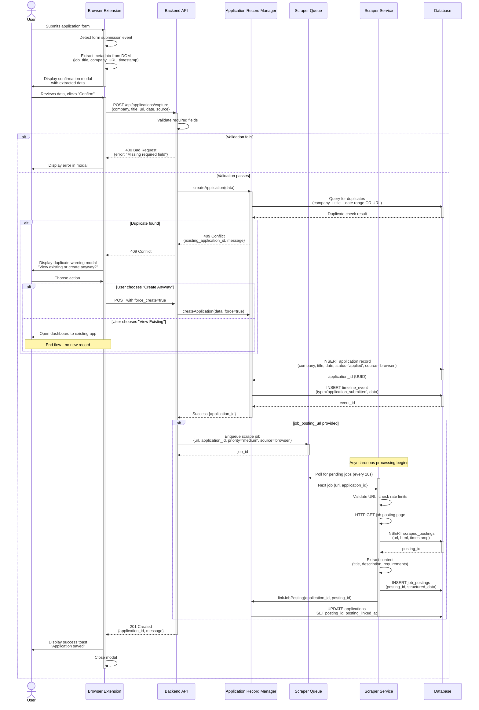
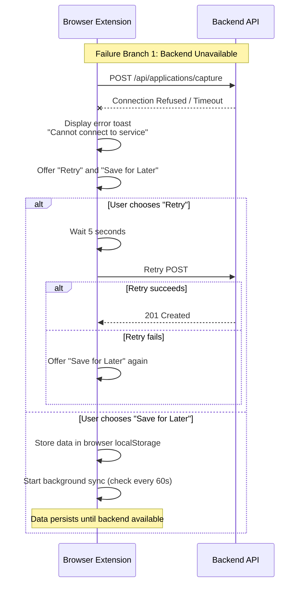
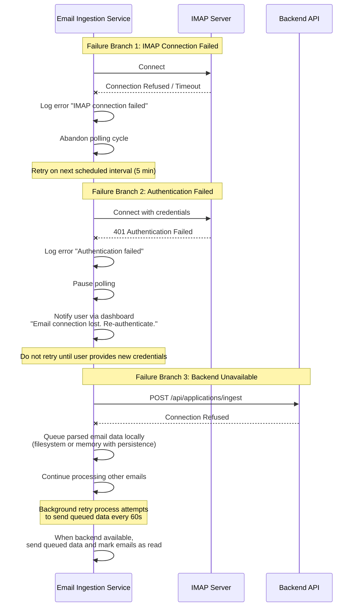
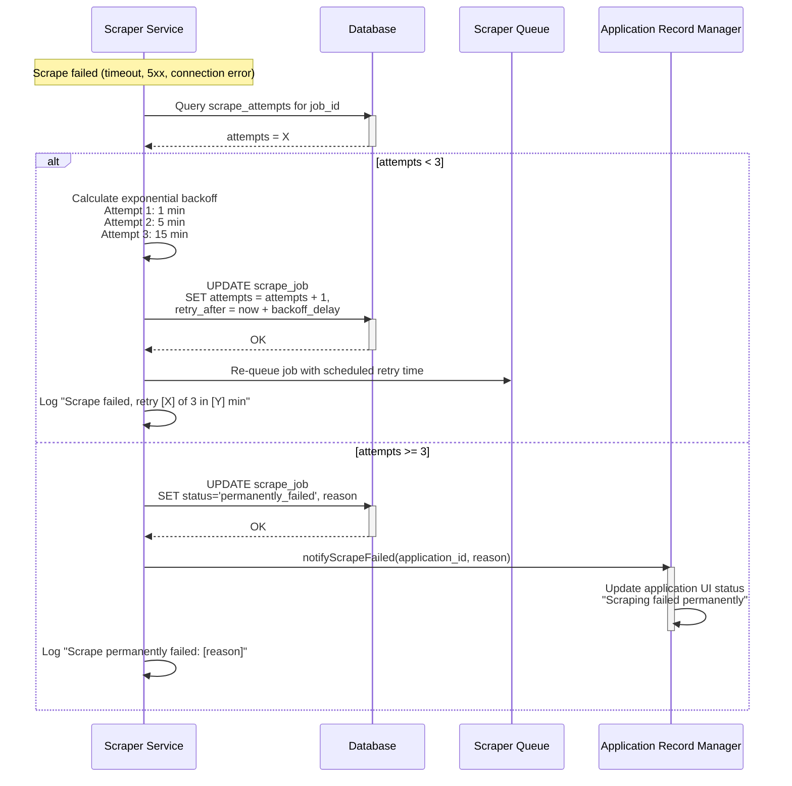
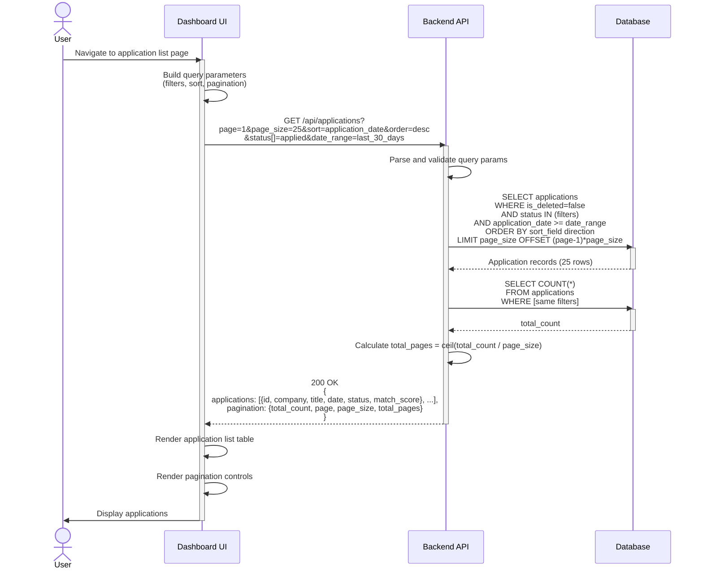
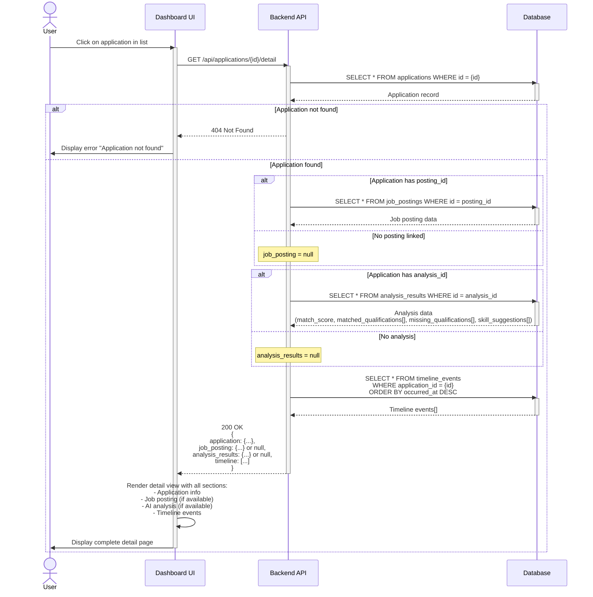
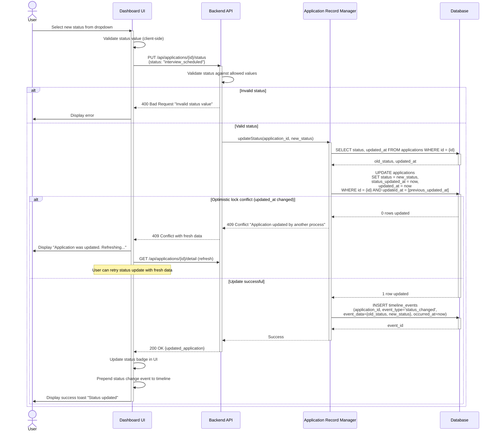
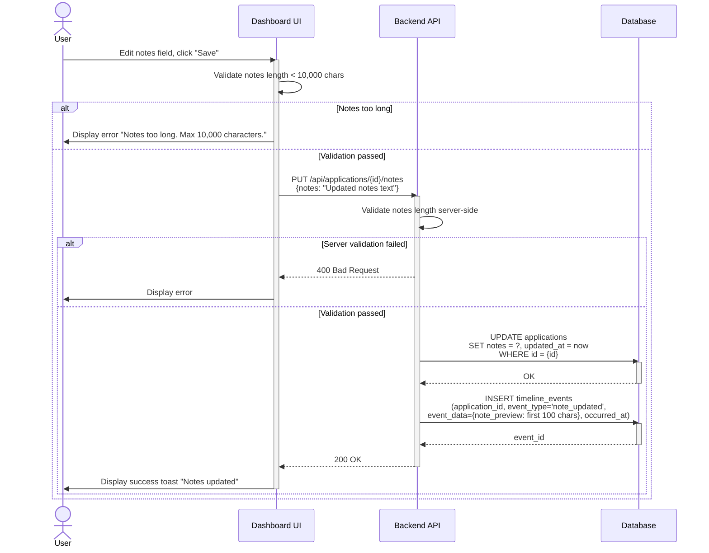
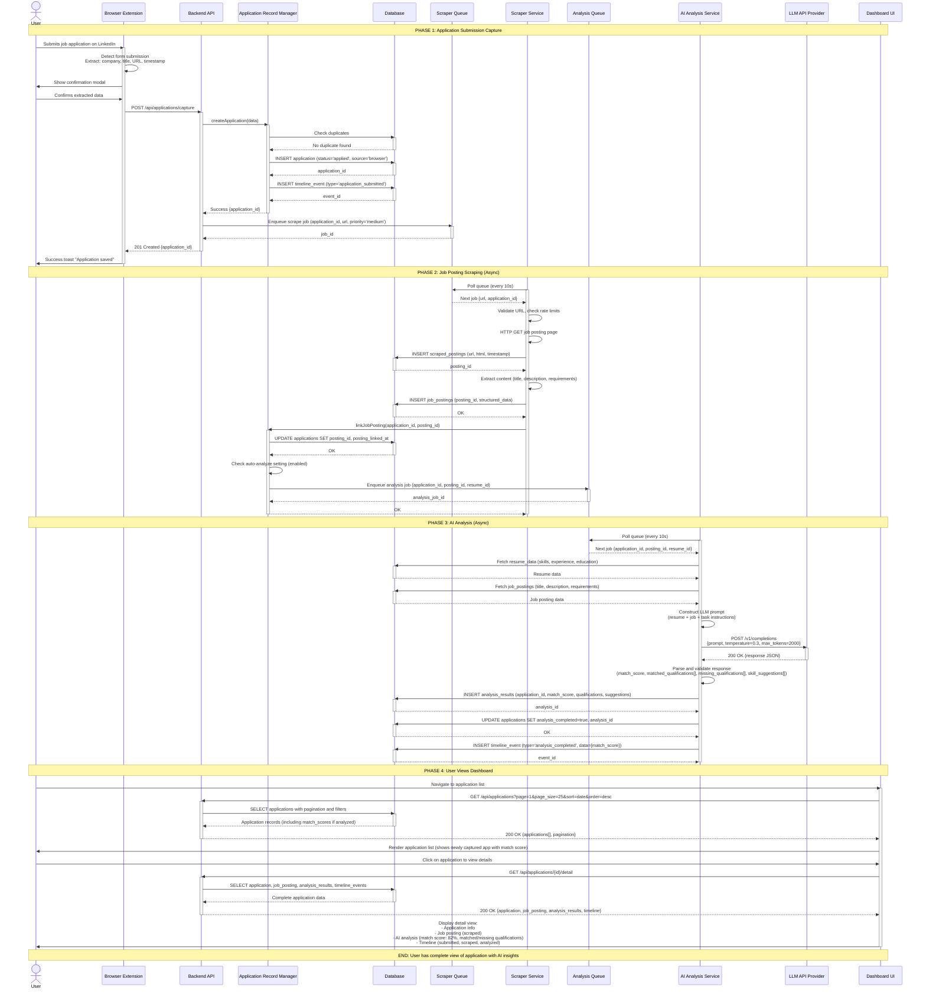

# Job Application Tracker - User Flows & System Sequence Diagrams

**Document Version:** 1.0  
**Last Updated:** December 10, 2025  
**Purpose:** Define user interactions and system component communication patterns

---

## Part 1: High-Level User Flows

### User Flow 1: Browser-Based Application Submission Capture

**Flow ID:** UF-BR-001  
**Primary Actor:** Job Seeker  
**Supporting Actors:** Browser Extension, Backend API, Application Record Manager, Scraping Service

**Start State:** User is on a monitored job board page with an application form

**Main Success Path:**
1. User fills out application form on job board (LinkedIn, Indeed, Greenhouse)
2. User clicks "Submit" button
3. Browser Extension detects form submission event within 200ms
4. Extension extracts metadata from page DOM:
   - Job title from page heading
   - Company name from page metadata
   - Job posting URL from browser address bar
   - Timestamp (current time)
   - Job board source (domain)
5. Extension displays confirmation modal with extracted data (renders within 2000ms)
6. User reviews extracted data in modal
7. **Decision Point A:** Is extracted data correct?
   - **YES:** User clicks "Confirm" → Proceed to step 8
   - **NO:** User edits fields in modal → User clicks "Confirm" → Proceed to step 8
8. Extension sends POST request to Backend API at `http://localhost:[PORT]/api/applications/capture`
9. Backend validates required fields (company_name, job_title)
10. Backend calls ARM to create application record
11. ARM performs duplicate detection (BR-002: check company + title + date, or URL match)
12. **Decision Point B:** Duplicate detected?
    - **NO:** ARM creates new application record → Proceed to step 13
    - **YES:** ARM returns duplicate warning → Backend returns 409 → Extension shows modal: "Application already tracked. View existing or create anyway?" → User chooses → If create anyway, ARM creates record → Proceed to step 13
13. ARM returns application_id
14. **Decision Point C:** Does application have job_posting_url?
    - **YES:** Backend queues scraping job with URL → Proceed to step 15
    - **NO:** Skip scraping → Proceed to step 15
15. Backend returns 201 Created response to extension
16. Extension displays success toast: "Application for [Job Title] at [Company] saved"
17. Extension closes modal

**End State:** Application record created in database; scraping queued if URL present; user notified of success

**Alternate Path 1: Extraction Failure**
- At step 4: Extension cannot extract job title or company name
- Extension sets fields to "Unknown Company" / "Unknown Position"
- Modal displays with visual indicator for missing data
- User MUST manually enter data
- Continue to step 7

**Alternate Path 2: Backend Unavailable**
- At step 8: POST request fails (connection refused)
- Extension displays error toast: "Cannot connect to tracking service. Ensure application is running."
- Extension shows "Retry" and "Save for Later" buttons
- **If Retry:** Wait 5 seconds → Retry POST → If fails again, offer "Save for Later"
- **If Save for Later:** Extension stores data in browser local storage → Success toast: "Application saved locally. Will sync when service available."
- Background sync process attempts to send stored data every 60 seconds

**Alternate Path 3: User Cancels**
- At step 7: User clicks "Cancel" in modal
- Modal closes
- No data sent to backend
- No application created
- User can re-submit form to trigger capture again

**Failure Path 1: Validation Error**
- At step 9: Backend validation fails (e.g., job_title empty after user edit)
- Backend returns 400 with error details
- Extension displays error in modal: "Please enter job title"
- User corrects data → Click confirm → Retry from step 8

**Failure Path 2: Page Navigation Before Confirmation**
- At step 6: User closes tab or navigates away
- Modal dismissed automatically
- Data discarded
- No application created
- No error shown (silent failure acceptable per requirements)

**Missing Data Handling:**
- Job posting URL missing: Application created without URL; no scraping triggered; AI analysis cannot run until URL added manually or description pasted in notes
- Company name missing: Set to "Unknown Company"; user can edit later
- Job title missing: Set to "Unknown Position"; user can edit later

---

### User Flow 2: Email-Based Application Confirmation Ingestion

**Flow ID:** UF-EI-001  
**Primary Actor:** Email Ingestion Service (automated)  
**Supporting Actors:** IMAP Server, Backend API, Application Record Manager, Scraping Service

**Start State:** Email polling interval reached (default: 5 minutes); IMAP connection configured

**Main Success Path:**
1. Email Ingestion Service initiates polling cycle
2. Service connects to IMAP server using stored credentials
3. Service issues SEARCH UNSEEN command on target folder
4. IMAP server returns list of unread email UIDs
5. **Decision Point A:** Any unread emails found?
   - **NO:** Log "No new emails" → End polling cycle → End State (wait for next interval)
   - **YES:** Proceed to step 6
6. Service fetches email messages (headers + body) for each UID
7. For each email, service performs confirmation detection:
   - Check subject line for patterns: "application received", "application submitted", "thank you for applying"
   - Check sender domain against known job boards or tracked companies
   - Check body for patterns: "your application", "application for [job title]"
8. **Decision Point B:** Is email a confirmation?
   - **NO:** Skip email → Continue to next email → Repeat from step 7
   - **YES:** Proceed to step 9
9. Service parses email to extract metadata:
   - Company name from sender domain or body
   - Job title from subject or body
   - Application timestamp (email received time)
   - Job posting URL from body links (if present)
   - Email subject and sender for reference
10. **Decision Point C:** Required fields extracted (company_name, job_title)?
    - **NO:** Flag as "needs_review" but continue → Proceed to step 11
    - **YES:** Proceed to step 11
11. Service calls Backend API POST `/api/applications/ingest` with parsed data
12. Backend validates data and calls ARM to create application record
13. ARM performs duplicate detection (same logic as browser capture)
14. **Decision Point D:** Duplicate detected?
    - **NO:** ARM creates new application record → Proceed to step 15
    - **YES:** ARM checks if duplicate is from email source or different source
      - If email source: Skip creation (already processed) → Proceed to step 18
      - If different source (browser): Present as cross-channel duplicate → Create anyway with note "Confirmed via email" → Proceed to step 15
15. ARM returns application_id
16. **Decision Point E:** Does application have job_posting_url?
    - **YES:** Backend queues scraping job with URL → Proceed to step 17
    - **NO:** Skip scraping → Proceed to step 17
17. Backend returns 201 Created response to Email Service
18. Email Service marks email as read in IMAP (sets \Seen flag)
19. Email Service updates local processed UID tracking (prevent reprocessing if IMAP operation fails)
20. Email Service logs successful processing
21. Repeat steps 7-20 for remaining emails in batch
22. Polling cycle completes

**End State:** All confirmation emails processed; application records created; emails marked as read; scraping queued where applicable

**Alternate Path 1: Partial Extraction**
- At step 10: Company name extracted but job title missing
- Service sets job_title to "Position from [sender domain]"
- Application created with "needs_review" flag
- Dashboard displays with ⚠️ icon indicating incomplete data
- User can edit application to add missing details

**Alternate Path 2: Email with Multiple Jobs**
- At step 9: Email body mentions multiple job titles (bulk submission)
- Service attempts to extract all mentioned job titles
- **Decision Point:** Can separate jobs be identified?
  - **YES:** Create separate application records for each job
  - **NO:** Create single record with note: "Multiple positions mentioned: [list]"

**Failure Path 1: IMAP Connection Failed**
- At step 2: Connection to IMAP server fails (network error, timeout)
- Service logs error: "IMAP connection failed: [reason]"
- Service abandons current polling cycle
- Service waits for next scheduled interval
- No data loss (emails remain unread)
- If failures persist for 5 consecutive cycles, notify user: "Email monitoring not functioning. Check connection."

**Failure Path 2: Authentication Failed**
- At step 2: IMAP authentication rejected (invalid credentials, expired token)
- Service logs error: "IMAP authentication failed"
- Service pauses polling
- Service notifies user via dashboard: "Email connection lost. Please re-authenticate."
- Service does not retry until user provides new credentials

**Failure Path 3: Email Parsing Failure**
- At step 9: Email body is HTML-only with malformed markup; text extraction fails
- Service logs warning: "Failed to parse email [UID]"
- Service skips email (leaves unread)
- Service continues to next email
- Failed email will be retried on next polling cycle

**Failure Path 4: Backend Unavailable**
- At step 11: POST request to backend fails
- Service logs error: "Backend unavailable, queueing email data"
- Service stores parsed email data in local queue (filesystem or memory with persistence)
- Service continues processing remaining emails
- Background retry process attempts to send queued data every 60 seconds
- When backend available, queued data sent and emails marked as read

**Missing Data Handling:**
- Job posting URL missing: Application created without URL; scraping not triggered; user can add URL manually later
- Company name missing: Extract from sender domain (e.g., "noreply@acme.com" → "Acme")
- Job title missing: Set to "Position from [sender]"; flag for review

---

### User Flow 3: Manual Application Creation

**Flow ID:** UF-MAN-001  
**Primary Actor:** User (Job Seeker)  
**Supporting Actors:** Dashboard UI, Backend API, Application Record Manager, Scraping Service

**Start State:** User is viewing dashboard with application list

**Main Success Path:**
1. User clicks "Add Application" button in dashboard
2. Dashboard displays application entry form with fields:
   - Company Name (required)
   - Job Title (required)
   - Application Date (required, defaults to today)
   - Job Posting URL (optional)
   - Status (optional, defaults to "applied")
   - Notes (optional)
3. User fills out form fields
4. User clicks "Save" button
5. Dashboard validates client-side:
   - Company name not empty
   - Job title not empty
   - Application date not in future
   - URL format valid (if provided)
6. **Decision Point A:** Client validation passed?
   - **NO:** Display inline validation errors → Return to step 3
   - **YES:** Proceed to step 7
7. Dashboard sends POST request to Backend API `/api/applications/manual`
8. Backend validates required fields again (server-side)
9. **Decision Point B:** Server validation passed?
   - **NO:** Return 400 with error details → Dashboard displays error → Return to step 3
   - **YES:** Proceed to step 10
10. Backend calls ARM to create application record with source="manual"
11. ARM performs duplicate detection
12. **Decision Point C:** Duplicate detected?
    - **NO:** ARM creates record → Proceed to step 13
    - **YES:** ARM returns duplicate info → Backend returns 409 → Dashboard shows modal: "Similar application found: [Company] - [Job Title] applied on [Date]. Create anyway?" → User decides:
      - **Cancel:** Return to step 2 (keep form data)
      - **View Existing:** Navigate to existing application detail view → End State (no new record)
      - **Create Anyway:** ARM creates record despite duplicate → Proceed to step 13
13. ARM returns application_id
14. **Decision Point D:** Job posting URL provided?
    - **YES:** Backend queues scraping job with priority=high (manual) → Proceed to step 15
    - **NO:** Skip scraping → Proceed to step 15
15. Backend returns 201 Created with application_id
16. Dashboard closes form
17. Dashboard refreshes application list
18. Dashboard displays success toast: "Application created successfully"
19. Dashboard navigates to detail view of new application (optional, user-configurable)

**End State:** Application record created; scraping queued if URL provided; user viewing updated dashboard

**Alternate Path 1: Provide URL Later**
- At step 3: User leaves URL field empty
- Application created without URL
- User later edits application to add URL
- Edit triggers scraping queue entry at that time

**Alternate Path 2: Paste Job Description**
- At step 3: User does not provide URL but pastes full job description in Notes field
- Application created with description in notes
- AI analysis can use notes content if structured properly (future enhancement)

**Failure Path 1: Network Error During Save**
- At step 7: POST request fails (network timeout, backend unavailable)
- Dashboard displays error: "Could not save application. Check connection and retry."
- Dashboard preserves form data
- User clicks "Save" again → Retry from step 7

**Failure Path 2: Validation Errors**
- At step 8: Backend validation fails (e.g., job title exceeds 300 characters)
- Backend returns 400 with specific error message
- Dashboard displays error: "Job title too long. Maximum 300 characters."
- User corrects data → Click "Save" → Retry from step 7

**Missing Data Handling:**
- URL missing: Application created; scraping skipped; AI analysis cannot auto-trigger
- Status missing: Defaults to "applied"
- Application date missing: Defaults to current date
- Notes missing: Stored as empty string

---

### User Flow 4: Job Posting Scraping (Automatic and Manual Triggers)

**Flow ID:** UF-JS-001  
**Primary Actor:** Scraping Service (automated)  
**Supporting Actors:** Backend API, Application Record Manager, HTTP Client

**Start State (Automatic Trigger):** Application created with job_posting_url; scraping job queued

**Start State (Manual Trigger):** User clicks "Scrape Job Posting" button in application detail view

**Main Success Path:**
1. Scraping Service polls scraping queue every 10 seconds
2. Service dequeues next pending scrape job (priority order: manual > browser > email)
3. Service extracts URL from job record
4. Service performs URL validation:
   - URL format valid (HTTP/HTTPS)
   - DNS resolution succeeds
5. **Decision Point A:** URL valid?
   - **NO:** Mark job as failed with reason "URL_NOT_FOUND" → Log error → Update application record with failure → End State
   - **YES:** Proceed to step 6
6. Service performs deduplication check:
   - Normalize URL (remove tracking params, lowercase domain)
   - Query database for existing scraped_postings with same normalized URL
7. **Decision Point B:** Duplicate found?
   - **NO:** Proceed to step 9 (perform scrape)
   - **YES:** Check age of existing scrape
     - **If age < 7 days:** Reuse existing scraped data → Link to application record → Mark job as complete → End State
     - **If age >= 7 days:** Proceed to step 9 (re-scrape for updated content)
8. Service checks rate limit for domain:
   - Query rate limit state (last request time per domain)
   - Calculate: requests in last 60 seconds for this domain
9. **Decision Point C:** Rate limit exceeded (>10 req/min)?
   - **YES:** Delay scrape job by 6 seconds → Re-queue job → End State (will retry on next cycle)
   - **NO:** Proceed to step 10
10. Service performs HTTP GET request:
    - Set User-Agent header (standard browser signature)
    - Set timeout: 30 seconds
    - Follow redirects: max 5
11. Service awaits HTTP response
12. **Decision Point D:** Request outcome?
    - **Timeout:** Mark as failed "TIMEOUT" → Retry logic (step 23) → End State
    - **4xx/5xx Error:** Mark as failed "HTTP_[code]" → Retry logic (step 23) → End State
    - **Connection Error:** Mark as failed "CONNECTION_ERROR" → Retry logic (step 23) → End State
    - **Success (200-299):** Proceed to step 13
13. Service stores raw HTML in database:
    - Create scraped_postings record with: url (normalized), html_content, fetch_timestamp, http_status, final_url (post-redirect), content_hash
14. Service extracts job posting content from HTML:
    - Job title (h1, meta og:title, or class patterns)
    - Company name (meta, class patterns, or domain inference)
    - Job description (largest text block in main content)
    - Requirements section (headers: "Requirements", "Qualifications")
    - Nice-to-have section (headers: "Nice to Have", "Bonus")
    - Salary range (regex patterns: $XX,XXX - $XX,XXX)
    - Location (meta, class patterns)
    - Employment type (patterns: Full-time, Part-time)
15. **Decision Point E:** Critical fields extracted (job_title, description)?
    - **NO:** Mark extraction as incomplete; store partial data → Proceed to step 16
    - **YES:** Mark extraction as complete → Proceed to step 16
16. Service stores extracted job_postings record with posting_id
17. Service calls ARM to link application with posting_id (ARM-003)
18. ARM updates application record: posting_id = scraped_posting_id, posting_linked_at = timestamp
19. **Decision Point F:** Auto-analyze enabled?
    - **YES:** ARM triggers AI analysis (AI-001) → Queue analysis job
    - **NO:** Skip analysis trigger
20. Service marks scrape job as complete
21. Service logs success: "Scrape completed for [URL]"
22. Service updates application status indicator in dashboard (via websocket or polling)

**End State:** Job posting scraped and stored; application linked to posting; AI analysis queued (if enabled); user notified in dashboard

**Alternate Path 1: Partial Extraction**
- At step 15: Job title extracted but description missing or truncated
- Service stores available data
- Application detail view shows "Incomplete job data" warning
- User can manually paste description into notes or retry scrape

**Alternate Path 2: JavaScript-Rendered Page**
- At step 14: HTML contains minimal content (SPA skeleton); no job data in initial HTML
- Extraction finds no job title or description
- Mark as failed "INCOMPLETE_EXTRACTION"
- Log warning: "Page may require JavaScript rendering"
- User notified: "Could not extract job details. Page may require JavaScript."
- System does not retry (headless browser not implemented in MVP)

**Alternate Path 3: Paywall or Login Required**
- At step 12: Response is 200 but HTML is login page (detected by title or content patterns)
- Extraction finds no job data
- Mark as failed "AUTHENTICATION_REQUIRED"
- User notified: "Job posting requires login. Cannot scrape automatically."
- User can manually copy/paste description into notes

**Failure Path 1: Timeout**
- At step 11: HTTP request times out after 30 seconds
- Mark job as failed "TIMEOUT"
- Proceed to Retry Logic (step 23)

**Failure Path 2: HTTP Error (404, 403, 5xx)**
- At step 12: Response code 4xx or 5xx
- Mark job as failed "HTTP_[code]"
- **If 404:** Permanent failure (no retry) → Notify user: "Job posting no longer available"
- **If 403:** Permanent failure (access forbidden) → Notify user: "Access denied to job posting"
- **If 5xx:** Temporary failure → Proceed to Retry Logic (step 23)

**Failure Path 3: Connection Error**
- At step 11: Network error (DNS failure, connection refused)
- Mark job as failed "CONNECTION_ERROR"
- Proceed to Retry Logic (step 23)

**Retry Logic (Step 23):**
- Query scrape_attempts count for this job
- **If attempts < 3:**
  - Calculate backoff delay: 1 min, 5 min, 15 min (exponential)
  - Re-queue job with scheduled retry time
  - Log: "Scrape failed, retry [X] of 3 in [Y] minutes"
- **If attempts >= 3:**
  - Mark job as permanently failed
  - Notify user: "Could not scrape [URL]: [reason]. No more retries."
  - Application remains with available metadata; no posting linked

**Missing Data Handling:**
- Job title missing: Attempt extraction from page title or URL slug; if still missing, leave null
- Company name missing: Extract from URL domain (e.g., "jobs.acme.com" → "Acme")
- Salary range missing: Set to null (not required for analysis)
- Location missing: Set to "Not specified"
- Requirements not distinct from description: Attempt paragraph classification; if fails, store entire description

---

### User Flow 5: Resume Upload and Parsing

**Flow ID:** UF-RP-001  
**Primary Actor:** User (Job Seeker)  
**Supporting Actors:** Dashboard UI, Backend API, Resume Parser Service, Database

**Start State:** User navigates to Settings or Profile section in dashboard

**Main Success Path:**
1. User clicks "Upload Resume" button
2. Dashboard displays file picker dialog with filters: PDF, DOCX, TXT
3. User selects resume file from filesystem
4. Dashboard validates file client-side:
   - File size < 10MB
   - File extension matches supported formats (.pdf, .docx, .txt)
5. **Decision Point A:** Client validation passed?
   - **NO:** Display error: "Invalid file. Please upload PDF, DOCX, or TXT under 10MB." → Return to step 2
   - **YES:** Proceed to step 6
6. Dashboard displays upload progress indicator
7. Dashboard sends multipart POST request to Backend API `/api/resumes/upload`
8. Backend receives file and validates server-side:
   - File size < 10MB
   - MIME type matches extension
   - Write file to upload directory with UUID-based filename
9. **Decision Point B:** Server validation passed?
   - **NO:** Return 400 with error → Dashboard displays error → Return to step 2
   - **YES:** Proceed to step 10
10. Backend creates resumes record in database: filename, upload_timestamp, file_path, status=pending
11. Backend returns 201 with resume_id
12. Backend queues parsing job for Resume Parser Service
13. Dashboard displays: "Resume uploaded. Parsing in progress..."
14. Resume Parser Service dequeues parsing job
15. Parser determines file format from extension
16. **Decision Point C:** File format?
    - **PDF:** Use PDF extraction library (pdfplumber, PyPDF2) → Extract text page by page → Proceed to step 17
    - **DOCX:** Use DOCX library (python-docx) → Extract paragraphs and tables → Proceed to step 17
    - **TXT:** Read file with UTF-8 encoding → Proceed to step 17
17. Parser receives extracted plain text
18. **Decision Point D:** Text extraction successful?
    - **NO (empty or error):** Mark resume as failed → Update status to "failed" with error → Notify user: "Could not extract text from resume. File may be scanned PDF or corrupted." → End State
    - **YES:** Proceed to step 19
19. Parser normalizes text (remove excess whitespace, consistent newlines)
20. Parser performs section identification (case-insensitive keyword matching):
    - Contact Info: Look for "Contact", "Email", "Phone" (typically top of resume)
    - Summary: "Summary", "Objective", "Profile"
    - Experience: "Experience", "Work History", "Employment"
    - Education: "Education", "Academic Background"
    - Skills: "Skills", "Technical Skills", "Competencies"
    - Certifications: "Certifications", "Licenses"
21. **Decision Point E:** Sections identified?
    - **NO (unstructured resume):** Place entire content in "other" section → Log warning → Proceed to step 22
    - **YES:** Proceed to step 22
22. Parser performs structured data extraction:
    - **Contact Info:** Extract email (regex), phone (regex), location (patterns)
    - **Skills:** Extract comma-separated or bullet list → Store as array
    - **Experience:** Extract job entries with company, title, dates, responsibilities → Store as array of objects
    - **Education:** Extract institution, degree, major, year → Store as array of objects
    - **Certifications:** Extract cert names → Store as array
23. **Decision Point F:** Structured extraction successful?
    - **Partial Success:** Store successfully extracted fields; store raw text for failed sections → Proceed to step 24
    - **Complete Failure:** Store all raw text in unstructured format → Log warning → Proceed to step 24
    - **Full Success:** Proceed to step 24
24. Parser stores structured data in resume_data table linked to resume_id
25. Parser checks for existing active resume
26. **Decision Point G:** Existing active resume found?
    - **YES:** Mark existing resume as archived: is_active=false, archived_at=timestamp → Proceed to step 27
    - **NO:** Proceed to step 27
27. Parser marks new resume as active: is_active=true
28. Parser updates resume status to "completed"
29. Backend notifies dashboard (via websocket or polling)
30. Dashboard displays success: "Resume uploaded and parsed successfully"
31. Dashboard shows resume preview with extracted sections

**End State:** Resume uploaded, parsed, and set as active; previous resume archived; extracted data available for AI analysis

**Alternate Path 1: Scanned PDF**
- At step 17: PDF text extraction returns empty or minimal text (image-based PDF)
- Parser detects empty text
- Mark as failed with error: "PDF contains no extractable text. Please use text-based PDF or run OCR first."
- Notify user with clear message
- Resume record remains but status=failed
- User must re-upload text-based version

**Alternate Path 2: Password-Protected File**
- At step 16: File access fails due to password protection
- Parser catches exception
- Mark as failed with error: "Document is password-protected. Please remove password and re-upload."
- Notify user
- Resume record status=failed

**Alternate Path 3: Unconventional Format**
- At step 20: No standard section headers found
- Parser places all content in "other" section
- Structured extraction attempts pattern matching for skills, dates, company names
- If patterns found, extract to structured fields
- If no patterns, store as raw text
- Mark extraction as incomplete
- Notify user: "Resume format not standard. AI analysis may be less accurate."
- Resume still usable for analysis

**Alternate Path 4: Multiple Resume Uploads**
- At step 10: User has already uploaded resume in past
- Current resume remains active during new upload parsing
- At step 26: Existing active resume found and archived after new resume parsing completes
- User can view archived resumes in settings
- Only active resume used for AI analysis

**Failure Path 1: File Upload Network Error**
- At step 7: POST request fails (network timeout)
- Dashboard displays error: "Upload failed. Check connection and retry."
- User clicks "Upload Resume" again → Restart from step 2

**Failure Path 2: Corrupted File**
- At step 16: File cannot be opened or read (corrupted)
- Parser catches exception
- Mark as failed with error: "Resume file is corrupted. Please re-upload."
- Notify user
- Resume record status=failed

**Failure Path 3: Parsing Service Unavailable**
- At step 14: Parsing service crashes or is not running
- Job remains in queue
- After 5 minutes, backend checks stuck jobs
- Notify user: "Resume parsing delayed. Service will retry automatically."
- When service restarts, job processed from queue

**Missing Data Handling:**
- Email missing from contact section: Set to null; user can add manually in settings
- Skills section empty: Initialize as empty array; AI analysis proceeds with available data
- Experience entries unparseable: Store as raw text strings; AI analysis can still process text
- Education missing: Set to null; not required for analysis

---

### User Flow 6: AI Analysis Pipeline (Auto-Trigger + Manual Re-Run)

**Flow ID:** UF-AI-001  
**Primary Actor:** AI Analysis Service (automated for auto-trigger); User (for manual re-run)  
**Supporting Actors:** Backend API, Application Record Manager, LLM API Provider, Database

**Start State (Auto-Trigger):** Application created with linked job posting; auto-analyze enabled in settings

**Start State (Manual Re-Run):** User viewing application detail; clicks "Run Analysis" or "Re-run Analysis" button

**Main Success Path (Auto-Trigger):**
1. ARM detects new application with posting_id linked (triggered by scraping completion)
2. ARM checks if auto-analyze setting enabled
3. **Decision Point A:** Auto-analyze enabled?
   - **NO:** Skip analysis → End State
   - **YES:** Proceed to step 4
4. ARM queries for active resume (is_active=true)
5. **Decision Point B:** Active resume exists?
   - **NO:** Log warning "No active resume for auto-analysis" → End State
   - **YES:** Proceed to step 6
6. ARM queues analysis job: application_id, posting_id, resume_id, status=pending, queued_at=timestamp
7. AI Analysis Service polls analysis queue every 10 seconds
8. Service dequeues next pending analysis job
9. Service fetches resume data from resume_data table
10. Service fetches job posting data from job_postings table
11. **Decision Point C:** Job posting has description data?
    - **NO:** Mark analysis as failed "MISSING_JOB_DATA" → Notify user: "Job posting data incomplete. Cannot analyze." → End State
    - **YES:** Proceed to step 12
12. Service constructs LLM prompt:
    - System context: "You are a job application analyzer..."
    - Resume input: Include summary, skills array, experience entries, education, certifications
    - Job posting input: Include job_title, company, description, requirements, nice_to_have
    - Task: "Analyze match... Provide: (1) match score 0-100, (2) matched qualifications, (3) missing qualifications, (4) top 3 skill suggestions"
    - Output format: "Return JSON: {match_score, matched_qualifications, missing_qualifications, skill_suggestions}"
13. **Decision Point D:** Combined prompt size > 12,000 tokens?
    - **YES:** Truncate job description while preserving requirements section → Proceed to step 14
    - **NO:** Proceed to step 14
14. Service calls LLM API (OpenAI, Anthropic, or configured provider):
    - POST request with prompt, temperature=0.3, max_tokens=2000
    - Timeout: 60 seconds
15. Service awaits API response
16. **Decision Point E:** API call outcome?
    - **Success (200):** Proceed to step 17
    - **Rate Limit (429):** Handle retry with backoff (step 28) → End State (will retry)
    - **Timeout:** Handle retry (step 28) → End State (will retry)
    - **Auth Error (401/403):** Mark failed "API_KEY_INVALID" → Notify user: "AI service not configured. Add API key in settings." → End State
    - **Server Error (5xx):** Handle retry with backoff (step 28) → End State (will retry)
17. Service receives response body
18. Service parses JSON from response (may be wrapped in markdown code blocks)
19. **Decision Point F:** Valid JSON parsed?
    - **NO:** Attempt to extract JSON from markdown fences (```json ... ```) → If still fails, mark as failed "INVALID_RESPONSE" → Notify user: "AI analysis failed. Retry." → End State
    - **YES:** Proceed to step 20
20. Service validates JSON structure:
    - match_score: present and numeric (if outside 0-100, clamp to range)
    - matched_qualifications: present and array
    - missing_qualifications: present and array
    - skill_suggestions: present and array
21. **Decision Point G:** Validation passed?
    - **NO:** Mark as failed "INVALID_RESPONSE_STRUCTURE" → Notify user → End State
    - **YES:** Proceed to step 22
22. Service stores analysis_results record:
    - application_id, match_score, matched_qualifications (JSON array), missing_qualifications (JSON array), skill_suggestions (JSON array), analyzed_at=timestamp, model_used=[provider]
23. Service updates application record: analysis_completed=true, analysis_id=result_id
24. Service marks analysis job as complete
25. Service logs success: "Analysis completed for application [id], match score: [score]"
26. Backend notifies dashboard (via websocket or polling)
27. Dashboard updates application detail view with analysis results

**End State:** AI analysis completed; results stored and linked to application; displayed in dashboard

**Main Success Path (Manual Re-Run):**
- Starts at step 8 (user clicks "Run Analysis" → Backend creates analysis job → Service processes)
- At step 22: If previous analysis exists, archive it (soft delete or version)
- New analysis result replaces displayed result in UI
- All other steps same as auto-trigger

**Alternate Path 1: Low Match Score**
- At step 22: match_score is 0-15 (very low)
- Service stores score as-is (no suppression)
- missing_qualifications array is extensive
- User sees low score prominently in UI
- UI displays message: "Significant skill gap. Consider tailoring resume or focusing on skill development."

**Alternate Path 2: Incomplete Data**
- At step 10: Job posting has only title and company (no description)
- At step 11: Missing description → Mark failed "MISSING_JOB_DATA"
- OR: If requirements section present but description missing, proceed with available data
- Prompt includes note: "Job description unavailable. Analyze based on title and requirements."
- Analysis proceeds but includes disclaimer: "Analysis based on limited data"

**Failure Path 1: No Active Resume**
- At step 5: No resume with is_active=true
- Mark analysis as failed "NO_ACTIVE_RESUME"
- Notify user: "Please upload resume before running analysis"
- Provide link to resume upload page

**Failure Path 2: API Rate Limit (429)**
- At step 16: API returns 429 Too Many Requests
- Service logs: "Rate limit hit for [provider]"
- Proceed to Retry Logic (step 28)
- User sees status: "Analysis queued (rate limit)"

**Failure Path 3: API Timeout**
- At step 15: API request times out after 60 seconds
- Service logs: "API timeout for [provider]"
- Proceed to Retry Logic (step 28)
- Retry once after 10 seconds
- If second timeout, mark as failed "TIMEOUT"
- Notify user: "AI analysis timed out. Please retry."

**Failure Path 4: Invalid API Key**
- At step 16: API returns 401 or 403
- Mark as failed "API_KEY_INVALID" immediately (no retry)
- Notify user: "AI service not configured. Please add valid API key in settings."
- Provide link to settings page

**Retry Logic (Step 28):**
- Query analysis_attempts count for this job
- **If attempts < 3:**
  - Calculate backoff:
    - Rate limit (429): 1 min, 5 min, 15 min (exponential)
    - Timeout: 10 sec, 5 min, 15 min
    - Server error (5xx): 1 min, 5 min, 15 min
  - Re-queue job with scheduled retry time
  - Log: "Analysis failed, retry [X] of 3 in [Y]"
  - User sees status: "Analysis in progress (retry [X])"
- **If attempts >= 3:**
  - Mark as permanently failed
  - Notify user: "AI analysis failed after 3 attempts. [Reason]. Please retry manually."

**Missing Data Handling:**
- Skills array empty in resume: Analysis proceeds; matched_qualifications may be sparse
- Requirements section missing from job: Analysis uses description only; may be less specific
- Education missing from resume: Not critical; analysis focuses on skills and experience

---

### User Flow 7: Application Status Updates and Timeline Events

**Flow ID:** UF-ST-001  
**Primary Actor:** User (Job Seeker)  
**Supporting Actors:** Dashboard UI, Backend API, Application Record Manager, Timeline Service

**Start State:** User viewing application detail page

**Main Success Path (Status Update):**
1. User reviews current application status (e.g., "Applied")
2. User clicks status dropdown or "Update Status" button
3. Dashboard displays status selection dropdown with options:
   - Applied, Screening, Interview Scheduled, Interviewed, Offer Received, Accepted, Rejected, Withdrawn
4. User selects new status (e.g., "Interview Scheduled")
5. **Decision Point A:** Status requires additional details?
   - **Interview Scheduled:** Optional prompt for date/time → If provided, create manual timeline event → Proceed to step 6
   - **Other statuses:** Proceed to step 6
6. Dashboard sends PUT request to Backend API `/api/applications/{id}/status` with new status
7. Backend validates status value against allowed list
8. **Decision Point B:** Valid status?
   - **NO:** Return 400 "Invalid status value" → Dashboard displays error → Return to step 3
   - **YES:** Proceed to step 9
9. Backend calls ARM to update application status (ARM-004)
10. ARM fetches current status from application record (old_status)
11. ARM updates application record: status = new_status, status_updated_at = timestamp, updated_at = timestamp
12. ARM calls Timeline Service to create status change event (TL-001)
13. Timeline Service creates timeline_events record:
    - event_type = "status_changed"
    - application_id = [id]
    - event_data = {old_status: [old], new_status: [new]}
    - occurred_at = timestamp
14. ARM returns success response
15. Backend returns 200 OK
16. Dashboard updates application detail view:
    - Status badge reflects new status
    - Timeline section prepends new status change event
17. Dashboard displays success toast: "Status updated to [new_status]"

**End State:** Application status updated; status change logged in timeline; UI reflects changes

**Main Success Path (Manual Timeline Event):**
1. User viewing application detail page
2. User clicks "Add Event" or "Add Note to Timeline" button
3. Dashboard displays timeline event form:
   - Event Type dropdown: Interview Scheduled, Email Sent, Phone Call, Other
   - Description text area
   - Date/Time picker (defaults to now)
4. User fills out form
5. User clicks "Save Event"
6. Dashboard sends POST request to Backend API `/api/applications/{id}/timeline/events`
7. Backend validates event type and description not empty
8. **Decision Point C:** Validation passed?
   - **NO:** Return 400 with error → Dashboard displays error → Return to step 4
   - **YES:** Proceed to step 9
9. Backend calls Timeline Service (TL-003)
10. Timeline Service creates timeline_events record:
    - event_type = "manual_[type]" (e.g., "manual_interview_scheduled")
    - application_id = [id]
    - event_data = {description: [text], manually_added_by_user: true}
    - occurred_at = [user-specified or now]
11. Timeline Service returns event_id
12. Backend returns 201 Created
13. Dashboard closes event form
14. Dashboard refreshes timeline section
15. Dashboard displays new manual event in timeline with distinct icon (e.g., 📝)
16. Dashboard displays success toast: "Event added to timeline"

**End State:** Manual timeline event created and displayed; timeline reflects user action

**Alternate Path 1: Status Update with Notes**
- At step 5: After selecting status, dashboard prompts: "Add notes about this status change?"
- User enters notes (optional)
- Notes included in PUT request as separate field
- Backend updates application notes field in addition to status
- Notes update logged as separate timeline event (note_added)

**Alternate Path 2: Bulk Status Update**
- Start: User viewing application list (not detail)
- User selects multiple applications (checkboxes)
- User clicks "Bulk Update Status" from toolbar
- Dashboard prompts for new status
- User selects status
- Dashboard sends bulk PUT request with array of application IDs
- Backend iterates through IDs, updates each status, creates timeline events
- Returns summary: "Updated [X] applications"

**Failure Path 1: Optimistic Concurrency Conflict**
- At step 11: Application record has updated_at timestamp newer than expected (concurrent update)
- ARM detects conflict (compare timestamps)
- Return 409 Conflict with latest data
- Dashboard displays: "Application was updated by another process. Refreshing..."
- Dashboard reloads application data
- User retries status update with fresh data

**Failure Path 2: Application Not Found**
- At step 9: Application ID does not exist (deleted by concurrent operation)
- ARM returns 404
- Backend returns 404
- Dashboard displays error: "Application no longer exists"
- Dashboard redirects to application list

**Missing Data Handling:**
- Date/time for manual event not specified: Default to current timestamp
- Description for manual event empty: Reject with validation error (description required for manual events)

---

### User Flow 8: Exporting Data (CSV, JSON)

**Flow ID:** UF-EX-001  
**Primary Actor:** User (Job Seeker)  
**Supporting Actors:** Dashboard UI, Backend API, Export Service

**Start State:** User viewing application list or detail page

**Main Success Path:**
1. User clicks "Export" button in dashboard toolbar
2. Dashboard displays export configuration modal with options:
   - **Format:** CSV (default) or JSON (radio buttons)
   - **Date Range:** All time (default), Last 30 days, Last 90 days, Custom range (date pickers)
   - **Status Filter:** All statuses (default), or multi-select specific statuses
   - **Include AI Analysis:** Checkbox (default: checked)
3. User configures export options
4. User clicks "Export" button in modal
5. Dashboard validates selections:
   - If custom date range: end date >= start date
   - Format selected
6. **Decision Point A:** Validation passed?
   - **NO:** Display inline error → Return to step 3
   - **YES:** Proceed to step 7
7. Dashboard sends POST request to Backend API `/api/applications/export` with:
   - format: "csv" or "json"
   - date_range: {start, end} or null (all time)
   - status_filter: [array of statuses] or null (all)
   - include_analysis: true/false
8. Backend validates parameters:
   - Format is "csv" or "json"
   - Date range valid (if provided)
   - Status values valid (if provided)
9. **Decision Point B:** Validation passed?
   - **NO:** Return 400 with error details → Dashboard displays error → Return to step 3
   - **YES:** Proceed to step 10
10. Backend calls Export Service with parameters
11. Export Service queries database for applications matching filters:
    - Apply date range filter on application_date
    - Apply status filter
    - Include joins for job_postings (if linked), analysis_results (if include_analysis=true)
    - Exclude soft-deleted records (is_deleted=false)
12. **Decision Point C:** Any records match filters?
    - **NO:** Proceed to step 13 (export empty file)
    - **YES:** Proceed to step 13
13. **Decision Point D:** Export format?
    - **CSV:** Export Service generates CSV (step 14-17)
    - **JSON:** Export Service generates JSON (step 18-20)

**CSV Generation Path (Steps 14-17):**
14. Export Service constructs CSV with columns:
    - Basic: company_name, job_title, application_date, status, source, job_posting_url
    - Analysis (if include_analysis=true): match_score, matched_qualifications_count, missing_qualifications_count
    - Notes: notes (truncated to 500 chars or full based on config)
    - Timestamps: created_at, updated_at
15. Export Service writes header row
16. Export Service iterates through query results, writes each row:
    - Properly escape commas, quotes, newlines in text fields
    - Empty fields rendered as empty string
    - Analysis fields show "N/A" if analysis not run
17. Export Service saves CSV file to temp directory with filename: `job_tracker_export_[timestamp].csv`
18. Proceed to step 21

**JSON Generation Path (Steps 18-20):**
18. Export Service constructs JSON array of application objects
19. Each object includes:
    - All application fields
    - Nested job_posting object (if linked)
    - Nested analysis_results object (if include_analysis=true and analysis exists)
    - Nested timeline_events array (optional, based on config)
20. Export Service serializes to JSON with 2-space indentation, UTF-8 encoding
21. Export Service saves JSON file to temp directory with filename: `job_tracker_export_[timestamp].json`

**File Delivery (Steps 21-25):**
21. Export Service returns file path to Backend
22. Backend returns 200 OK with response:
    - file_id: [UUID]
    - filename: [timestamp-based name]
    - record_count: [number of exported applications]
    - file_size: [bytes]
    - download_url: `/api/exports/download/{file_id}`
23. Dashboard closes export modal
24. Dashboard triggers file download by navigating to download_url
25. Browser downloads file with appropriate Content-Disposition header
26. Dashboard displays success toast: "Export complete. [count] applications exported."
27. Backend schedules cleanup: delete export file after 24 hours

**End State:** Data exported to CSV or JSON; file downloaded by user; temporary file scheduled for cleanup

**Alternate Path 1: Large Export (>1000 records)**
- At step 12: Query returns >1000 records
- Backend responds immediately with: "Export queued. You will be notified when ready."
- Export Service processes asynchronously
- When complete, notify user via dashboard notification
- User downloads from notification link or Exports history page

**Alternate Path 2: No Matching Records**
- At step 12: No applications match filters
- Export Service generates empty file (CSV with headers only, JSON with empty array)
- File still downloadable
- Toast message: "Export complete. 0 records matched filters."

**Alternate Path 3: Re-Download Previous Export**
- At step 2: Dashboard shows "Recent Exports" section with exports from last 24 hours
- User clicks download icon on previous export
- Dashboard navigates to existing download_url
- File re-downloaded (if still within 24-hour retention)
- If file expired (>24 hours), display: "Export expired. Please create new export."

**Failure Path 1: Export Generation Error**
- At step 16 or 20: File write fails (disk space, permissions)
- Export Service logs error
- Backend returns 500 with error: "Could not generate export. Check disk space and try again."
- Dashboard displays error message
- User can retry export

**Failure Path 2: Download Network Error**
- At step 24: Download fails (network interruption)
- Browser handles download failure (retry mechanism browser-dependent)
- User can re-download from "Recent Exports" section within 24 hours

**Missing Data Handling:**
- Applications with no analysis: Analysis columns show "N/A" in CSV, null in JSON
- Applications with no job posting: job_posting fields null or omitted
- Empty notes: Rendered as empty string in CSV, empty string or null in JSON

---

### User Flow 9: Recovering from Failures

**Flow ID:** UF-REC-001  
**Primary Actor:** User (Job Seeker) or System (automated recovery)  
**Supporting Actors:** Dashboard UI, Backend API, Scraping Service, AI Analysis Service, Email Ingestion Service

---

#### Subflow 9A: Recovering from Scraping Failures

**Start State:** Scraping job failed permanently after 3 retries; application has no linked job posting

**Main Success Path (Manual Retry):**
1. User views application detail page
2. Dashboard displays scraping failure indicator:
   - Warning badge: "⚠️ Scraping Failed"
   - Error message: "Could not scrape job posting: [reason]"
3. User clicks "Retry Scrape" button
4. Dashboard sends POST request to Backend API `/api/applications/{id}/scrape/retry`
5. Backend calls Scraping Service to create new scrape job with priority=high (manual)
6. Scraping Service adds job to queue with reset retry counter (attempts=0)
7. Backend returns 202 Accepted
8. Dashboard displays: "Scraping queued. Will retry shortly."
9. Dashboard shows progress indicator for scraping status
10. Scraping Service processes job following UF-JS-001 flow
11. **Decision Point A:** Scrape successful this time?
    - **YES:** Job posting linked to application → Dashboard updates to show job details → Success toast: "Job posting scraped successfully" → End State
    - **NO:** Fails again → Display same error → User can try alternative (step 12)
12. User chooses alternative approach: "Paste Job Description"
13. Dashboard displays text area: "Paste full job description here"
14. User pastes job description from external source (browser copy/paste)
15. User clicks "Save"
16. Dashboard sends PUT request to Backend API `/api/applications/{id}/notes` with pasted content
17. Backend saves content in notes field with prefix: "[Manual Job Description]"
18. Dashboard displays: "Job description saved in notes. AI analysis can now run (with limitations)."
19. User can now trigger AI analysis manually (may have reduced accuracy without structured data)

**End State:** Either scraping succeeded on retry OR user manually provided job description; AI analysis can proceed

**Alternate Path:** URL No Longer Valid (404)
- At step 11: Scrape fails with 404 (job posting removed)
- System marks as permanently failed with reason "JOB_REMOVED"
- Dashboard displays: "Job posting no longer available (404). Consider adding URL for archived version or pasting description manually."
- User can update job_posting_url field with archive.org link or similar
- Or use manual paste flow (step 12-19)

---

#### Subflow 9B: Recovering from AI Analysis Failures

**Start State:** AI analysis failed after 3 retries; application has no analysis results

**Main Success Path (Manual Retry with Fixed Issue):**
1. User views application detail page
2. Dashboard displays analysis failure indicator:
   - Warning badge: "⚠️ Analysis Failed"
   - Error message: "AI analysis failed: [reason]"
3. **Decision Point A:** Failure reason?
   - **API_KEY_INVALID:** User clicks "Configure API Key" → Navigate to settings → User adds valid API key → Return to step 4
   - **NO_ACTIVE_RESUME:** User clicks "Upload Resume" → Follow UF-RP-001 → Return to step 4
   - **MISSING_JOB_DATA:** User clicks "Edit Job Details" → User pastes job description in notes → Return to step 4
   - **TIMEOUT / RATE_LIMIT / SERVER_ERROR:** Proceed to step 4
4. User clicks "Retry Analysis" button
5. Dashboard sends POST request to Backend API `/api/applications/{id}/analysis/retry`
6. Backend validates prerequisites:
   - Active resume exists
   - Job posting or notes with description exists
   - API key configured
7. **Decision Point B:** Prerequisites met?
   - **NO:** Return 400 with specific error (e.g., "Please upload resume first") → Dashboard displays error → Return to step 3
   - **YES:** Proceed to step 8
8. Backend calls AI Analysis Service to create new analysis job with reset retry counter
9. AI Analysis Service adds job to queue
10. Backend returns 202 Accepted
11. Dashboard displays: "Analysis in progress..."
12. Dashboard shows progress indicator
13. AI Analysis Service processes job following UF-AI-001 flow
14. **Decision Point C:** Analysis successful this time?
    - **YES:** Results stored and displayed → Success toast: "Analysis complete: [match_score]% match" → End State
    - **NO:** Fails again → Display error with detailed message → User can contact support or wait and retry later

**End State:** Analysis succeeded on retry OR user informed of persistent failure with troubleshooting steps

**Alternate Path:** Provider-Specific Failure
- At step 3: Error reason is "RATE_LIMIT" for specific provider (e.g., OpenAI)
- Dashboard displays: "Rate limit reached for [provider]. Analysis will retry automatically or you can switch providers in settings."
- User navigates to settings
- User changes LLM provider (e.g., from OpenAI to Anthropic)
- User returns to application detail
- User clicks "Retry Analysis"
- System uses new provider
- Analysis proceeds with different provider

---

#### Subflow 9C: Recovering from Email Parsing Failures

**Start State:** Email confirmation detected but parsing failed; no application created

**Main Success Path (Manual Entry from Email):**
1. Email Ingestion Service detects confirmation email
2. Service attempts to parse email
3. Parsing fails (cannot extract company_name or job_title)
4. Service logs error: "Failed to parse email [UID]: [reason]"
5. Service leaves email unread (will retry on next poll)
6. **Decision Point A:** Retry on next poll cycle?
   - **After 3 failed poll cycles:** Service marks email as "parse_failed" and moves to failed folder (if configured)
   - **Manual intervention required**
7. User notices application not captured (expected email but no record)
8. User checks email inbox, finds confirmation email
9. User opens dashboard, clicks "Add Application" (manual entry)
10. User manually extracts information from email:
    - Company name from sender or body
    - Job title from subject or body
    - Job posting URL from links in email (if present)
11. User enters data in manual application form
12. User notes in Notes field: "Added manually from email confirmation [date]"
13. User clicks "Save"
14. Follow UF-MAN-001 manual creation flow
15. Application created successfully

**End State:** Application manually created from failed email parsing; user has record in system

**Alternate Path:** Configure Better Email Patterns
- At step 9: User navigates to Settings → Email Configuration
- User adds custom email parsing pattern for this sender/company
- User provides regex or keyword pattern for this email format
- System attempts to re-process failed emails with new pattern
- If successful, applications created automatically
- If still fails, user falls back to manual entry (step 9-15)

---

#### Subflow 9D: Recovering from Backend Service Unavailable

**Start State:** User submits application in browser; backend service not running; extension cannot connect

**Main Success Path (Local Storage Queue):**
1. User submits application form on job board
2. Browser extension captures submission
3. Extension attempts POST to backend
4. **Decision Point A:** Backend reachable?
   - **NO:** Connection refused or timeout → Proceed to step 5
5. Extension displays error toast: "Cannot connect to tracking service. Ensure application is running."
6. Extension displays two buttons: "Retry" and "Save for Later"
7. User clicks "Save for Later"
8. Extension stores captured data in browser local storage with timestamp
9. Extension displays success toast: "Application saved locally. Will sync when service available."
10. Extension closes modal
11. Extension background script starts sync monitoring (checks backend every 60 seconds)
12. **[Time passes]** User starts backend service
13. Extension's next sync check detects backend available
14. Extension retrieves all locally stored pending applications
15. Extension sends POST requests to backend for each pending application
16. **Decision Point B:** Each POST successful?
    - **YES:** Remove from local storage → Proceed to next pending application
    - **NO:** Leave in local storage → Log error → Retry on next sync cycle
17. When all successfully synced: Extension displays notification: "Synced [count] applications from local storage"
18. Extension clears local storage

**End State:** Applications captured during backend downtime successfully synced when backend becomes available; no data loss

**Alternate Path:** User Retries Immediately
- At step 7: User clicks "Retry" instead of "Save for Later"
- Extension waits 5 seconds
- Extension retries POST
- **If success:** Application saved → Success toast → Modal closes
- **If fails again:** Return to step 6 (offer "Retry" and "Save for Later" again)
- After second failure, "Save for Later" is recommended option

---

#### Subflow 9E: Recovering from Database Connection Lost

**Start State:** Backend service running but database connection lost (PostgreSQL stopped, network issue)

**Main Success Path (Graceful Degradation and Reconnect):**
1. User attempts to view application list in dashboard
2. Dashboard sends GET request to Backend API
3. Backend attempts database query
4. Database connection fails (connection refused, timeout)
5. Backend logs error: "Database connection lost: [reason]"
6. Backend attempts to reconnect (3 attempts with 5-second delays)
7. **Decision Point A:** Reconnect successful?
   - **YES:** Query executes → Data returned → Dashboard renders normally → Background log: "Database reconnected" → End State
   - **NO:** All reconnect attempts fail → Proceed to step 8
8. Backend returns 503 Service Unavailable with error: "Database temporarily unavailable. Retrying..."
9. Dashboard displays error page: "Cannot load applications. Service is reconnecting to database. Please wait..."
10. Dashboard automatically retries request every 10 seconds (client-side retry)
11. **[Administrator intervenes]** Database service restarted
12. Next backend reconnect attempt succeeds
13. Dashboard's next retry request succeeds
14. Dashboard renders application list normally
15. Dashboard displays toast: "Connection restored"

**End State:** Database connection restored; application continues functioning normally; no data loss

**Alternate Path:** Background Tasks Queue While DB Down
- At step 4: Scraping Service or AI Analysis Service attempts database write
- Write fails due to connection loss
- Service logs error
- Service re-queues task with exponential backoff (1 min, 5 min, 15 min)
- When database connection restored, queued tasks process normally
- No data loss; tasks eventually complete

---

## Part 2: System Sequence Diagrams

### SSD-A: Browser Capture → Backend → ARM → Scraper



**Failure Branches for SSD-A:**



---

### SSD-B: Email Polling → Email Parser → ARM

```mermaid
sequenceDiagram
    participant Scheduler as Polling Scheduler
    participant EmailService as Email Ingestion Service
    participant IMAPServer as IMAP Server
    participant Parser as Email Parser
    participant BackendAPI as Backend API
    participant ARM as Application Record Manager
    participant Database as Database
    participant ScraperQueue as Scraper Queue

    Scheduler->>EmailService: Trigger polling (every 5 min)
    activate EmailService
    
    EmailService->>IMAPServer: Connect with stored credentials
    activate IMAPServer
    IMAPServer-->>EmailService: Connection established
    
    EmailService->>IMAPServer: SEARCH UNSEEN (target folder)
    IMAPServer-->>EmailService: List of unread email UIDs
    
    alt No unread emails
        EmailService->>EmailService: Log "No new emails"
        deactivate EmailService
        Note over EmailService: End polling cycle
    else Unread emails found
        loop For each email UID
            EmailService->>IMAPServer: FETCH email (headers + body)
            IMAPServer-->>EmailService: Email message
            
            EmailService->>Parser: detectConfirmation(email)
            activate Parser
            Parser->>Parser: Check subject patterns<br/>("application received", etc.)
            Parser->>Parser: Check sender domain<br/>(job boards, known companies)
            Parser->>Parser: Check body patterns<br/>("your application for...")
            
            alt Not a confirmation email
                Parser-->>EmailService: is_confirmation=false
                deactivate Parser
                Note over EmailService: Skip email, remains unread
            else Is confirmation email
                Parser-->>EmailService: is_confirmation=true
                
                EmailService->>Parser: parseEmail(email)
                activate Parser
                Parser->>Parser: Extract company_name<br/>(from sender domain or body)
                Parser->>Parser: Extract job_title<br/>(from subject or body)
                Parser->>Parser: Extract application_timestamp<br/>(email received time)
                Parser->>Parser: Extract job_posting_url<br/>(from links in body, optional)
                Parser-->>EmailService: parsed_data {company, title, url, timestamp}
                deactivate Parser
                
                alt Required fields missing
                    EmailService->>EmailService: Flag as "needs_review"<br/>Set defaults for missing fields
                end
                
                EmailService->>BackendAPI: POST /api/applications/ingest<br/>{parsed_data, source='email'}
                activate BackendAPI
                
                BackendAPI->>ARM: createApplication(data)
                activate ARM
                
                ARM->>Database: Query for duplicates
                activate Database
                Database-->>ARM: Duplicate check result
                deactivate Database
                
                alt Duplicate from email source
                    ARM-->>BackendAPI: Skip (already processed)
                    BackendAPI-->>EmailService: 200 OK (skipped)
                    Note over EmailService: Don't mark email as read
                else Duplicate from different source
                    ARM->>Database: INSERT application with note<br/>"Confirmed via email"
                    Database-->>ARM: application_id
                    ARM-->>BackendAPI: 201 Created
                else No duplicate
                    ARM->>Database: INSERT application record<br/>(source='email', needs_review flag if incomplete)
                    activate Database
                    Database-->>ARM: application_id
                    deactivate Database
                    
                    ARM->>Database: INSERT timeline_event<br/>(type='email_received')
                    activate Database
                    Database-->>ARM: event_id
                    deactivate Database
                    
                    ARM-->>BackendAPI: Success {application_id}
                end
                deactivate ARM
                
                alt job_posting_url extracted
                    BackendAPI->>ScraperQueue: Enqueue scrape job<br/>{url, application_id, priority='low', source='email'}
                    ScraperQueue-->>BackendAPI: job_id
                end
                
                BackendAPI-->>EmailService: 201 Created
                deactivate BackendAPI
                
                EmailService->>IMAPServer: STORE +FLAGS \Seen<br/>(mark email as read)
                IMAPServer-->>EmailService: OK
                
                EmailService->>Database: INSERT processed_email_uid<br/>(uid, processed_at)
                activate Database
                Database-->>EmailService: OK
                deactivate Database
                
                EmailService->>EmailService: Log success
            end
        end
        
        deactivate IMAPServer
        EmailService->>EmailService: Polling cycle complete
        deactivate EmailService
    end
```

**Failure Branches for SSD-B:**



---

### SSD-C: Scraping Pipeline

```mermaid
sequenceDiagram
    participant ScraperQueue as Scraper Queue
    participant ScraperService as Scraper Service
    participant RateLimiter as Rate Limiter
    participant HTTPClient as HTTP Client
    participant TargetSite as Job Posting Site
    participant Database as Database
    participant ContentExtractor as Content Extractor
    participant ARM as Application Record Manager

    Note over ScraperService: Service polls queue every 10 seconds
    ScraperService->>ScraperQueue: Poll for next pending job
    activate ScraperService
    activate ScraperQueue
    ScraperQueue-->>ScraperService: Job {url, application_id, priority, source}
    deactivate ScraperQueue
    
    ScraperService->>ScraperService: Validate URL format (HTTP/HTTPS)
    
    alt URL invalid
        ScraperService->>Database: UPDATE scrape_job<br/>SET status='failed', reason='INVALID_URL'
        ScraperService->>ARM: notifyScrapeFailed(application_id, reason)
        Note over ScraperService: End - no retry
    else URL valid
        ScraperService->>ScraperService: Normalize URL<br/>(remove tracking params, lowercase domain)
        
        ScraperService->>Database: Query scraped_postings<br/>WHERE normalized_url = ?
        activate Database
        Database-->>ScraperService: Existing scrape records
        deactivate Database
        
        alt Duplicate found AND age < 7 days
            ScraperService->>ScraperService: Reuse existing scraped data
            ScraperService->>ARM: linkJobPosting(application_id, existing_posting_id)
            ScraperService->>Database: UPDATE scrape_job SET status='complete'
            Note over ScraperService: End - no scraping needed
        else No recent duplicate OR age >= 7 days
            ScraperService->>RateLimiter: Check rate limit for domain
            activate RateLimiter
            RateLimiter->>RateLimiter: Query: requests in last 60s for domain
            
            alt Rate limit exceeded (>10 req/min)
                RateLimiter-->>ScraperService: Rate limit exceeded
                deactivate RateLimiter
                ScraperService->>ScraperQueue: Re-queue job with 6s delay
                Note over ScraperService: Will retry on next poll cycle
            else Rate limit OK
                RateLimiter-->>ScraperService: OK to proceed
                deactivate RateLimiter
                
                ScraperService->>HTTPClient: GET request to URL<br/>(User-Agent: browser, timeout: 30s, follow redirects: max 5)
                activate HTTPClient
                HTTPClient->>TargetSite: HTTP GET
                activate TargetSite
                
                alt Success (200-299)
                    TargetSite-->>HTTPClient: 200 OK<br/>HTML content
                    deactivate TargetSite
                    HTTPClient-->>ScraperService: Response {status: 200, html, final_url, headers}
                    deactivate HTTPClient
                    
                    ScraperService->>Database: INSERT scraped_postings<br/>(url, normalized_url, html_content,<br/>fetch_timestamp, http_status, final_url, content_hash)
                    activate Database
                    Database-->>ScraperService: posting_id
                    deactivate Database
                    
                    ScraperService->>ContentExtractor: extractJobData(html, url)
                    activate ContentExtractor
                    ContentExtractor->>ContentExtractor: Parse HTML (BeautifulSoup or similar)
                    ContentExtractor->>ContentExtractor: Extract job_title<br/>(h1, meta og:title, patterns)
                    ContentExtractor->>ContentExtractor: Extract company_name<br/>(meta, patterns, domain)
                    ContentExtractor->>ContentExtractor: Extract description<br/>(largest text block)
                    ContentExtractor->>ContentExtractor: Extract requirements<br/>(section headers)
                    ContentExtractor->>ContentExtractor: Extract salary, location, type<br/>(patterns, optional)
                    
                    alt Critical fields missing (title, description)
                        ContentExtractor-->>ScraperService: Partial data + incomplete flag
                        ScraperService->>ScraperService: Log warning "Incomplete extraction"
                    else Extraction successful
                        ContentExtractor-->>ScraperService: Structured job data
                    end
                    deactivate ContentExtractor
                    
                    ScraperService->>Database: INSERT job_postings<br/>(posting_id, job_title, company_name,<br/>description, requirements, etc.)
                    activate Database
                    Database-->>ScraperService: OK
                    deactivate Database
                    
                    ScraperService->>ARM: linkJobPosting(application_id, posting_id)
                    activate ARM
                    ARM->>Database: UPDATE applications<br/>SET posting_id, posting_linked_at
                    activate Database
                    Database-->>ARM: OK
                    deactivate Database
                    
                    ARM->>ARM: Check auto-analyze setting
                    alt Auto-analyze enabled
                        ARM->>ARM: Queue AI analysis job<br/>(application_id, posting_id)
                    end
                    ARM-->>ScraperService: OK
                    deactivate ARM
                    
                    ScraperService->>Database: UPDATE scrape_job<br/>SET status='complete', completed_at
                    ScraperService->>ScraperService: Log success
                    
                else HTTP Error (4xx, 5xx)
                    TargetSite-->>HTTPClient: Error response (404, 403, 500, etc.)
                    deactivate TargetSite
                    HTTPClient-->>ScraperService: Response {status: [code]}
                    deactivate HTTPClient
                    
                    alt Permanent error (404, 403)
                        ScraperService->>Database: UPDATE scrape_job<br/>SET status='failed', reason='HTTP_[code]'
                        ScraperService->>ARM: notifyScrapeFailed(application_id, reason)
                        Note over ScraperService: No retry - permanent failure
                    else Temporary error (5xx)
                        ScraperService->>ScraperService: Handle retry logic<br/>(see Failure Branch)
                    end
                    
                else Timeout
                    HTTPClient--xScraperService: Timeout after 30s
                    deactivate HTTPClient
                    ScraperService->>ScraperService: Handle retry logic<br/>(see Failure Branch)
                    
                else Connection Error
                    HTTPClient--xScraperService: Connection refused / DNS failure
                    deactivate HTTPClient
                    ScraperService->>ScraperService: Handle retry logic<br/>(see Failure Branch)
                end
            end
        end
    end
    deactivate ScraperService
```

**Failure Branch: Retry Logic for SSD-C:**



---

### SSD-D: Resume Parsing Pipeline

```mermaid
sequenceDiagram
    actor User
    participant DashboardUI as Dashboard UI
    participant BackendAPI as Backend API
    participant FileStorage as File Storage
    participant Database as Database
    participant ParserQueue as Parser Queue
    participant ParserService as Resume Parser Service
    participant TextExtractor as Text Extractor
    participant SectionIdentifier as Section Identifier
    participant DataExtractor as Structured Data Extractor

    User->>DashboardUI: Click "Upload Resume"
    activate DashboardUI
    DashboardUI->>User: Display file picker (PDF, DOCX, TXT)
    deactivate DashboardUI
    
    User->>DashboardUI: Select resume file
    activate DashboardUI
    DashboardUI->>DashboardUI: Validate client-side<br/>(size < 10MB, extension matches)
    
    alt Validation fails
        DashboardUI->>User: Display error<br/>"Invalid file. Use PDF/DOCX/TXT under 10MB"
    else Validation passes
        DashboardUI->>DashboardUI: Display upload progress
        DashboardUI->>BackendAPI: POST /api/resumes/upload<br/>(multipart form data)
        activate BackendAPI
        
        BackendAPI->>BackendAPI: Validate server-side<br/>(size, MIME type)
        
        alt Server validation fails
            BackendAPI-->>DashboardUI: 400 Bad Request
            DashboardUI->>User: Display error
        else Server validation passes
            BackendAPI->>FileStorage: Write file to upload directory<br/>(UUID-based filename)
            activate FileStorage
            FileStorage-->>BackendAPI: file_path
            deactivate FileStorage
            
            BackendAPI->>Database: INSERT resumes record<br/>(filename, upload_timestamp, file_path, status='pending')
            activate Database
            Database-->>BackendAPI: resume_id
            deactivate Database
            
            BackendAPI->>ParserQueue: Enqueue parsing job<br/>(resume_id, file_path, format)
            activate ParserQueue
            ParserQueue-->>BackendAPI: job_id
            deactivate ParserQueue
            
            BackendAPI-->>DashboardUI: 201 Created {resume_id}
            deactivate BackendAPI
            
            DashboardUI->>User: Display "Resume uploaded. Parsing in progress..."
            DashboardUI->>DashboardUI: Show progress indicator
            deactivate DashboardUI
            
            Note over ParserService: Asynchronous parsing begins
            ParserService->>ParserQueue: Poll for pending jobs (every 5s)
            activate ParserService
            ParserQueue-->>ParserService: Job {resume_id, file_path, format}
            
            ParserService->>ParserService: Determine file format from extension
            
            alt Format is PDF
                ParserService->>TextExtractor: extractTextFromPDF(file_path)
                activate TextExtractor
                TextExtractor->>TextExtractor: Use pdfplumber / PyPDF2
                TextExtractor->>TextExtractor: Extract text page by page
                
                alt PDF is image-based (no text layer)
                    TextExtractor-->>ParserService: Empty or minimal text
                    ParserService->>Database: UPDATE resumes<br/>SET status='failed',<br/>error='PDF contains no extractable text'
                    ParserService->>DashboardUI: Notify user (via websocket/polling)
                    DashboardUI->>User: Error: "PDF is scanned. Use text-based PDF or run OCR."
                    Note over ParserService: End - parsing failed
                else Text extraction successful
                    TextExtractor-->>ParserService: plain_text
                end
                deactivate TextExtractor
                
            else Format is DOCX
                ParserService->>TextExtractor: extractTextFromDOCX(file_path)
                activate TextExtractor
                TextExtractor->>TextExtractor: Use python-docx
                TextExtractor->>TextExtractor: Extract paragraphs and tables
                
                alt DOCX is corrupted or password-protected
                    TextExtractor-->>ParserService: Error
                    ParserService->>Database: UPDATE resumes<br/>SET status='failed',<br/>error='Document corrupted or password-protected'
                    ParserService->>DashboardUI: Notify user
                    DashboardUI->>User: Error with remediation steps
                    Note over ParserService: End - parsing failed
                else Text extraction successful
                    TextExtractor-->>ParserService: plain_text
                end
                deactivate TextExtractor
                
            else Format is TXT
                ParserService->>TextExtractor: readTextFile(file_path)
                activate TextExtractor
                TextExtractor->>TextExtractor: Read with UTF-8 encoding
                TextExtractor-->>ParserService: plain_text
                deactivate TextExtractor
            end
            
            alt Text is empty
                ParserService->>Database: UPDATE resumes SET status='failed', error='Empty file'
                ParserService->>DashboardUI: Notify user
                Note over ParserService: End - parsing failed
            else Text extracted successfully
                ParserService->>ParserService: Normalize text<br/>(remove excess whitespace, consistent newlines)
                
                ParserService->>SectionIdentifier: identifySections(plain_text)
                activate SectionIdentifier
                SectionIdentifier->>SectionIdentifier: Look for section headers (case-insensitive)<br/>Contact, Summary, Experience, Education, Skills, Certifications
                
                alt No sections identifiable
                    SectionIdentifier-->>ParserService: {other: full_text}
                    ParserService->>ParserService: Log warning "Unstructured resume"
                else Sections identified
                    SectionIdentifier-->>ParserService: {contact: ..., experience: ..., education: ..., skills: ..., other: ...}
                end
                deactivate SectionIdentifier
                
                ParserService->>DataExtractor: extractStructuredData(sections)
                activate DataExtractor
                DataExtractor->>DataExtractor: Extract email (regex from contact)
                DataExtractor->>DataExtractor: Extract phone (regex from contact)
                DataExtractor->>DataExtractor: Extract location (patterns from contact)
                DataExtractor->>DataExtractor: Extract skills (comma-separated or bullet lists)
                DataExtractor->>DataExtractor: Extract experience entries<br/>(company, title, dates, responsibilities)
                DataExtractor->>DataExtractor: Extract education entries<br/>(institution, degree, major, year)
                DataExtractor->>DataExtractor: Extract certifications (names)
                
                alt Structured extraction partially fails
                    DataExtractor-->>ParserService: Partial structured data + raw text for failed sections
                    ParserService->>ParserService: Log "Partial extraction"
                else Structured extraction fully successful
                    DataExtractor-->>ParserService: Complete structured data
                end
                deactivate DataExtractor
                
                ParserService->>Database: INSERT resume_data<br/>(resume_id, email, phone, location, skills[],<br/>experience[], education[], certifications[])
                activate Database
                Database-->>ParserService: OK
                deactivate Database
                
                ParserService->>Database: Query for existing active resume
                activate Database
                Database-->>ParserService: existing_resume_id (if any)
                deactivate Database
                
                alt Existing active resume found
                    ParserService->>Database: UPDATE resumes<br/>SET is_active=false, archived_at=now<br/>WHERE resume_id = existing_resume_id
                    activate Database
                    Database-->>ParserService: OK
                    deactivate Database
                end
                
                ParserService->>Database: UPDATE resumes<br/>SET is_active=true, status='completed'<br/>WHERE resume_id = new_resume_id
                activate Database
                Database-->>ParserService: OK
                deactivate Database
                
                ParserService->>DashboardUI: Notify parsing complete (via websocket/polling)
                deactivate ParserService
                
                DashboardUI->>User: Display success<br/>"Resume uploaded and parsed successfully"
                DashboardUI->>User: Show resume preview with extracted sections
            end
        end
    end
```



---

### SSD-E: AI Analysis Pipeline

```mermaid
sequenceDiagram
    participant Trigger as Trigger Event
    participant ARM as Application Record Manager
    participant AnalysisQueue as Analysis Queue
    participant AnalysisService as AI Analysis Service
    participant Database as Database
    participant PromptBuilder as Prompt Constructor
    participant LLMAPI as LLM API Provider
    participant ResponseParser as Response Parser

    Note over Trigger: Trigger can be:<br/>1. Auto: Job posting linked (from scraper)<br/>2. Manual: User clicks "Run Analysis"
    
    Trigger->>ARM: triggerAnalysis(application_id)
    activate ARM
    
    ARM->>Database: Query for active resume (is_active=true)
    activate Database
    Database-->>ARM: resume_id (or null)
    deactivate Database
    
    alt No active resume
        ARM->>ARM: Log warning "No active resume"
        ARM-->>Trigger: Error "Please upload resume before analysis"
        Note over ARM: End - cannot proceed
    else Active resume exists
        ARM->>Database: Query application for posting_id
        activate Database
        Database-->>ARM: application_data (with posting_id or null)
        deactivate Database
        
        alt No posting linked or no description
            ARM-->>Trigger: Error "Job posting data incomplete"
            Note over ARM: End - cannot proceed
        else Posting has description
            ARM->>AnalysisQueue: Enqueue analysis job<br/>(application_id, posting_id, resume_id, status='pending', queued_at)
            activate AnalysisQueue
            AnalysisQueue-->>ARM: job_id
            deactivate AnalysisQueue
            ARM-->>Trigger: Success "Analysis queued"
            deactivate ARM
            
            Note over AnalysisService: Async processing begins
            AnalysisService->>AnalysisQueue: Poll for pending jobs (every 10s)
            activate AnalysisService
            AnalysisQueue-->>AnalysisService: Job {application_id, posting_id, resume_id}
            
            AnalysisService->>Database: Fetch resume_data (resume_id)
            activate Database
            Database-->>AnalysisService: Resume data (skills[], experience[], education[])
            deactivate Database
            
            AnalysisService->>Database: Fetch job_postings (posting_id)
            activate Database
            Database-->>AnalysisService: Job data (title, description, requirements)
            deactivate Database
            
            AnalysisService->>PromptBuilder: constructPrompt(resume_data, job_data)
            activate PromptBuilder
            PromptBuilder->>PromptBuilder: Build system context<br/>"You are a job application analyzer..."
            PromptBuilder->>PromptBuilder: Format resume input<br/>(summary, skills, experience, education)
            PromptBuilder->>PromptBuilder: Format job input<br/>(title, description, requirements)
            PromptBuilder->>PromptBuilder: Specify task and output format<br/>"Provide JSON: {match_score, matched_qualifications,<br/>missing_qualifications, skill_suggestions}"
            PromptBuilder->>PromptBuilder: Check token count
            
            alt Combined prompt > 12,000 tokens
                PromptBuilder->>PromptBuilder: Truncate job description<br/>(preserve requirements section)
            end
            
            PromptBuilder-->>AnalysisService: Complete prompt string
            deactivate PromptBuilder
            
            AnalysisService->>LLMAPI: POST /v1/completions<br/>{prompt, temperature=0.3, max_tokens=2000, format='json'}
            activate LLMAPI
            LLMAPI->>LLMAPI: Process request
            
            alt API Success (200)
                LLMAPI-->>AnalysisService: 200 OK {response_body}
                deactivate LLMAPI
                
                AnalysisService->>ResponseParser: parseResponse(response_body)
                activate ResponseParser
                ResponseParser->>ResponseParser: Extract JSON from response<br/>(may be wrapped in markdown)
                
                alt Valid JSON parsed
                    ResponseParser->>ResponseParser: Validate structure<br/>(match_score numeric, arrays present)
                    
                    alt Validation passed
                        ResponseParser->>ResponseParser: Clamp match_score to 0-100 if needed
                        ResponseParser->>ResponseParser: Filter empty strings from arrays
                        ResponseParser-->>AnalysisService: Validated analysis_data
                        
                        AnalysisService->>Database: INSERT analysis_results<br/>(application_id, match_score,<br/>matched_qualifications[], missing_qualifications[],<br/>skill_suggestions[], analyzed_at, model_used)
                        activate Database
                        Database-->>AnalysisService: analysis_id
                        deactivate Database
                        
                        AnalysisService->>Database: UPDATE applications<br/>SET analysis_completed=true, analysis_id
                        activate Database
                        Database-->>AnalysisService: OK
                        deactivate Database
                        
                        AnalysisService->>Database: INSERT timeline_event<br/>(type='analysis_completed', data={analysis_id, match_score})
                        activate Database
                        Database-->>AnalysisService: event_id
                        deactivate Database
                        
                        AnalysisService->>Database: UPDATE analysis_job SET status='complete'
                        AnalysisService->>AnalysisService: Log success "Analysis completed, score: X"
                        
                    else Validation failed
                        ResponseParser-->>AnalysisService: Error "Invalid response structure"
                        deactivate ResponseParser
                        AnalysisService->>AnalysisService: Handle retry logic (see Failure Branch)
                    end
                    
                else JSON parsing failed
                    ResponseParser-->>AnalysisService: Error "Invalid JSON"
                    deactivate ResponseParser
                    AnalysisService->>AnalysisService: Handle retry logic (see Failure Branch)
                end
                
            else API Rate Limit (429)
                LLMAPI-->>AnalysisService: 429 Too Many Requests<br/>{Retry-After header}
                deactivate LLMAPI
                AnalysisService->>AnalysisService: Handle retry with backoff (see Failure Branch)
                
            else API Timeout
                LLMAPI--xAnalysisService: Timeout after 60s
                deactivate LLMAPI
                AnalysisService->>AnalysisService: Handle retry (see Failure Branch)
                
            else API Auth Error (401/403)
                LLMAPI-->>AnalysisService: 401/403 Unauthorized
                deactivate LLMAPI
                AnalysisService->>Database: UPDATE analysis_job<br/>SET status='failed', reason='API_KEY_INVALID'
                AnalysisService->>AnalysisService: Notify user "AI service not configured. Add API key."
                Note over AnalysisService: No retry - requires user action
                
            else API Server Error (5xx)
                LLMAPI-->>AnalysisService: 5xx Server Error
                deactivate LLMAPI
                AnalysisService->>AnalysisService: Handle retry with backoff (see Failure Branch)
            end
            
            deactivate AnalysisService
        end
    end
```

**Failure Branch: Retry Logic for SSD-E:**

```mermaid
sequenceDiagram
    participant AnalysisService as AI Analysis Service
    participant Database as Database
    participant AnalysisQueue as Analysis Queue

    Note over AnalysisService: Analysis failed (rate limit, timeout, 5xx, invalid response)
    
    AnalysisService->>Database: Query analysis_attempts for job_id
    activate Database
    Database-->>AnalysisService: attempts = X
    deactivate Database
    
    alt attempts < 3
        AnalysisService->>AnalysisService: Calculate backoff based on failure type:<br/>Rate limit (429): 1min, 5min, 15min<br/>Timeout: 10s, 5min, 15min<br/>Server error (5xx): 1min, 5min, 15min<br/>Invalid response: 1min, 5min, 15min
        AnalysisService->>Database: UPDATE analysis_job<br/>SET attempts = attempts + 1,<br/>retry_after = now + backoff_delay
        activate Database
        Database-->>AnalysisService: OK
        deactivate Database
        AnalysisService->>AnalysisQueue: Re-queue job with scheduled retry time
        AnalysisService->>AnalysisService: Log "Analysis failed, retry [X] of 3 in [Y]"
        AnalysisService->>AnalysisService: Update UI status "Analysis in progress (retry X)"
    else attempts >= 3
        AnalysisService->>Database: UPDATE analysis_job<br/>SET status='permanently_failed', reason
        activate Database
        Database-->>AnalysisService: OK
        deactivate Database
        AnalysisService->>AnalysisService: Notify user<br/>"AI analysis failed after 3 attempts: [reason]. Retry manually."
        AnalysisService->>AnalysisService: Log "Analysis permanently failed: [reason]"
    end
attempts: [reason]. Retry manually."
        AnalysisService->>AnalysisService: Log "Analysis permanently failed: [reason]"
    end
```

---

### SSD-F: Dashboard Operations

#### F1: Application List View Fetch



#### F2: Application Detail View Fetch



#### F3: Status Update



#### F4: Notes Update



---

## Part 3: Integrated End-to-End Diagram

### Master E2E Flow: Browser Submission → Analysis → Dashboard



---

**End of User Flows & System Sequence Diagrams Document**

---