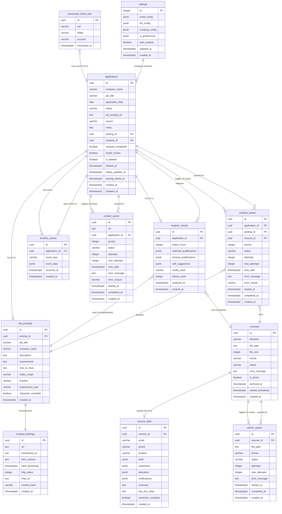
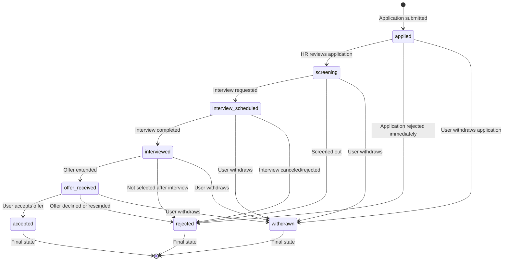
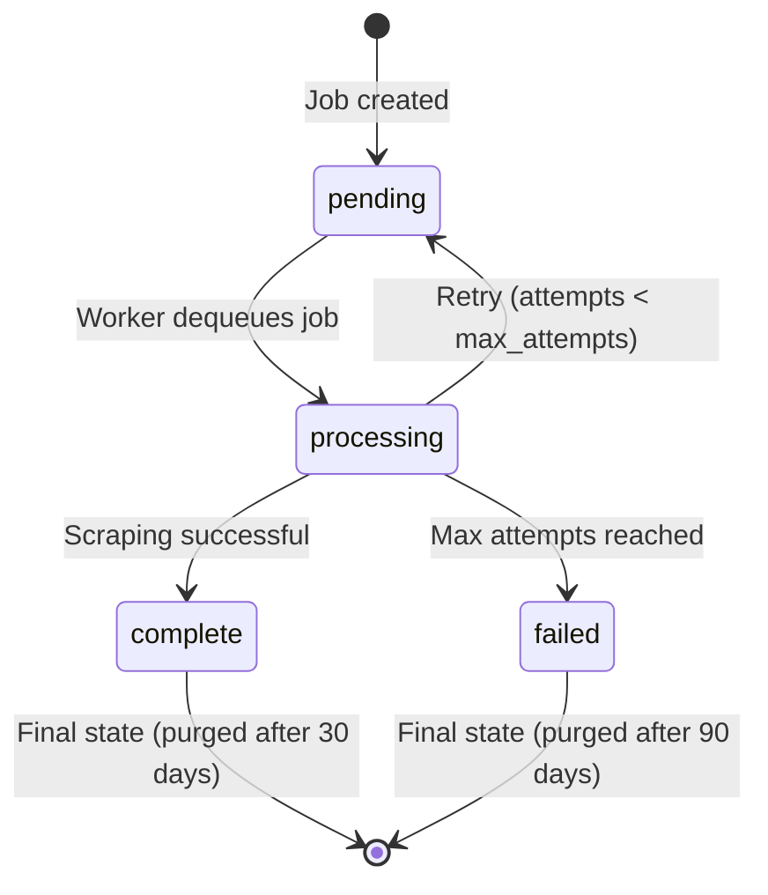
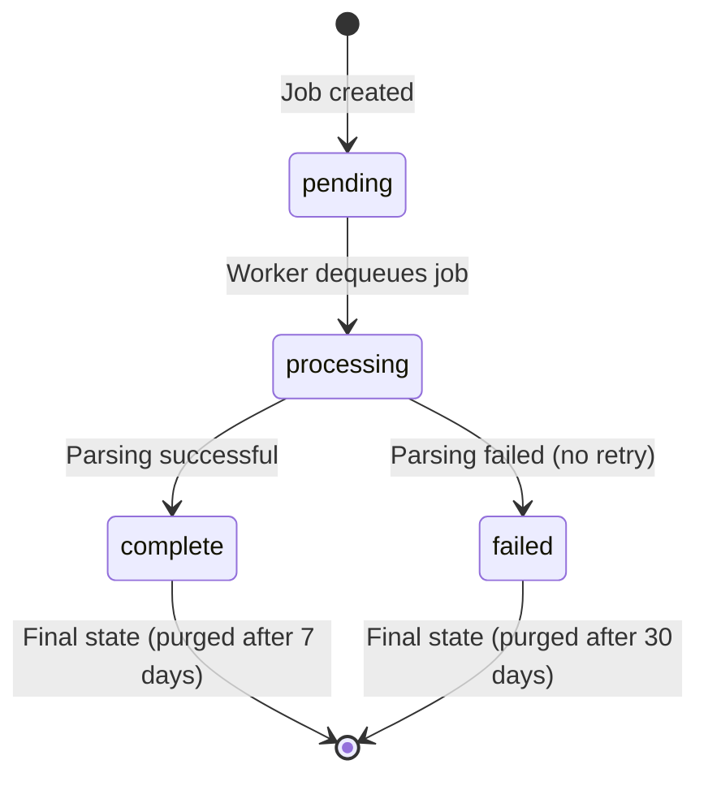
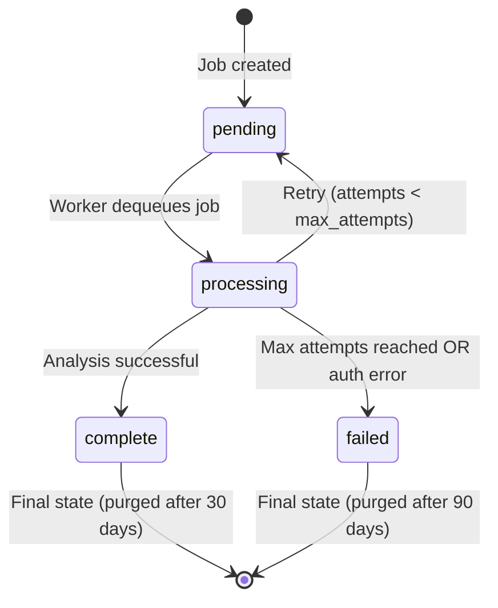

# Job Application Tracker - Data Schema Design Document

**Document Version:** 1.0  
**Last Updated:** December 10, 2025  
**Database Target:** PostgreSQL 14+ (with SQLite compatibility notes where applicable)

---

## PART 1: Entity Definitions

### Entity 1: applications

**Purpose:**  
Core entity representing a single job application submitted by the user. Tracks application metadata, status, and relationships to job postings, analyses, and timeline events.

**Lifecycle:**  
Created when user submits application (browser, email, or manual) → Status transitions through hiring pipeline → May be soft-deleted by user → Permanently purged after configurable retention period.

**Fields:**

| Field Name | Data Type | Required | Nullable | Mutable | Default | Constraints | Purpose |
|------------|-----------|----------|----------|---------|---------|-------------|---------|
| `id` | UUID | Yes | No | No | gen_random_uuid() | PRIMARY KEY | Unique application identifier |
| `company_name` | VARCHAR(200) | Yes | No | Yes | - | NOT NULL | Company name (user-editable) |
| `job_title` | VARCHAR(300) | Yes | No | Yes | - | NOT NULL | Job title (user-editable) |
| `application_date` | DATE | Yes | No | Yes | CURRENT_DATE | NOT NULL, CHECK <= today | Date application submitted |
| `status` | VARCHAR(50) | Yes | No | Yes | 'applied' | NOT NULL, CHECK IN (enum) | Current application status |
| `job_posting_url` | TEXT | No | Yes | Yes | NULL | - | URL to original job posting |
| `source` | VARCHAR(20) | Yes | No | No | - | NOT NULL, CHECK IN ('browser', 'email', 'manual') | How application was captured |
| `notes` | TEXT | No | Yes | Yes | NULL | CHECK length <= 10000 | User notes (markdown) |
| `posting_id` | UUID | No | Yes | No | NULL | FK → job_postings(id) | Linked job posting |
| `analysis_id` | UUID | No | Yes | No | NULL | FK → analysis_results(id) | Linked analysis result |
| `analysis_completed` | BOOLEAN | Yes | No | Yes | false | NOT NULL | Flag: analysis has run |
| `needs_review` | BOOLEAN | Yes | No | Yes | false | NOT NULL | Flag: incomplete data from email |
| `is_deleted` | BOOLEAN | Yes | No | Yes | false | NOT NULL | Soft delete flag |
| `deleted_at` | TIMESTAMPTZ | No | Yes | No | NULL | - | When soft-deleted |
| `status_updated_at` | TIMESTAMPTZ | Yes | No | Yes | NOW() | NOT NULL | Last status change timestamp |
| `posting_linked_at` | TIMESTAMPTZ | No | Yes | No | NULL | - | When posting was linked |
| `created_at` | TIMESTAMPTZ | Yes | No | No | NOW() | NOT NULL | Record creation timestamp |
| `updated_at` | TIMESTAMPTZ | Yes | No | Yes | NOW() | NOT NULL | Last update timestamp (optimistic locking) |

**Indexes:**
- PRIMARY KEY: `id`
- INDEX: `company_name` (for search/filtering)
- INDEX: `application_date DESC` (for default list view sort)
- INDEX: `status` (for filtering)
- INDEX: `is_deleted, application_date DESC` (composite for active apps list)
- INDEX: `posting_id` (FK lookup)
- INDEX: `analysis_id` (FK lookup)
- UNIQUE: None (duplicates allowed per user choice)

**Foreign Key Behavior:**
- `posting_id` → job_postings(id): ON DELETE SET NULL (posting can be deleted, app remains)
- `analysis_id` → analysis_results(id): ON DELETE SET NULL (analysis can be deleted, app remains)

**Uniqueness:**  
None enforced at database level. Duplicate detection handled in application logic (ARM).

**Immutable Fields:**  
`id`, `source`, `created_at` (set once at creation, never modified)

**Mutable Fields:**  
All other fields can be updated by user or system.

---

### Entity 2: job_postings

**Purpose:**  
Stores extracted structured data from scraped job posting HTML. Represents the "clean" parsed version of job posting content used for AI analysis and display.

**Lifecycle:**  
Created after scraper successfully extracts content from scraped_postings HTML → Linked to one or more applications → May be deleted independently or when associated scraped_posting deleted.

**Fields:**

| Field Name | Data Type | Required | Nullable | Mutable | Default | Constraints | Purpose |
|------------|-----------|----------|----------|---------|---------|-------------|---------|
| `id` | UUID | Yes | No | No | gen_random_uuid() | PRIMARY KEY | Unique job posting identifier |
| `posting_id` | UUID | Yes | No | No | - | NOT NULL, FK → scraped_postings(id) | Link to raw scraped HTML |
| `job_title` | VARCHAR(300) | Yes | No | No | - | NOT NULL | Extracted job title |
| `company_name` | VARCHAR(200) | Yes | No | No | - | NOT NULL | Extracted company name |
| `description` | TEXT | Yes | No | No | - | NOT NULL | Full job description |
| `requirements` | TEXT | No | Yes | No | NULL | - | Requirements section (if identifiable) |
| `nice_to_have` | TEXT | No | Yes | No | NULL | - | Nice-to-have/bonus section |
| `salary_range` | VARCHAR(100) | No | Yes | No | NULL | - | Extracted salary range (if present) |
| `location` | VARCHAR(200) | No | Yes | No | NULL | - | Job location |
| `employment_type` | VARCHAR(50) | No | Yes | No | NULL | - | Full-time, Part-time, Contract, etc. |
| `extraction_complete` | BOOLEAN | Yes | No | No | true | NOT NULL | Flag: all critical fields extracted |
| `created_at` | TIMESTAMPTZ | Yes | No | No | NOW() | NOT NULL | Extraction timestamp |

**Indexes:**
- PRIMARY KEY: `id`
- INDEX: `posting_id` (FK lookup, 1:1 relationship)
- FULLTEXT INDEX (PostgreSQL): `to_tsvector('english', description || ' ' || COALESCE(requirements, ''))` (for future search capability)

**Foreign Key Behavior:**
- `posting_id` → scraped_postings(id): ON DELETE CASCADE (if raw HTML deleted, delete extracted data too)

**Uniqueness:**  
`posting_id` is effectively unique (1:1 with scraped_postings), but not enforced as UNIQUE constraint because FK already enforces 1:1.

**Immutable Fields:**  
All fields immutable after creation. Re-scraping creates new scraped_posting and new job_posting.

---

### Entity 3: scraped_postings

**Purpose:**  
Stores raw HTML snapshots of scraped job postings for audit, re-parsing, and change detection. Represents the "raw" unprocessed data from HTTP GET.

**Lifecycle:**  
Created when scraper successfully fetches job posting HTML → job_postings extraction performed → Retained indefinitely or purged based on user settings (age-based cleanup).

**Fields:**

| Field Name | Data Type | Required | Nullable | Mutable | Default | Constraints | Purpose |
|------------|-----------|----------|----------|---------|---------|-------------|---------|
| `id` | UUID | Yes | No | No | gen_random_uuid() | PRIMARY KEY | Unique scraped posting identifier |
| `url` | TEXT | Yes | No | No | - | NOT NULL | Original job posting URL |
| `normalized_url` | TEXT | Yes | No | No | - | NOT NULL | URL normalized for deduplication |
| `html_content` | TEXT | Yes | No | No | - | NOT NULL | Raw HTML response body |
| `fetch_timestamp` | TIMESTAMPTZ | Yes | No | No | NOW() | NOT NULL | When HTML was fetched |
| `http_status` | INTEGER | Yes | No | No | - | NOT NULL | HTTP response status code |
| `final_url` | TEXT | Yes | No | No | - | NOT NULL | URL after following redirects |
| `content_hash` | VARCHAR(64) | Yes | No | No | - | NOT NULL | SHA-256 hash of HTML (change detection) |
| `created_at` | TIMESTAMPTZ | Yes | No | No | NOW() | NOT NULL | Record creation timestamp |

**Indexes:**
- PRIMARY KEY: `id`
- UNIQUE INDEX: `normalized_url, fetch_timestamp` (allow re-scraping same URL at different times)
- INDEX: `normalized_url` (for deduplication lookup during scraping)
- INDEX: `fetch_timestamp DESC` (for age-based cleanup)

**Foreign Key Behavior:**  
None (this is a root entity; job_postings references it).

**Uniqueness:**  
Composite uniqueness on (normalized_url, fetch_timestamp) to allow multiple scrapes of same URL over time.

**Immutable Fields:**  
All fields immutable after creation (scraped data is historical record).

**Storage Considerations:**  
HTML content can be large (average 100KB - 5MB per page). Provide user setting to auto-purge HTML older than 90 days to save space.

---

### Entity 4: resumes

**Purpose:**  
Tracks uploaded resume files with metadata. Represents the raw file before parsing. Supports resume versioning (multiple uploads over time, one active).

**Lifecycle:**  
Created on file upload → Parsing queued → After parsing completes, status updated → If new resume uploaded, previous marked as archived → Deleted only by explicit user action.

**Fields:**

| Field Name | Data Type | Required | Nullable | Mutable | Default | Constraints | Purpose |
|------------|-----------|----------|----------|---------|---------|-------------|---------|
| `id` | UUID | Yes | No | No | gen_random_uuid() | PRIMARY KEY | Unique resume identifier |
| `filename` | VARCHAR(255) | Yes | No | No | - | NOT NULL | Original upload filename |
| `file_path` | TEXT | Yes | No | No | - | NOT NULL | Path on filesystem |
| `file_size` | INTEGER | Yes | No | No | - | NOT NULL, CHECK > 0 | File size in bytes |
| `format` | VARCHAR(10) | Yes | No | No | - | NOT NULL, CHECK IN ('pdf', 'docx', 'txt') | File format |
| `status` | VARCHAR(20) | Yes | No | Yes | 'pending' | NOT NULL, CHECK IN ('pending', 'completed', 'failed') | Parsing status |
| `error_message` | TEXT | No | Yes | Yes | NULL | - | Parsing error details (if failed) |
| `is_active` | BOOLEAN | Yes | No | Yes | false | NOT NULL | Flag: currently active resume |
| `archived_at` | TIMESTAMPTZ | No | Yes | Yes | NULL | - | When marked inactive |
| `upload_timestamp` | TIMESTAMPTZ | Yes | No | No | NOW() | NOT NULL | When file uploaded |
| `created_at` | TIMESTAMPTZ | Yes | No | No | NOW() | NOT NULL | Record creation timestamp |

**Indexes:**
- PRIMARY KEY: `id`
- INDEX: `is_active` (to quickly find active resume)
- INDEX: `upload_timestamp DESC` (for resume history view)

**Foreign Key Behavior:**  
None (this is a root entity; resume_data references it).

**Uniqueness:**  
Only one `is_active=true` resume should exist at a time (enforced by application logic, not database constraint, to avoid race conditions during concurrent uploads).

**Immutable Fields:**  
`id`, `filename`, `file_path`, `file_size`, `format`, `upload_timestamp`, `created_at`

**Mutable Fields:**  
`status`, `error_message`, `is_active`, `archived_at` (updated during parsing lifecycle and versioning)

---

### Entity 5: resume_data

**Purpose:**  
Stores extracted structured data from parsed resume files. Represents the "clean" parsed version of resume content used for AI analysis.

**Lifecycle:**  
Created after parser successfully extracts content from resume file → Linked to resumes record → Immutable after creation (new upload creates new resume + resume_data).

**Fields:**

| Field Name | Data Type | Required | Nullable | Mutable | Default | Constraints | Purpose |
|------------|-----------|----------|----------|---------|---------|-------------|---------|
| `id` | UUID | Yes | No | No | gen_random_uuid() | PRIMARY KEY | Unique resume data identifier |
| `resume_id` | UUID | Yes | No | No | - | NOT NULL, UNIQUE, FK → resumes(id) | Link to resume file record |
| `email` | VARCHAR(255) | No | Yes | No | NULL | - | Extracted email address |
| `phone` | VARCHAR(50) | No | Yes | No | NULL | - | Extracted phone number |
| `location` | VARCHAR(200) | No | Yes | No | NULL | - | Extracted location |
| `skills` | JSONB | Yes | No | No | '[]'::jsonb | NOT NULL | Array of skill strings |
| `experience` | JSONB | Yes | No | No | '[]'::jsonb | NOT NULL | Array of experience objects |
| `education` | JSONB | Yes | No | No | '[]'::jsonb | NOT NULL | Array of education objects |
| `certifications` | JSONB | Yes | No | No | '[]'::jsonb | NOT NULL | Array of certification strings |
| `summary` | TEXT | No | Yes | No | NULL | - | Resume summary/objective section |
| `raw_text_other` | TEXT | No | Yes | No | NULL | - | Unstructured content (fallback) |
| `extraction_complete` | BOOLEAN | Yes | No | No | true | NOT NULL | Flag: all sections successfully parsed |
| `created_at` | TIMESTAMPTZ | Yes | No | No | NOW() | NOT NULL | Extraction timestamp |

**JSONB Structure Examples:**
```json
// skills: ["Python", "JavaScript", "React", "SQL"]

// experience: [
//   {
//     "company": "Acme Corp",
//     "title": "Software Engineer",
//     "dates": "2020-2023",
//     "responsibilities": ["Built features", "Fixed bugs"]
//   }
// ]

// education: [
//   {
//     "institution": "MIT",
//     "degree": "BS",
//     "major": "Computer Science",
//     "year": "2020"
//   }
// ]

// certifications: ["AWS Certified Solutions Architect", "PMP"]
```

**Indexes:**
- PRIMARY KEY: `id`
- UNIQUE INDEX: `resume_id` (1:1 relationship with resumes)
- GIN INDEX (PostgreSQL): `skills` (for future skill-based search)

**Foreign Key Behavior:**
- `resume_id` → resumes(id): ON DELETE CASCADE (if resume deleted, delete parsed data too)

**Uniqueness:**  
`resume_id` is unique (1:1 with resumes).

**Immutable Fields:**  
All fields immutable after creation. Re-parsing creates new resume + resume_data.

---

### Entity 6: analysis_results

**Purpose:**  
Stores AI-generated analysis comparing resume against job posting. Represents output from LLM analysis pipeline.

**Lifecycle:**  
Created after successful LLM API call and response parsing → Linked to application → Immutable after creation (re-analysis creates new record, old archived or deleted).

**Fields:**

| Field Name | Data Type | Required | Nullable | Mutable | Default | Constraints | Purpose |
|------------|-----------|----------|----------|---------|---------|-------------|---------|
| `id` | UUID | Yes | No | No | gen_random_uuid() | PRIMARY KEY | Unique analysis result identifier |
| `application_id` | UUID | Yes | No | No | - | NOT NULL, FK → applications(id) | Link to application |
| `match_score` | INTEGER | Yes | No | No | - | NOT NULL, CHECK >= 0 AND <= 100 | Overall match score (0-100) |
| `matched_qualifications` | JSONB | Yes | No | No | '[]'::jsonb | NOT NULL | Array of matched requirement strings |
| `missing_qualifications` | JSONB | Yes | No | No | '[]'::jsonb | NOT NULL | Array of missing requirement strings |
| `skill_suggestions` | JSONB | Yes | No | No | '[]'::jsonb | NOT NULL | Array of skill emphasis suggestions |
| `model_used` | VARCHAR(100) | Yes | No | No | - | NOT NULL | LLM provider and model (e.g., "gpt-4") |
| `tokens_used` | INTEGER | No | Yes | No | NULL | CHECK > 0 | Tokens consumed (for cost tracking) |
| `analyzed_at` | TIMESTAMPTZ | Yes | No | No | NOW() | NOT NULL | When analysis performed |
| `created_at` | TIMESTAMPTZ | Yes | No | No | NOW() | NOT NULL | Record creation timestamp |

**JSONB Structure Examples:**
```json
// matched_qualifications: [
//   "5+ years Python experience",
//   "Experience with React and modern frontend frameworks",
//   "Strong SQL and database skills"
// ]

// missing_qualifications: [
//   "AWS certification",
//   "Experience with Kubernetes"
// ]

// skill_suggestions: [
//   "Emphasize your distributed systems experience",
//   "Highlight your Python performance optimization work",
//   "Add metrics on scale of systems you've built"
// ]
```

**Indexes:**
- PRIMARY KEY: `id`
- INDEX: `application_id` (FK lookup, allows multiple analyses per application if re-run)
- INDEX: `analyzed_at DESC` (for finding most recent analysis)

**Foreign Key Behavior:**
- `application_id` → applications(id): ON DELETE CASCADE (if application deleted, delete analysis too)

**Uniqueness:**  
None (multiple analyses per application allowed for re-runs). Application logic handles linking most recent analysis to application.analysis_id.

**Immutable Fields:**  
All fields immutable after creation (analysis is historical record).

---

### Entity 7: timeline_events

**Purpose:**  
Audit log of all significant events in application lifecycle. Provides chronological history for user visibility and system debugging.

**Lifecycle:**  
Created when event occurs (application submitted, status changed, scraping completed, etc.) → Retained indefinitely or purged based on age (configurable: retain 1 year).

**Fields:**

| Field Name | Data Type | Required | Nullable | Mutable | Default | Constraints | Purpose |
|------------|-----------|----------|----------|---------|---------|-------------|---------|
| `id` | UUID | Yes | No | No | gen_random_uuid() | PRIMARY KEY | Unique event identifier |
| `application_id` | UUID | Yes | No | No | - | NOT NULL, FK → applications(id) | Link to application |
| `event_type` | VARCHAR(50) | Yes | No | No | - | NOT NULL, CHECK IN (enum) | Type of event |
| `event_data` | JSONB | Yes | No | No | '{}'::jsonb | NOT NULL | Event-specific structured data |
| `occurred_at` | TIMESTAMPTZ | Yes | No | No | NOW() | NOT NULL | When event occurred |
| `created_at` | TIMESTAMPTZ | Yes | No | No | NOW() | NOT NULL | Record creation timestamp |

**Event Types (enum):**
- `application_submitted` (browser/email/manual)
- `status_changed` (old_status → new_status)
- `job_scraped` (scraping completed)
- `analysis_completed` (analysis finished)
- `note_updated` (user edited notes)
- `email_received` (confirmation email processed)
- `manual_interview_scheduled` (user-added event)
- `manual_email_sent` (user-added event)
- `manual_phone_call` (user-added event)
- `manual_other` (user-added event)

**Event Data Structure Examples:**
```json
// status_changed:
{
  "old_status": "applied",
  "new_status": "interview_scheduled"
}

// job_scraped:
{
  "posting_id": "uuid",
  "url": "https://...",
  "extraction_complete": true
}

// analysis_completed:
{
  "analysis_id": "uuid",
  "match_score": 85
}

// manual_interview_scheduled:
{
  "description": "Phone screen with hiring manager",
  "manually_added_by_user": true
}
```

**Indexes:**
- PRIMARY KEY: `id`
- INDEX: `application_id, occurred_at DESC` (composite for timeline queries)
- INDEX: `event_type` (for filtering by event type)

**Foreign Key Behavior:**
- `application_id` → applications(id): ON DELETE CASCADE (if application deleted, delete timeline too)

**Uniqueness:**  
None (multiple events of same type can occur).

**Immutable Fields:**  
All fields immutable after creation (audit log).

---

### Entity 8: scraper_queue

**Purpose:**  
Job queue for web scraping tasks. Manages pending, processing, and completed/failed scraping jobs with retry logic.

**Lifecycle:**  
Created when application has job_posting_url → Dequeued by scraper worker → Status transitions: pending → processing → complete/failed → Purged after retention period (30 days for complete, 90 days for failed).

**Fields:**

| Field Name | Data Type | Required | Nullable | Mutable | Default | Constraints | Purpose |
|------------|-----------|----------|----------|---------|---------|-------------|---------|
| `id` | SERIAL or UUID | Yes | No | No | AUTO | PRIMARY KEY | Unique job identifier |
| `url` | TEXT | Yes | No | No | - | NOT NULL | Job posting URL to scrape |
| `application_id` | UUID | Yes | No | No | - | NOT NULL, FK → applications(id) | Link to application |
| `priority` | INTEGER | Yes | No | No | 50 | NOT NULL, CHECK >= 0 AND <= 100 | Job priority (100=high, 50=medium, 0=low) |
| `status` | VARCHAR(20) | Yes | No | Yes | 'pending' | NOT NULL, CHECK IN ('pending', 'processing', 'complete', 'failed') | Job status |
| `attempts` | INTEGER | Yes | No | Yes | 0 | NOT NULL, CHECK >= 0 | Number of attempts made |
| `max_attempts` | INTEGER | Yes | No | No | 3 | NOT NULL | Maximum retry attempts |
| `retry_after` | TIMESTAMPTZ | No | Yes | Yes | NULL | - | Earliest time to retry (exponential backoff) |
| `error_message` | TEXT | No | Yes | Yes | NULL | - | Error details if failed |
| `error_reason` | VARCHAR(50) | No | Yes | Yes | NULL | - | Error code (TIMEOUT, HTTP_404, etc.) |
| `started_at` | TIMESTAMPTZ | No | Yes | Yes | NULL | - | When processing started |
| `completed_at` | TIMESTAMPTZ | No | Yes | Yes | NULL | - | When completed or failed |
| `created_at` | TIMESTAMPTZ | Yes | No | No | NOW() | NOT NULL | Job creation timestamp |

**Indexes:**
- PRIMARY KEY: `id`
- INDEX: `status, priority DESC, created_at ASC` (composite for dequeue query)
- INDEX: `application_id` (FK lookup)
- INDEX: `completed_at` (for cleanup queries)
- INDEX: `retry_after` (for finding jobs ready to retry)

**Foreign Key Behavior:**
- `application_id` → applications(id): ON DELETE CASCADE (if application deleted, cancel scraping job)

**Uniqueness:**  
None (same URL can be queued multiple times for retries or different applications).

**Immutable Fields:**  
`id`, `url`, `application_id`, `priority`, `max_attempts`, `created_at`

**Mutable Fields:**  
`status`, `attempts`, `retry_after`, `error_message`, `error_reason`, `started_at`, `completed_at`

---

### Entity 9: parser_queue

**Purpose:**  
Job queue for resume parsing tasks. Manages pending, processing, and completed/failed parsing jobs.

**Lifecycle:**  
Created when resume uploaded → Dequeued by parser worker → Status transitions: pending → processing → complete/failed → Purged after completion (7 days).

**Fields:**

| Field Name | Data Type | Required | Nullable | Mutable | Default | Constraints | Purpose |
|------------|-----------|----------|----------|---------|---------|-------------|---------|
| `id` | SERIAL or UUID | Yes | No | No | AUTO | PRIMARY KEY | Unique job identifier |
| `resume_id` | UUID | Yes | No | No | - | NOT NULL, FK → resumes(id) | Link to resume file |
| `file_path` | TEXT | Yes | No | No | - | NOT NULL | Path to resume file |
| `format` | VARCHAR(10) | Yes | No | No | - | NOT NULL, CHECK IN ('pdf', 'docx', 'txt') | File format |
| `status` | VARCHAR(20) | Yes | No | Yes | 'pending' | NOT NULL, CHECK IN ('pending', 'processing', 'complete', 'failed') | Job status |
| `attempts` | INTEGER | Yes | No | Yes | 0 | NOT NULL, CHECK >= 0 | Number of attempts made |
| `max_attempts` | INTEGER | Yes | No | No | 1 | NOT NULL | Maximum attempts (no retry for parsing) |
| `error_message` | TEXT | No | Yes | Yes | NULL | - | Error details if failed |
| `started_at` | TIMESTAMPTZ | No | Yes | Yes | NULL | - | When processing started |
| `completed_at` | TIMESTAMPTZ | No | Yes | Yes | NULL | - | When completed or failed |
| `created_at` | TIMESTAMPTZ | Yes | No | No | NOW() | NOT NULL | Job creation timestamp |

**Indexes:**
- PRIMARY KEY: `id`
- INDEX: `status, created_at ASC` (for FIFO dequeue)
- INDEX: `resume_id` (FK lookup)
- INDEX: `completed_at` (for cleanup queries)

**Foreign Key Behavior:**
- `resume_id` → resumes(id): ON DELETE CASCADE (if resume deleted, cancel parsing job)

**Uniqueness:**  
None (though typically only one parsing job per resume).

**Immutable Fields:**  
`id`, `resume_id`, `file_path`, `format`, `max_attempts`, `created_at`

**Mutable Fields:**  
`status`, `attempts`, `error_message`, `started_at`, `completed_at`

---

### Entity 10: analysis_queue

**Purpose:**  
Job queue for AI analysis tasks. Manages pending, processing, and completed/failed analysis jobs with retry logic.

**Lifecycle:**  
Created when job posting linked (auto) or user triggers analysis (manual) → Dequeued by analysis worker → Status transitions: pending → processing → complete/failed → Purged after completion (30 days).

**Fields:**

| Field Name | Data Type | Required | Nullable | Mutable | Default | Constraints | Purpose |
|------------|-----------|----------|----------|---------|---------|-------------|---------|
| `id` | SERIAL or UUID | Yes | No | No | AUTO | PRIMARY KEY | Unique job identifier |
| `application_id` | UUID | Yes | No | No | - | NOT NULL, FK → applications(id) | Link to application |
| `posting_id` | UUID | Yes | No | No | - | NOT NULL, FK → job_postings(id) | Link to job posting |
| `resume_id` | UUID | Yes | No | No | - | NOT NULL, FK → resumes(id) | Link to resume (snapshot at time of analysis) |
| `priority` | INTEGER | Yes | No | No | 50 | NOT NULL, CHECK >= 0 AND <= 100 | Job priority (100=manual, 50=auto) |
| `status` | VARCHAR(20) | Yes | No | Yes | 'pending' | NOT NULL, CHECK IN ('pending', 'processing', 'complete', 'failed') | Job status |
| `attempts` | INTEGER | Yes | No | Yes | 0 | NOT NULL, CHECK >= 0 | Number of attempts made |
| `max_attempts` | INTEGER | Yes | No | No | 3 | NOT NULL | Maximum retry attempts |
| `retry_after` | TIMESTAMPTZ | No | Yes | Yes | NULL | - | Earliest time to retry (exponential backoff) |
| `error_message` | TEXT | No | Yes | Yes | NULL | - | Error details if failed |
| `error_reason` | VARCHAR(50) | No | Yes | Yes | NULL | - | Error code (API_KEY_INVALID, TIMEOUT, etc.) |
| `started_at` | TIMESTAMPTZ | No | Yes | Yes | NULL | - | When processing started |
| `completed_at` | TIMESTAMPTZ | No | Yes | Yes | NULL | - | When completed or failed |
| `created_at` | TIMESTAMPTZ | Yes | No | No | NOW() | NOT NULL | Job creation timestamp |

**Indexes:**
- PRIMARY KEY: `id`
- INDEX: `status, priority DESC, created_at ASC` (composite for dequeue query)
- INDEX: `application_id` (FK lookup)
- INDEX: `completed_at` (for cleanup queries)
- INDEX: `retry_after` (for finding jobs ready to retry)

**Foreign Key Behavior:**
- `application_id` → applications(id): ON DELETE CASCADE
- `posting_id` → job_postings(id): ON DELETE CASCADE
- `resume_id` → resumes(id): ON DELETE SET NULL (analysis references snapshot; resume deletion shouldn't cascade)

**Uniqueness:**  
None (multiple analyses per application allowed for re-runs).

**Immutable Fields:**  
`id`, `application_id`, `posting_id`, `resume_id`, `priority`, `max_attempts`, `created_at`

**Mutable Fields:**  
`status`, `attempts`, `retry_after`, `error_message`, `error_reason`, `started_at`, `completed_at`

---

### Entity 11: processed_email_uids

**Purpose:**  
Tracks processed email UIDs to prevent duplicate processing when IMAP mark-as-read fails. Provides idempotency for email ingestion.

**Lifecycle:**  
Created after successfully processing email → Retained for 90 days → Purged after retention period to prevent unbounded growth.

**Fields:**

| Field Name | Data Type | Required | Nullable | Mutable | Default | Constraints | Purpose |
|------------|-----------|----------|----------|---------|---------|-------------|---------|
| `id` | SERIAL or UUID | Yes | No | No | AUTO | PRIMARY KEY | Unique record identifier |
| `uid` | VARCHAR(255) | Yes | No | No | - | NOT NULL, UNIQUE | IMAP email UID |
| `folder` | VARCHAR(255) | Yes | No | No | - | NOT NULL | IMAP folder path |
| `account` | VARCHAR(255) | Yes | No | No | - | NOT NULL | Email account identifier (for multi-account support) |
| `processed_at` | TIMESTAMPTZ | Yes | No | No | NOW() | NOT NULL | When email processed |

**Indexes:**
- PRIMARY KEY: `id`
- UNIQUE INDEX: `account, folder, uid` (composite uniqueness for deduplication)
- INDEX: `processed_at` (for age-based cleanup)

**Foreign Key Behavior:**  
None (independent tracking table).

**Uniqueness:**  
Composite (account, folder, uid) ensures each email processed only once.

**Immutable Fields:**  
All fields immutable after creation (audit log).

---

### Entity 12: settings

**Purpose:**  
Stores system configuration and user preferences. Single-row table with JSON fields for flexibility.

**Lifecycle:**  
Created on first run with defaults → Updated by user via settings UI → Never deleted (single row).

**Fields:**

| Field Name | Data Type | Required | Nullable | Mutable | Default | Constraints | Purpose |
|------------|-----------|----------|----------|---------|---------|-------------|---------|
| `id` | INTEGER | Yes | No | No | 1 | PRIMARY KEY, CHECK = 1 | Singleton row identifier |
| `email_config` | JSONB | Yes | No | Yes | '{}'::jsonb | NOT NULL | Email ingestion settings |
| `llm_config` | JSONB | Yes | No | Yes | '{}'::jsonb | NOT NULL | LLM provider settings |
| `scraping_config` | JSONB | Yes | No | Yes | '{}'::jsonb | NOT NULL | Scraping behavior settings |
| `ui_preferences` | JSONB | Yes | No | Yes | '{}'::jsonb | NOT NULL | Dashboard UI preferences |
| `auto_analyze` | BOOLEAN | Yes | No | Yes | true | NOT NULL | Auto-trigger analysis on scrape |
| `updated_at` | TIMESTAMPTZ | Yes | No | Yes | NOW() | NOT NULL | Last update timestamp |
| `created_at` | TIMESTAMPTZ | Yes | No | No | NOW() | NOT NULL | Record creation timestamp |

**JSONB Structure Examples:**
```json
// email_config:
{
  "enabled": true,
  "imap_server": "imap.gmail.com",
  "imap_port": 993,
  "username": "user@gmail.com",
  "target_folder": "Job Applications",
  "polling_interval_seconds": 300
}

// llm_config:
{
  "provider": "openai",
  "model": "gpt-4",
  "temperature": 0.3,
  "max_tokens": 2000
}

// scraping_config:
{
  "rate_limit_per_domain": 10,
  "request_timeout_seconds": 30,
  "max_retries": 3,
  "user_agent": "Mozilla/5.0..."
}

// ui_preferences:
{
  "default_page_size": 25,
  "default_sort_field": "application_date",
  "default_sort_order": "desc",
  "theme": "light"
}
```

**Indexes:**
- PRIMARY KEY: `id` (single row, id=1)

**Foreign Key Behavior:**  
None (independent configuration table).

**Uniqueness:**  
Primary key enforces single row (id=1).

**Immutable Fields:**  
`id`, `created_at`

**Mutable Fields:**  
All configuration fields.

**Note:** Sensitive credentials (email password, API keys) NOT stored in this table. Stored in OS keychain via separate credential store mechanism.

---

## PART 2: Full Relational Model



**Relationship Cardinality:**
- applications → job_postings: 0..1 (application may or may not have scraped posting)
- applications → analysis_results: 0..1 (application may or may not have analysis; FK points to most recent)
- applications → timeline_events: 1..N (each application has at least one event: submission)
- job_postings → scraped_postings: 1..1 (each extracted posting has one raw HTML source)
- resumes → resume_data: 0..1 (resume may fail parsing, resulting in no data)
- analysis_results → applications: N..1 (multiple analyses can exist for one application; application.analysis_id points to current)

---

## PART 3: Normalization Decisions

### Why job_postings and scraped_postings are Separate

**Rationale:**
1. **Separation of Concerns:**
   - `scraped_postings`: Raw, immutable historical snapshot of HTTP response
   - `job_postings`: Extracted, structured, queryable data optimized for analysis

2. **Data Integrity:**
   - Raw HTML preserved for audit, debugging, and re-parsing if extraction logic improves
   - Extraction failures don't lose raw data; can retry parsing without re-scraping

3. **Storage Optimization:**
   - HTML content large (100KB - 5MB); structured data small (1-10KB)
   - Queries for analysis only need structured data; don't need to load HTML
   - HTML can be purged independently (age-based cleanup) while retaining structured data

4. **Re-scraping Logic:**
   - Duplicate detection based on `scraped_postings.normalized_url` and age
   - Re-scraping creates new `scraped_postings` row; new extraction creates new `job_postings` row
   - Old scrapes retained for change detection (compare content_hash)

5. **Performance:**
   - Full-text search on `job_postings.description` (indexed) without scanning HTML
   - `job_postings` much smaller table; faster queries

**Alternative Considered:** Single table with HTML and structured fields
- **Rejected:** Bloats row size; all queries must skip HTML column; harder to purge HTML selectively

---

### Why resume_data is Separate from resumes

**Rationale:**
1. **Parsing Lifecycle Decoupling:**
   - `resumes`: File metadata and parsing status (pending, completed, failed)
   - `resume_data`: Parsed content (only exists after successful parsing)

2. **Failure Handling:**
   - If parsing fails, `resumes` record remains with error message; no `resume_data` created
   - User can retry or re-upload; `resumes` tracks attempts

3. **Versioning:**
   - Multiple `resumes` records over time (user uploads new versions)
   - Each has corresponding `resume_data` (if parsed successfully)
   - Only one `resumes.is_active=true` at a time; corresponding `resume_data` used for analysis

4. **Storage Optimization:**
   - `resumes`: Small metadata (~500 bytes per record)
   - `resume_data`: Larger structured data (5-50KB with JSONB arrays)
   - Queries for active resume only need to check `resumes.is_active`, then join to `resume_data`

5. **Immutability:**
   - Both tables immutable after creation (new upload = new rows)
   - Clear 1:1 relationship enforced by UNIQUE constraint on `resume_data.resume_id`

**Alternative Considered:** Single table with parsed fields nullable
- **Rejected:** Mixing metadata with content; nullable structured fields confusing; harder to query "successfully parsed resumes"

---

### Why analysis_results is Separate from applications

**Rationale:**
1. **Optional Functionality:**
   - Not all applications require analysis (user may skip if no job description)
   - Analysis is computationally expensive (LLM API cost); not always run

2. **Re-analysis Support:**
   - Users may re-run analysis (e.g., after updating resume or if initial analysis failed)
   - Each re-run creates new `analysis_results` record
   - `applications.analysis_id` points to most recent; old analyses can be archived or deleted

3. **Data Size:**
   - Analysis results include large JSONB arrays (matched/missing qualifications)
   - Separating keeps `applications` table lean for list view queries

4. **Lifecycle Independence:**
   - Analysis can fail without affecting application record
   - Analysis can be deleted (e.g., user privacy cleanup) without deleting application

5. **Auditability:**
   - Multiple analysis records show history of score changes over time
   - Can track if score improved after resume updates

**Alternative Considered:** Analysis fields directly in applications table
- **Rejected:** Bloats applications table; no support for re-analysis history; nullable fields for non-analyzed apps

---

### Why timeline_events is a Separate Log Table

**Rationale:**
1. **Append-Only Audit Log:**
   - Timeline is immutable event history
   - Events never updated or deleted (only entire timeline if application deleted)

2. **Unbounded Growth:**
   - Applications have many events (submission, status changes, scrapes, analyses, user notes)
   - Embedding in `applications` as JSONB array would bloat row size and make queries inefficient

3. **Query Efficiency:**
   - Timeline queries need ordering by `occurred_at DESC`
   - Separate table with index on `(application_id, occurred_at DESC)` is optimal
   - Querying JSONB array in applications would be slow and complex

4. **Flexible Event Schema:**
   - Each event_type has different `event_data` structure
   - JSONB in separate table allows flexible schema per event type without affecting applications table

5. **Purge Policy:**
   - Can implement age-based purge (e.g., delete events > 1 year old) without touching applications
   - Applications remain; timeline just becomes less detailed over time

**Alternative Considered:** events JSONB array in applications table
- **Rejected:** Row size grows unbounded; inefficient queries; hard to purge old events; no index on event timestamps

---

### Why Queue Tables are Not Combined

**Rationale:**
1. **Different Job Schemas:**
   - `scraper_queue`: Needs `url`, `priority`, `retry_after` (rate limiting)
   - `parser_queue`: Needs `file_path`, `format`, no priority (FIFO)
   - `analysis_queue`: Needs `application_id`, `posting_id`, `resume_id`, `priority`, `retry_after`

2. **Different Retry Policies:**
   - Scraper: 3 retries with exponential backoff (1m, 5m, 15m)
   - Parser: No retries (user must re-upload if parsing fails)
   - Analysis: 3 retries with variable backoff (depends on error type)

3. **Different Dequeue Logic:**
   - Scraper: Priority-based dequeue with rate limit checks per domain
   - Parser: FIFO dequeue (no priority)
   - Analysis: Priority-based dequeue (manual=100, auto=50)

4. **Worker Pool Isolation:**
   - Each worker type polls its own queue
   - Separate tables prevent workers from interfering with each other
   - Clear separation of concerns

5. **Monitoring and Metrics:**
   - Separate queue depth metrics per job type
   - Easier to identify bottlenecks (e.g., "analysis queue backed up")

**Alternative Considered:** Single `job_queue` table with `job_type` discriminator
- **Rejected:** Would need nullable columns for type-specific fields (url, file_path); complex dequeue queries; harder to optimize indexes

---

## PART 4: Required, Optional, and Nullable Fields

### applications Table

| Field | Classification | Reason |
|-------|----------------|--------|
| `id` | REQUIRED | Primary key; auto-generated |
| `company_name` | REQUIRED | Core application data; defaults to "Unknown Company" if extraction fails |
| `job_title` | REQUIRED | Core application data; defaults to "Unknown Position" if extraction fails |
| `application_date` | REQUIRED | Core application data; defaults to today if not provided |
| `status` | REQUIRED | Lifecycle tracking; defaults to 'applied' |
| `job_posting_url` | OPTIONAL | May not be available (manual entry without URL) |
| `source` | REQUIRED | Audit trail; must know capture method |
| `notes` | OPTIONAL | User may or may not add notes |
| `posting_id` | NULLABLE | Null until scraping completes; SET NULL if posting deleted |
| `analysis_id` | NULLABLE | Null until analysis completes; SET NULL if analysis deleted |
| `analysis_completed` | REQUIRED | Boolean flag; defaults to false |
| `needs_review` | REQUIRED | Boolean flag; defaults to false (set true by email parser if incomplete) |
| `is_deleted` | REQUIRED | Soft delete flag; defaults to false |
| `deleted_at` | NULLABLE | Null unless is_deleted=true |
| `status_updated_at` | REQUIRED | Timestamp; defaults to NOW() |
| `posting_linked_at` | NULLABLE | Null until posting linked |
| `created_at` | REQUIRED | Audit; auto-set |
| `updated_at` | REQUIRED | Optimistic locking; auto-updated |

---

### job_postings Table

| Field | Classification | Reason |
|-------|----------------|--------|
| `id` | REQUIRED | Primary key |
| `posting_id` | REQUIRED | FK to scraped_postings; must have source |
| `job_title` | REQUIRED | Critical for analysis; extraction must find this |
| `company_name` | REQUIRED | Critical for display; extraction must find this |
| `description` | REQUIRED | Critical for analysis; extraction must find this |
| `requirements` | OPTIONAL | Not all job postings have distinct requirements section |
| `nice_to_have` | OPTIONAL | Not all job postings have this section |
| `salary_range` | OPTIONAL | Often not disclosed in job postings |
| `location` | OPTIONAL | May not be in posting (remote jobs) |
| `employment_type` | OPTIONAL | May not be explicitly stated |
| `extraction_complete` | REQUIRED | Boolean flag; indicates if critical fields extracted |
| `created_at` | REQUIRED | Audit timestamp |

---

### scraped_postings Table

| Field | Classification | Reason |
|-------|----------------|--------|
| All fields | REQUIRED | Raw HTTP response data; all must be captured for audit |

---

### resumes Table

| Field | Classification | Reason |
|-------|----------------|--------|
| `id` | REQUIRED | Primary key |
| `filename`, `file_path`, `file_size`, `format` | REQUIRED | File metadata; all known at upload time |
| `status` | REQUIRED | Lifecycle tracking |
| `error_message` | NULLABLE | Only populated if parsing fails |
| `is_active` | REQUIRED | Boolean flag; only one active resume at a time |
| `archived_at` | NULLABLE | Only populated when marked inactive |
| `upload_timestamp`, `created_at` | REQUIRED | Audit timestamps |

---

### resume_data Table

| Field | Classification | Reason |
|-------|----------------|--------|
| `id`, `resume_id` | REQUIRED | Primary key and FK |
| `email`, `phone`, `location` | OPTIONAL | Contact info may not be extractable |
| `skills`, `experience`, `education`, `certifications` | REQUIRED | JSONB arrays; default to empty array `[]` if not extracted |
| `summary` | OPTIONAL | Not all resumes have summary section |
| `raw_text_other` | OPTIONAL | Fallback for unstructured content |
| `extraction_complete` | REQUIRED | Boolean flag |
| `created_at` | REQUIRED | Audit timestamp |

---

### analysis_results Table

| Field | Classification | Reason |
|-------|----------------|--------|
| `id`, `application_id` | REQUIRED | Primary key and FK |
| `match_score` | REQUIRED | Core analysis output |
| `matched_qualifications`, `missing_qualifications`, `skill_suggestions` | REQUIRED | Core analysis outputs; default to empty array `[]` if LLM returns none |
| `model_used` | REQUIRED | Audit trail; must know which model used |
| `tokens_used` | OPTIONAL | Not all LLM providers return token counts |
| `analyzed_at`, `created_at` | REQUIRED | Audit timestamps |

---

### timeline_events Table

| Field | Classification | Reason |
|-------|----------------|--------|
| All fields REQUIRED except `event_data` can be empty object `{}` if no additional data | Events are audit log; all metadata required |

---

### Queue Tables (scraper_queue, parser_queue, analysis_queue)

| Field | Classification | Reason |
|-------|----------------|--------|
| `id`, `status`, `attempts`, `max_attempts`, `created_at` | REQUIRED | Core job queue fields |
| `priority` | REQUIRED (scraper, analysis) / NOT PRESENT (parser) | Priority queuing for some workers |
| `retry_after` | NULLABLE | Only populated when job scheduled for retry |
| `error_message`, `error_reason` | NULLABLE | Only populated on failure |
| `started_at`, `completed_at` | NULLABLE | Lifecycle timestamps; null until job processed |

---

### processed_email_uids Table

| Field | Classification | Reason |
|-------|----------------|--------|
| All fields REQUIRED | Deduplication requires complete identification (account, folder, uid) |

---

### settings Table

| Field | Classification | Reason |
|-------|----------------|--------|
| All JSONB fields REQUIRED (but can be empty objects `{}`) | Configuration; defaults provided |
| `auto_analyze` | REQUIRED | Boolean flag; defaults to true |

---

## PART 5: Indexing Strategy

### applications Table

```sql
PRIMARY KEY: id
INDEX: idx_applications_company_name ON (company_name)
  -- Rationale: Search/filter by company name (partial match queries)
  
INDEX: idx_applications_list_view ON (is_deleted, application_date DESC)
  -- Rationale: Default list view query: WHERE is_deleted=false ORDER BY application_date DESC
  -- Composite index covers both filter and sort
  
INDEX: idx_applications_status ON (status)
  -- Rationale: Filter by status (applied, interview_scheduled, etc.)
  
INDEX: idx_applications_posting_id ON (posting_id)
  -- Rationale: FK lookup when querying job posting relationships
  
INDEX: idx_applications_analysis_id ON (analysis_id)
  -- Rationale: FK lookup when querying analysis relationships
  
PARTIAL INDEX: idx_applications_needs_review ON (id) WHERE needs_review = true
  -- Rationale: Dashboard "Incomplete Applications" view; only small subset has needs_review=true

FULLTEXT INDEX (PostgreSQL): idx_applications_fulltext ON to_tsvector('english', company_name || ' ' || job_title || ' ' || COALESCE(notes, ''))
  -- Rationale: Global search across applications
```

---

### job_postings Table

```sql
PRIMARY KEY: id

INDEX: idx_job_postings_posting_id ON (posting_id)
  -- Rationale: FK lookup to scraped_postings (1:1 relationship)
  
FULLTEXT INDEX (PostgreSQL): idx_job_postings_fulltext ON to_tsvector('english', description || ' ' || COALESCE(requirements, ''))
  -- Rationale: Search within job posting content (future enhancement)
  
GIN INDEX (PostgreSQL): idx_job_postings_description_trgm ON description gin_trgm_ops
  -- Rationale: Fuzzy text search using trigrams (requires pg_trgm extension)
```

---

### scraped_postings Table

```sql
PRIMARY KEY: id

INDEX: idx_scraped_postings_normalized_url ON (normalized_url)
  -- Rationale: Deduplication check during scraping (find existing scrapes of same URL)
  
INDEX: idx_scraped_postings_fetch_timestamp ON (fetch_timestamp DESC)
  -- Rationale: Age-based cleanup queries (delete HTML older than 90 days)
  
UNIQUE INDEX: idx_scraped_postings_url_time ON (normalized_url, fetch_timestamp)
  -- Rationale: Allow multiple scrapes of same URL at different times; prevent exact duplicates
```

---

### resumes Table

```sql
PRIMARY KEY: id

INDEX: idx_resumes_is_active ON (id) WHERE is_active = true
  -- Rationale: Quickly find the single active resume (partial index because only 1 row matches at a time)
  
INDEX: idx_resumes_upload_timestamp ON (upload_timestamp DESC)
  -- Rationale: Resume history view sorted by upload date
```

---

### resume_data Table

```sql
PRIMARY KEY: id

UNIQUE INDEX: idx_resume_data_resume_id ON (resume_id)
  -- Rationale: Enforce 1:1 relationship with resumes table; FK lookup
  
GIN INDEX (PostgreSQL): idx_resume_data_skills ON (skills)
  -- Rationale: Search resumes by skill (future enhancement: find candidates with specific skills)
```

---

### analysis_results Table

```sql
PRIMARY KEY: id

INDEX: idx_analysis_results_application_id ON (application_id)
  -- Rationale: Find all analyses for an application (supports re-analysis history)
  
INDEX: idx_analysis_results_analyzed_at ON (analyzed_at DESC)
  -- Rationale: Find most recent analysis per application
  
COMPOSITE INDEX: idx_analysis_results_app_time ON (application_id, analyzed_at DESC)
  -- Rationale: Optimized query for "most recent analysis for this application"
```

---

### timeline_events Table

```sql
PRIMARY KEY: id

COMPOSITE INDEX: idx_timeline_events_app_time ON (application_id, occurred_at DESC)
  -- Rationale: Timeline query for specific application sorted by time (most common query)
  
INDEX: idx_timeline_events_type ON (event_type)
  -- Rationale: Filter timeline by event type (e.g., show only status_changed events)
```

---

### scraper_queue Table

```sql
PRIMARY KEY: id

COMPOSITE INDEX: idx_scraper_queue_dequeue ON (status, priority DESC, created_at ASC)
  -- Rationale: Optimized dequeue query: WHERE status='pending' ORDER BY priority DESC, created_at ASC LIMIT 1
  
INDEX: idx_scraper_queue_application_id ON (application_id)
  -- Rationale: FK lookup to applications
  
INDEX: idx_scraper_queue_retry_after ON (retry_after)
  -- Rationale: Find jobs ready to retry (retry_after <= NOW())
  
INDEX: idx_scraper_queue_completed_at ON (completed_at)
  -- Rationale: Age-based cleanup (purge completed jobs older than 30 days)
```

---

### parser_queue Table

```sql
PRIMARY KEY: id

COMPOSITE INDEX: idx_parser_queue_dequeue ON (status, created_at ASC)
  -- Rationale: FIFO dequeue: WHERE status='pending' ORDER BY created_at ASC LIMIT 1
  
INDEX: idx_parser_queue_resume_id ON (resume_id)
  -- Rationale: FK lookup to resumes
  
INDEX: idx_parser_queue_completed_at ON (completed_at)
  -- Rationale: Age-based cleanup
```

---

### analysis_queue Table

```sql
PRIMARY KEY: id

COMPOSITE INDEX: idx_analysis_queue_dequeue ON (status, priority DESC, created_at ASC)
  -- Rationale: Priority-based dequeue: WHERE status='pending' ORDER BY priority DESC, created_at ASC LIMIT 1
  
INDEX: idx_analysis_queue_application_id ON (application_id)
INDEX: idx_analysis_queue_posting_id ON (posting_id)
INDEX: idx_analysis_queue_resume_id ON (resume_id)
  -- Rationale: FK lookups
  
INDEX: idx_analysis_queue_retry_after ON (retry_after)
  -- Rationale: Find jobs ready to retry
  
INDEX: idx_analysis_queue_completed_at ON (completed_at)
  -- Rationale: Age-based cleanup
```

---

### processed_email_uids Table

```sql
PRIMARY KEY: id

UNIQUE COMPOSITE INDEX: idx_processed_email_uids_dedup ON (account, folder, uid)
  -- Rationale: Enforce uniqueness for deduplication (each email processed once)
  
INDEX: idx_processed_email_uids_processed_at ON (processed_at)
  -- Rationale: Age-based cleanup (purge records older than 90 days)
```

---

### settings Table

```sql
PRIMARY KEY: id
  -- Rationale: Single row table (id=1); no additional indexes needed
```

---

## PART 6: Data Lifecycle & State Machines

### 6.1 applications.status State Machine

**Allowed States:**
- `applied` (initial state)
- `screening`
- `interview_scheduled`
- `interviewed`
- `offer_received`
- `accepted`
- `rejected`
- `withdrawn`

**State Transition Diagram:**



**Transition Rules:**
- **Any state → Any state allowed:** No forbidden transitions (user may skip steps or go backward)
- **Enforcement:** Application logic only; no database CHECK constraint (too restrictive)
- **Timeline Event:** Every status change creates `status_changed` event with old_status and new_status

**Example Scenarios:**
- Common flow: applied → screening → interview_scheduled → interviewed → offer_received → accepted
- Fast rejection: applied → rejected
- User withdrawal: any_state → withdrawn
- Unusual but valid: interviewed → applied (user wants to update status after correction)

---

### 6.2 Scraping Job State Transitions

**Allowed States:**
- `pending` (initial state)
- `processing` (worker dequeued and is scraping)
- `complete` (scraping successful)
- `failed` (scraping failed after max attempts)

**State Transition Diagram:**



**Transition Rules:**
- **pending → processing:** Worker dequeues (status updated in transaction with SELECT FOR UPDATE)
- **processing → complete:** Scraper stores HTML and extracts content successfully
- **processing → pending (retry):** 
  - Transient error (timeout, 5xx, connection error)
  - Increment attempts
  - Set retry_after = NOW() + backoff_delay
  - Re-queue job
- **processing → failed:** 
  - Permanent error (404, 403) OR
  - attempts >= max_attempts after retries
  - Store error_reason and error_message

**Forbidden Transitions:**
- complete → any state (completed jobs are immutable)
- failed → pending (no automatic retry after permanent failure; user must manually trigger re-scrape)

**Enforcement:** Application logic in scraper worker; database allows any transition (no CHECK constraint)

---

### 6.3 Parsing Job State Transitions

**Allowed States:**
- `pending` (initial state)
- `processing` (worker dequeued and is parsing)
- `complete` (parsing successful)
- `failed` (parsing failed; no retry)

**State Transition Diagram:**



**Transition Rules:**
- **pending → processing:** Worker dequeues
- **processing → complete:** Parser extracts text and creates resume_data
- **processing → failed:** 
  - Scanned PDF (no text)
  - Corrupted file
  - Password-protected file
  - **No retry:** User must re-upload correct file

**Forbidden Transitions:**
- processing → pending (no retry for parsing)
- complete/failed → any state (final states)

**Enforcement:** Application logic in parser worker

---

### 6.4 Analysis Job State Transitions

**Allowed States:**
- `pending` (initial state)
- `processing` (worker dequeued and is analyzing)
- `complete` (analysis successful)
- `failed` (analysis failed after max attempts)

**State Transition Diagram:**



**Transition Rules:**
- **pending → processing:** Worker dequeues
- **processing → complete:** LLM API returns valid response; results stored
- **processing → pending (retry):**
  - Rate limit (429), timeout, server error (5xx), invalid response
  - Increment attempts
  - Set retry_after based on error type (1min, 5min, or 15min)
  - Re-queue job
- **processing → failed:**
  - Auth error (401/403) → immediate failure (no retry)
  - attempts >= max_attempts after retries

**Forbidden Transitions:**
- complete/failed → pending (user must manually trigger re-analysis, which creates new job)

**Enforcement:** Application logic in analysis worker

---

### 6.5 Resume Versioning (active → archived)

**Lifecycle:**
1. User uploads first resume → `is_active=true`, `archived_at=NULL`
2. User uploads second resume:
   - Parser marks first resume: `is_active=false`, `archived_at=NOW()`
   - Parser marks second resume: `is_active=true`
3. Only one `is_active=true` resume exists at any time (enforced by application logic, not database)

**Transition Rules:**
- New resume upload triggers archival of current active resume
- Archived resumes remain in database for history
- Analysis always uses active resume at time of analysis (analysis_queue.resume_id captures snapshot)

**Cleanup:**
- Archived resumes retained indefinitely by default
- User can manually delete old resumes via UI
- File storage: resume files retained even after archival (user can re-download)

---

### 6.6 Soft Deletion Rules

**Entities with Soft Delete:**
- `applications`: `is_deleted=true`, `deleted_at=NOW()`

**Behavior:**
- List queries filter: `WHERE is_deleted=false`
- Detail view: Can optionally show deleted applications (user preference)
- Restore: Update `is_deleted=false`, `deleted_at=NULL` (within grace period)
- Hard delete: After configurable retention (default: 30 days), permanently DELETE row

**Entities WITHOUT Soft Delete:**
- All other entities use hard delete (foreign key CASCADE or SET NULL handles cleanup)

---

### 6.7 Cleanup Routines

**HTML Snapshots (scraped_postings):**
- **Policy:** User-configurable; default = retain 90 days
- **Query:** `DELETE FROM scraped_postings WHERE fetch_timestamp < NOW() - INTERVAL '90 days'`
- **Note:** Cascades to job_postings if ON DELETE CASCADE (or user can choose to retain job_postings and delete only HTML)

**Failed Jobs (scraper_queue, parser_queue, analysis_queue):**
- **Policy:** Retain failed jobs for 90 days for debugging
- **Query:** `DELETE FROM scraper_queue WHERE status='failed' AND completed_at < NOW() - INTERVAL '90 days'`

**Completed Jobs (queues):**
- **Policy:** Retain completed jobs for 30 days
- **Query:** `DELETE FROM scraper_queue WHERE status='complete' AND completed_at < NOW() - INTERVAL '30 days'`

**Processed Email UIDs:**
- **Policy:** Retain 90 days
- **Query:** `DELETE FROM processed_email_uids WHERE processed_at < NOW() - INTERVAL '90 days'`

**Old Timeline Events:**
- **Policy:** User-configurable; default = retain 1 year
- **Query:** `DELETE FROM timeline_events WHERE occurred_at < NOW() - INTERVAL '1 year'`

**Soft-Deleted Applications:**
- **Policy:** Hard delete after 30 days
- **Query:** `DELETE FROM applications WHERE is_deleted=true AND deleted_at < NOW() - INTERVAL '30 days'`

---

## PART 7: Final Deliverable - SQL DDL

```sql
-- ============================================================================
-- Job Application Tracker - PostgreSQL Database Schema
-- Version: 1.0
-- Target: PostgreSQL 14+
-- ============================================================================

-- Enable UUID extension
CREATE EXTENSION IF NOT EXISTS "uuid-ossp";
CREATE EXTENSION IF NOT EXISTS "pg_trgm"; -- For fuzzy text search

-- ============================================================================
-- ENUMS
-- ============================================================================

-- Application status enum
CREATE TYPE application_status AS ENUM (
    'applied',
    'screening',
    'interview_scheduled',
    'interviewed',
    'offer_received',
    'accepted',
    'rejected',
    'withdrawn'
);

-- Application source enum
CREATE TYPE application_source AS ENUM (
    'browser',
    'email',
    'manual'
);

-- Resume format enum
CREATE TYPE resume_format AS ENUM (
    'pdf',
    'docx',
    'txt'
);

-- Resume parsing status enum
CREATE TYPE resume_status AS ENUM (
    'pending',
    'completed',
    'failed'
);

-- Job queue status enum
CREATE TYPE job_status AS ENUM (
    'pending',
    'processing',
    'complete',
    'failed'
);

-- Timeline event type enum
CREATE TYPE timeline_event_type AS ENUM (
    'application_submitted',
    'status_changed',
    'job_scraped',
    'analysis_completed',
    'note_updated',
    'email_received',
    'manual_interview_scheduled',
    'manual_email_sent',
    'manual_phone_call',
    'manual_other'
);

-- ============================================================================
-- TABLE: settings
-- ============================================================================

CREATE TABLE settings (
    id INTEGER PRIMARY KEY CHECK (id = 1), -- Singleton row
    email_config JSONB NOT NULL DEFAULT '{}'::jsonb,
    llm_config JSONB NOT NULL DEFAULT '{}'::jsonb,
    scraping_config JSONB NOT NULL DEFAULT '{}'::jsonb,
    ui_preferences JSONB NOT NULL DEFAULT '{}'::jsonb,
    auto_analyze BOOLEAN NOT NULL DEFAULT true,
    updated_at TIMESTAMPTZ NOT NULL DEFAULT NOW(),
    created_at TIMESTAMPTZ NOT NULL DEFAULT NOW()
);

-- Insert default settings row
INSERT INTO settings (id) VALUES (1);

COMMENT ON TABLE settings IS 'System configuration and user preferences (singleton table)';

-- ============================================================================
-- TABLE: scraped_postings
-- ============================================================================

CREATE TABLE scraped_postings (
    id UUID PRIMARY KEY DEFAULT uuid_generate_v4(),
    url TEXT NOT NULL,
    normalized_url TEXT NOT NULL,
    html_content TEXT NOT NULL,
    fetch_timestamp TIMESTAMPTZ NOT NULL DEFAULT NOW(),
    http_status INTEGER NOT NULL,
    final_url TEXT NOT NULL,
    content_hash VARCHAR(64) NOT NULL,
    created_at TIMESTAMPTZ NOT NULL DEFAULT NOW()
);

CREATE INDEX idx_scraped_postings_normalized_url ON scraped_postings(normalized_url);
CREATE INDEX idx_scraped_postings_fetch_timestamp ON scraped_postings(fetch_timestamp DESC);
CREATE UNIQUE INDEX idx_scraped_postings_url_time ON scraped_postings(normalized_url, fetch_timestamp);

COMMENT ON TABLE scraped_postings IS 'Raw HTML snapshots of scraped job postings';
COMMENT ON COLUMN scraped_postings.normalized_url IS 'URL with tracking params removed for deduplication';
COMMENT ON COLUMN scraped_postings.content_hash IS 'SHA-256 hash of HTML for change detection';

-- ============================================================================
-- TABLE: job_postings
-- ============================================================================

CREATE TABLE job_postings (
    id UUID PRIMARY KEY DEFAULT uuid_generate_v4(),
    posting_id UUID NOT NULL REFERENCES scraped_postings(id) ON DELETE CASCADE,
    job_title VARCHAR(300) NOT NULL,
    company_name VARCHAR(200) NOT NULL,
    description TEXT NOT NULL,
    requirements TEXT,
    nice_to_have TEXT,
    salary_range VARCHAR(100),
    location VARCHAR(200),
    employment_type VARCHAR(50),
    extraction_complete BOOLEAN NOT NULL DEFAULT true,
    created_at TIMESTAMPTZ NOT NULL DEFAULT NOW()
);

CREATE INDEX idx_job_postings_posting_id ON job_postings(posting_id);
CREATE INDEX idx_job_postings_fulltext ON job_postings USING gin(to_tsvector('english', description || ' ' || COALESCE(requirements, '')));
CREATE INDEX idx_job_postings_description_trgm ON job_postings USING gin(description gin_trgm_ops);

COMMENT ON TABLE job_postings IS 'Extracted structured data from scraped job postings';
COMMENT ON COLUMN job_postings.extraction_complete IS 'Flag indicating if all critical fields were extracted';

-- ============================================================================
-- TABLE: resumes
-- ============================================================================

CREATE TABLE resumes (
    id UUID PRIMARY KEY DEFAULT uuid_generate_v4(),
    filename VARCHAR(255) NOT NULL,
    file_path TEXT NOT NULL,
    file_size INTEGER NOT NULL CHECK (file_size > 0),
    format resume_format NOT NULL,
    status resume_status NOT NULL DEFAULT 'pending',
    error_message TEXT,
    is_active BOOLEAN NOT NULL DEFAULT false,
    archived_at TIMESTAMPTZ,
    upload_timestamp TIMESTAMPTZ NOT NULL DEFAULT NOW(),
    created_at TIMESTAMPTZ NOT NULL DEFAULT NOW()
);

CREATE INDEX idx_resumes_is_active ON resumes(id) WHERE is_active = true;
CREATE INDEX idx_resumes_upload_timestamp ON resumes(upload_timestamp DESC);

COMMENT ON TABLE resumes IS 'Uploaded resume files with metadata';
COMMENT ON COLUMN resumes.is_active IS 'Only one resume should be active at a time';

-- ============================================================================
-- TABLE: resume_data
-- ============================================================================

CREATE TABLE resume_data (
    id UUID PRIMARY KEY DEFAULT uuid_generate_v4(),
    resume_id UUID NOT NULL UNIQUE REFERENCES resumes(id) ON DELETE CASCADE,
    email VARCHAR(255),
    phone VARCHAR(50),
    location VARCHAR(200),
    skills JSONB NOT NULL DEFAULT '[]'::jsonb,
    experience JSONB NOT NULL DEFAULT '[]'::jsonb,
    education JSONB NOT NULL DEFAULT '[]'::jsonb,
    certifications JSONB NOT NULL DEFAULT '[]'::jsonb,
    summary TEXT,
    raw_text_other TEXT,
    extraction_complete BOOLEAN NOT NULL DEFAULT true,
    created_at TIMESTAMPTZ NOT NULL DEFAULT NOW()
);

CREATE UNIQUE INDEX idx_resume_data_resume_id ON resume_data(resume_id);
CREATE INDEX idx_resume_data_skills ON resume_data USING gin(skills);

COMMENT ON TABLE resume_data IS 'Extracted structured data from parsed resume files';
COMMENT ON COLUMN resume_data.skills IS 'Array of skill strings';
COMMENT ON COLUMN resume_data.experience IS 'Array of experience objects: {company, title, dates, responsibilities}';
COMMENT ON COLUMN resume_data.education IS 'Array of education objects: {institution, degree, major, year}';

-- ============================================================================
-- TABLE: applications
-- ============================================================================

CREATE TABLE applications (
    id UUID PRIMARY KEY DEFAULT uuid_generate_v4(),
    company_name VARCHAR(200) NOT NULL,
    job_title VARCHAR(300) NOT NULL,
    application_date DATE NOT NULL DEFAULT CURRENT_DATE CHECK (application_date <= CURRENT_DATE),
    status application_status NOT NULL DEFAULT 'applied',
    job_posting_url TEXT,
    source application_source NOT NULL,
    notes TEXT CHECK (LENGTH(notes) <= 10000),
    posting_id UUID REFERENCES job_postings(id) ON DELETE SET NULL,
    analysis_id UUID, -- FK added after analysis_results table created
    analysis_completed BOOLEAN NOT NULL DEFAULT false,
    needs_review BOOLEAN NOT NULL DEFAULT false,
    is_deleted BOOLEAN NOT NULL DEFAULT false,
    deleted_at TIMESTAMPTZ,
    status_updated_at TIMESTAMPTZ NOT NULL DEFAULT NOW(),
    posting_linked_at TIMESTAMPTZ,
    created_at TIMESTAMPTZ NOT NULL DEFAULT NOW(),
    updated_at TIMESTAMPTZ NOT NULL DEFAULT NOW()
);

CREATE INDEX idx_applications_company_name ON applications(company_name);
CREATE INDEX idx_applications_list_view ON applications(is_deleted, application_date DESC);
CREATE INDEX idx_applications_status ON applications(status);
CREATE INDEX idx_applications_posting_id ON applications(posting_id);
CREATE INDEX idx_applications_analysis_id ON applications(analysis_id);
CREATE INDEX idx_applications_needs_review ON applications(id) WHERE needs_review = true;
CREATE INDEX idx_applications_fulltext ON applications USING gin(to_tsvector('english', company_name || ' ' || job_title || ' ' || COALESCE(notes, '')));

COMMENT ON TABLE applications IS 'Core entity representing job applications';
COMMENT ON COLUMN applications.needs_review IS 'Flag for incomplete data from email parsing';
COMMENT ON COLUMN applications.updated_at IS 'Used for optimistic locking';

-- ============================================================================
-- TABLE: analysis_results
-- ============================================================================

CREATE TABLE analysis_results (
    id UUID PRIMARY KEY DEFAULT uuid_generate_v4(),
    application_id UUID NOT NULL REFERENCES applications(id) ON DELETE CASCADE,
    match_score INTEGER NOT NULL CHECK (match_score >= 0 AND match_score <= 100),
    matched_qualifications JSONB NOT NULL DEFAULT '[]'::jsonb,
    missing_qualifications JSONB NOT NULL DEFAULT '[]'::jsonb,
    skill_suggestions JSONB NOT NULL DEFAULT '[]'::jsonb,
    model_used VARCHAR(100) NOT NULL,
    tokens_used INTEGER CHECK (tokens_used > 0),
    analyzed_at TIMESTAMPTZ NOT NULL DEFAULT NOW(),
    created_at TIMESTAMPTZ NOT NULL DEFAULT NOW()
);

CREATE INDEX idx_analysis_results_application_id ON analysis_results(application_id);
CREATE INDEX idx_analysis_results_analyzed_at ON analysis_results(analyzed_at DESC);
CREATE INDEX idx_analysis_results_app_time ON analysis_results(application_id, analyzed_at DESC);

COMMENT ON TABLE analysis_results IS 'AI-generated analysis comparing resume against job posting';
COMMENT ON COLUMN analysis_results.matched_qualifications IS 'Array of matched requirement strings';
COMMENT ON COLUMN analysis_results.missing_qualifications IS 'Array of missing requirement strings';

-- Add FK from applications to analysis_results
ALTER TABLE applications ADD CONSTRAINT fk_applications_analysis 
    FOREIGN KEY (analysis_id) REFERENCES analysis_results(id) ON DELETE SET NULL;

-- ============================================================================
-- TABLE: timeline_events
-- ============================================================================

CREATE TABLE timeline_events (
    id UUID PRIMARY KEY DEFAULT uuid_generate_v4(),
    application_id UUID NOT NULL REFERENCES applications(id) ON DELETE CASCADE,
    event_type timeline_event_type NOT NULL,
    event_data JSONB NOT NULL DEFAULT '{}'::jsonb,
    occurred_at TIMESTAMPTZ NOT NULL DEFAULT NOW(),
    created_at TIMESTAMPTZ NOT NULL DEFAULT NOW()
);

CREATE INDEX idx_timeline_events_app_time ON timeline_events(application_id, occurred_at DESC);
CREATE INDEX idx_timeline_events_type ON timeline_events(event_type);

COMMENT ON TABLE timeline_events IS 'Audit log of all significant events in application lifecycle';
COMMENT ON COLUMN timeline_events.event_data IS 'Event-specific structured data (varies by event_type)';

-- ============================================================================
-- TABLE: scraper_queue
-- ============================================================================

CREATE TABLE scraper_queue (
    id UUID PRIMARY KEY DEFAULT uuid_generate_v4(),
    url TEXT NOT NULL,
    application_id UUID NOT NULL REFERENCES applications(id) ON DELETE CASCADE,
    priority INTEGER NOT NULL DEFAULT 50 CHECK (priority >= 0 AND priority <= 100),
    status job_status NOT NULL DEFAULT 'pending',
    attempts INTEGER NOT NULL DEFAULT 0 CHECK (attempts >= 0),
    max_attempts INTEGER NOT NULL DEFAULT 3,
    retry_after TIMESTAMPTZ,
    error_message TEXT,
    error_reason VARCHAR(50),
    started_at TIMESTAMPTZ,
    completed_at TIMESTAMPTZ,
    created_at TIMESTAMPTZ NOT NULL DEFAULT NOW()
);

CREATE INDEX idx_scraper_queue_dequeue ON scraper_queue(status, priority DESC, created_at ASC);
CREATE INDEX idx_scraper_queue_application_id ON scraper_queue(application_id);
CREATE INDEX idx_scraper_queue_retry_after ON scraper_queue(retry_after);
CREATE INDEX idx_scraper_queue_completed_at ON scraper_queue(completed_at);

COMMENT ON TABLE scraper_queue IS 'Job queue for web scraping tasks';
COMMENT ON COLUMN scraper_queue.priority IS '100=high (manual), 50=medium (browser), 0=low (email)';

-- ============================================================================
-- TABLE: parser_queue
-- ============================================================================

CREATE TABLE parser_queue (
    id UUID PRIMARY KEY DEFAULT uuid_generate_v4(),
    resume_id UUID NOT NULL REFERENCES resumes(id) ON DELETE CASCADE,
    file_path TEXT NOT NULL,
    format resume_format NOT NULL,
    status job_status NOT NULL DEFAULT 'pending',
    attempts INTEGER NOT NULL DEFAULT 0 CHECK (attempts >= 0),
    max_attempts INTEGER NOT NULL DEFAULT 1,
    error_message TEXT,
    started_at TIMESTAMPTZ,
    completed_at TIMESTAMPTZ,
    created_at TIMESTAMPTZ NOT NULL DEFAULT NOW()
);

CREATE INDEX idx_parser_queue_dequeue ON parser_queue(status, created_at ASC);
CREATE INDEX idx_parser_queue_resume_id ON parser_queue(resume_id);
CREATE INDEX idx_parser_queue_completed_at ON parser_queue(completed_at);

COMMENT ON TABLE parser_queue IS 'Job queue for resume parsing tasks';
COMMENT ON COLUMN parser_queue.max_attempts IS 'No retry for parsing (user must re-upload)';

-- ============================================================================
-- TABLE: analysis_queue
-- ============================================================================

CREATE TABLE analysis_queue (
    id UUID PRIMARY KEY DEFAULT uuid_generate_v4(),
    application_id UUID NOT NULL REFERENCES applications(id) ON DELETE CASCADE,
    posting_id UUID NOT NULL REFERENCES job_postings(id) ON DELETE CASCADE,
    resume_id UUID NOT NULL REFERENCES resumes(id) ON DELETE SET NULL,
    priority INTEGER NOT NULL DEFAULT 50 CHECK (priority >= 0 AND priority <= 100),
    status job_status NOT NULL DEFAULT 'pending',
    attempts INTEGER NOT NULL DEFAULT 0 CHECK (attempts >= 0),
    max_attempts INTEGER NOT NULL DEFAULT 3,
    retry_after TIMESTAMPTZ,
    error_message TEXT,
    error_reason VARCHAR(50),
    started_at TIMESTAMPTZ,
    completed_at TIMESTAMPTZ,
    created_at TIMESTAMPTZ NOT NULL DEFAULT NOW()
);

CREATE INDEX idx_analysis_queue_dequeue ON analysis_queue(status, priority DESC, created_at ASC);
CREATE INDEX idx_analysis_queue_application_id ON analysis_queue(application_id);
CREATE INDEX idx_analysis_queue_posting_id ON analysis_queue(posting_id);
CREATE INDEX idx_analysis_queue_resume_id ON analysis_queue(resume_id);
CREATE INDEX idx_analysis_queue_retry_after ON analysis_queue(retry_after);
CREATE INDEX idx_analysis_queue_completed_at ON analysis_queue(completed_at);

COMMENT ON TABLE analysis_queue IS 'Job queue for AI analysis tasks';
COMMENT ON COLUMN analysis_queue.priority IS '100=manual, 50=auto';

-- ============================================================================
-- TABLE: processed_email_uids
-- ============================================================================

CREATE TABLE processed_email_uids (
    id UUID PRIMARY KEY DEFAULT uuid_generate_v4(),
    uid VARCHAR(255) NOT NULL,
    folder VARCHAR(255) NOT NULL,
    account VARCHAR(255) NOT NULL,
    processed_at TIMESTAMPTZ NOT NULL DEFAULT NOW()
);

CREATE UNIQUE INDEX idx_processed_email_uids_dedup ON processed_email_uids(account, folder, uid);
CREATE INDEX idx_processed_email_uids_processed_at ON processed_email_uids(processed_at);

COMMENT ON TABLE processed_email_uids IS 'Tracks processed email UIDs to prevent duplicate processing';
COMMENT ON INDEX idx_processed_email_uids_dedup IS 'Ensures each email processed only once';

-- ============================================================================
-- TRIGGERS
-- ============================================================================

-- Trigger to update applications.updated_at on row update
CREATE OR REPLACE FUNCTION update_updated_at_column()
RETURNS TRIGGER AS $$
BEGIN
    NEW.updated_at = NOW();
    RETURN NEW;
END;
$$ LANGUAGE plpgsql;

CREATE TRIGGER trigger_applications_updated_at
    BEFORE UPDATE ON applications
    FOR EACH ROW
    EXECUTE FUNCTION update_updated_at_column();

CREATE TRIGGER trigger_settings_updated_at
    BEFORE UPDATE ON settings
    FOR EACH ROW
    EXECUTE FUNCTION update_updated_at_column();

-- ============================================================================
-- GRANT STATEMENTS (for application user)
-- ============================================================================

-- Assuming application connects as user 'job_tracker_app'
-- GRANT ALL PRIVILEGES ON ALL TABLES IN SCHEMA public TO job_tracker_app;
-- GRANT ALL PRIVILEGES ON ALL SEQUENCES IN SCHEMA public TO job_tracker_app;
-- GRANT EXECUTE ON ALL FUNCTIONS IN SCHEMA public TO job_tracker_app;

-- ============================================================================
-- END OF SCHEMA
-- ============================================================================
```

---

**End of Data Schema Design Document**

---